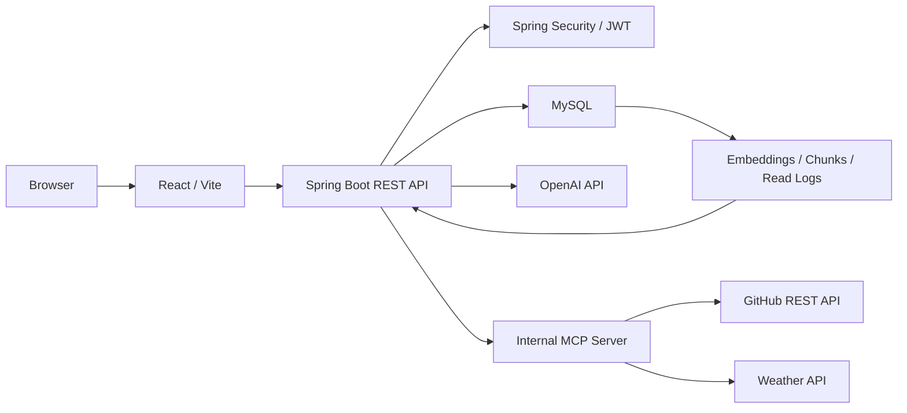
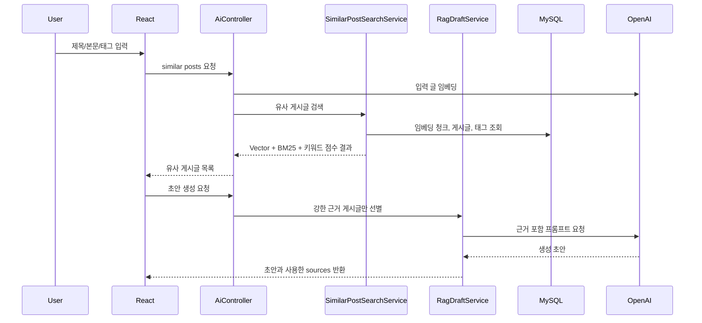
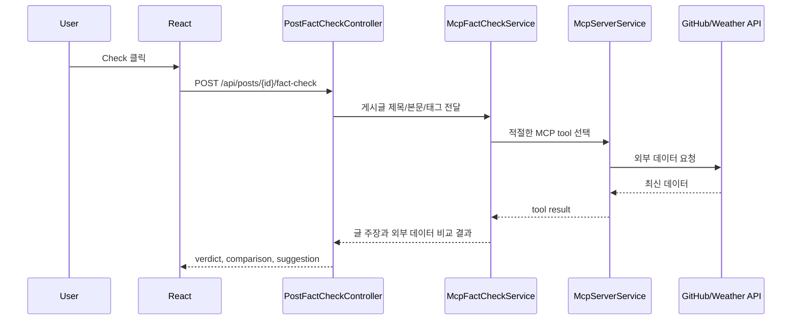
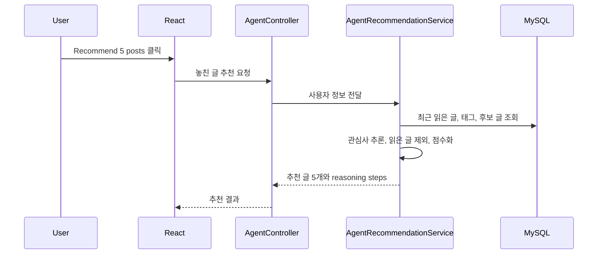

# Project Alpha

Project Alpha는 개발, 학습, 프로젝트, 일상 기록을 남기는 LinkedIn 스타일의 AI 게시판입니다.
일반 게시판 CRUD 위에 RAG, MCP, AI Agent 기능을 붙여서 사용자가 글을 더 잘 쓰고, 이미 쓴 글을 검증하고, 놓친 글을 추천받을 수 있게 만드는 것이 목표입니다.

## 핵심 기능

### 기본 게시판

- 회원가입, 로그인, 로그아웃
- JWT 기반 인증 요청
- 게시글 목록, 상세, 생성, 수정, 삭제
- 댓글 생성, 삭제
- 카테고리 필터, 태그 검색, 키워드 검색
- 페이지네이션과 카테고리별 전체 게시글 수 표시

### RAG

- 사용자가 작성 중인 제목, 본문, 태그를 기준으로 유사 게시글 검색
- 게시글 본문을 청크 단위로 나누어 임베딩 저장
- Vector similarity, BM25, 키워드 정렬 점수를 조합한 hybrid retrieval
- 관련성이 약한 검색 결과는 초안 근거에서 제외
- 유사 게시글을 근거로 글 초안 생성
- RAGAS 기반 평가 스크립트 제공

### MCP

- Spring Boot 내부에 JSON-RPC 형태의 MCP server 구현
- MCP 도구로 외부 시스템 호출
- 현재 도구:
  - GitHub repository summary
  - Weather current forecast
- 게시글 상세 화면에서 MCP fact check 버튼을 누르면 글 내용과 외부 데이터를 비교
- GitHub 저장소 주장이나 날씨 주장을 찾아 `Supported`, `Contradicted`, `Insufficient`, `Not supported` 형태로 판단

### AI Agent

- 사용자별 최근 읽은 글 기록 저장
- 읽은 글의 태그와 카테고리 흐름을 기반으로 관심사 추론
- 이미 읽은 글은 제외하고 놓쳤을 법한 글 5개 추천
- 추천 과정은 observe, infer, retrieve, rank 단계로 나누어 응답

## 기술 스택

| 영역 | 사용 기술 |
| --- | --- |
| Frontend | React, Vite, React Router |
| Backend | Spring Boot 3.5, Java 25 |
| Database | MySQL 8.4 |
| ORM | Spring Data JPA, Hibernate |
| Auth | Spring Security, JWT |
| LLM | OpenAI Chat API |
| Embedding | OpenAI Embedding API |
| RAG 저장소 | MySQL `post_embeddings`, `post_embedding_chunks` |
| Retrieval | Vector similarity, BM25, metadata/category/tag signals |
| MCP | Spring Boot 내부 JSON-RPC endpoint |
| Agent state | MySQL `post_reads` |
| Evaluation | RAGAS, custom retrieval evaluation script |
| Local infra | Docker Compose |

## 전체 아키텍처




## AI 기능 구조

### RAG 구조



### MCP 구조



### Agent 구조



## 실행 방법

### 1. 환경 변수 준비

루트의 `.env.example`을 참고해서 필요한 값을 준비합니다.

```properties
OPENAI_API_KEY=...
OPENAI_CHAT_MODEL=gpt-4.1-mini
OPENAI_EMBEDDING_MODEL=text-embedding-3-small
APP_JWT_SECRET=...
```

Backend는 `backend/.env` 파일을 선택적으로 읽습니다. API key와 비밀번호는 Git에 커밋하지 않습니다.

### 2. MySQL 실행

```powershell
cd C:\Users\cedis\week15_project
docker compose up -d mysql
```

### 3. Backend 실행

```powershell
cd C:\Users\cedis\week15_project\backend
.\gradlew.bat bootRun
```

Backend 기본 주소는 `http://127.0.0.1:8080` 입니다.

### 4. Frontend 실행

```powershell
cd C:\Users\cedis\week15_project\frontend\project-alpha
npm install
npm run dev
```

Frontend 기본 주소는 `http://127.0.0.1:5173` 입니다.

## 개발용 데이터 주입

RAG 검색 품질을 보기 위해 외부 한국어 웹 텍스트를 게시글처럼 저장할 수 있습니다.
소스 목록은 `backend/src/main/resources/corpus-sources.tsv`에 있습니다.

```powershell
cd C:\Users\cedis\week15_project\backend
.\gradlew.bat bootRun --args="--app.corpus-import.enabled=true --app.corpus-import.max-items=20"
```

코퍼스 importer는 다음 순서로 동작합니다.

1. URL에서 HTML 본문 텍스트 추출
2. `crawler` 작성자 생성 또는 재사용
3. `posts`에 일반 게시글로 저장
4. 태그를 `tags`, `post_tags`에 저장
5. `embedding_jobs`에 임베딩 작업 예약

평소 서버 실행에서는 `app.corpus-import.enabled=false`가 기본값이므로 자동 import가 돌지 않습니다.

## RAG 평가

간단한 retrieval 평가는 Node script로 실행합니다.

```powershell
node scripts\evaluate-rag-retrieval.mjs
```

RAGAS 평가는 별도 Python 환경에서 실행합니다.

```powershell
cd C:\Users\cedis\week15_project
python -m venv eval\ragas\.venv
eval\ragas\.venv\Scripts\python.exe -m pip install -r eval\ragas\requirements.txt
eval\ragas\.venv\Scripts\python.exe eval\ragas\run_project_alpha_ragas.py
```

평가 결과는 `eval/ragas/output` 아래에 저장되며 Git에는 올라가지 않습니다.

## 테스트와 검증

Backend 테스트:

```powershell
cd C:\Users\cedis\week15_project\backend
.\gradlew.bat test
```

Frontend 빌드:

```powershell
cd C:\Users\cedis\week15_project\frontend\project-alpha
npm run build
```

전체 기능 QA에서 확인한 주요 시나리오:

- 회원가입/로그인
- 게시글 CRUD
- 댓글 생성/삭제
- 검색, 태그, 카테고리, 페이징
- RAG 유사글 검색과 초안 생성
- MCP fact check의 supported/contradicted 케이스
- Agent 놓친 글 5개 추천

## 데모 시나리오

1. 로그인 후 메인 게시판 진입
2. `Write post`로 글 작성 모달 열기
3. 제목/본문을 입력하고 `Related posts`로 유사 게시글 확인
4. `Draft from sources`로 RAG 초안 생성
5. 게시글 발행 후 상세 페이지 이동
6. `MCP fact check`의 `Check` 버튼으로 외부 데이터 기반 검증
7. 메인에서 `Recommend 5 posts`로 Agent 추천 확인

## 주요 문서

- [초보자를 위한 코드 읽기 로드맵](docs/code-reading-roadmap.md)
- [코드 맵](docs/code-map.md)
- [DB 스키마](docs/database-schema.md)
- [AWS 워크숍 적용 계획](docs/aws-workshop-application-plan.md)
- [RAGAS 평가 안내](eval/ragas/README.md)

## 한계점과 개선 아이디어

- MySQL에 JSON 형태로 벡터를 저장하고 서버에서 유사도를 계산하므로 데이터가 커지면 검색 비용이 커질 수 있습니다.
- 대규모 검색으로 확장하려면 pgvector, OpenSearch, Chroma, Pinecone 같은 전용 Vector DB를 검토할 수 있습니다.
- 현재 RAG reranker는 직접 구현한 점수 조합에 가깝습니다. Cross-encoder reranker 또는 LLM reranker를 붙이면 더 정교해질 수 있습니다.
- MCP 도구는 GitHub와 날씨 중심입니다. 공공데이터, Jira, Slack, 뉴스 API 등으로 확장할 수 있습니다.
- Agent는 읽음 기록과 태그 기반 추천입니다. 클릭, 댓글, 작성 이력, 체류 시간까지 반영하면 개인화 품질을 높일 수 있습니다.
- 로컬 개발은 `ddl-auto=update`를 사용합니다. 배포 단계에서는 Flyway 또는 Liquibase 기반 migration이 필요합니다.
