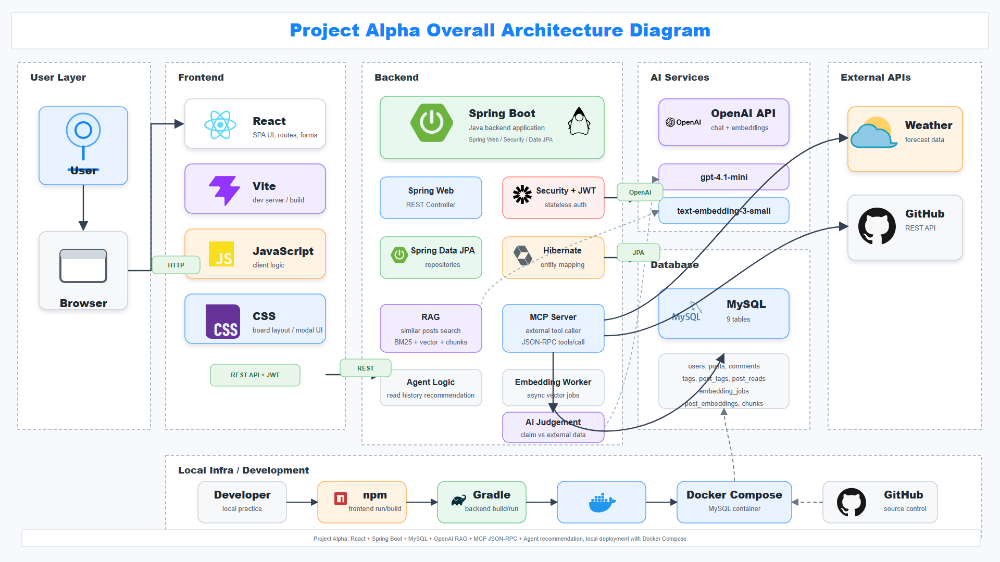
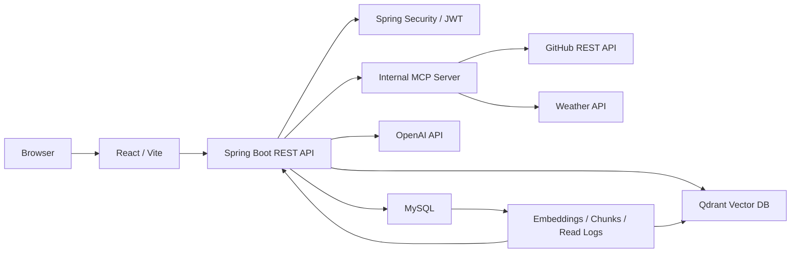
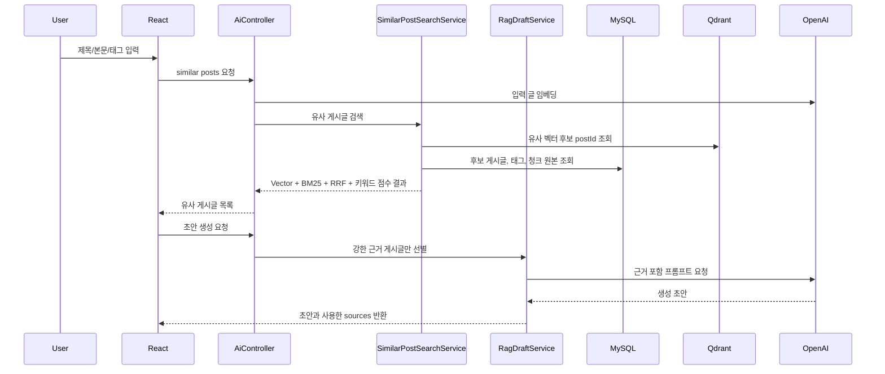
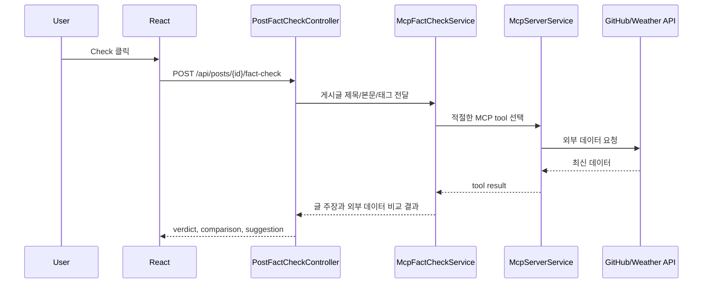
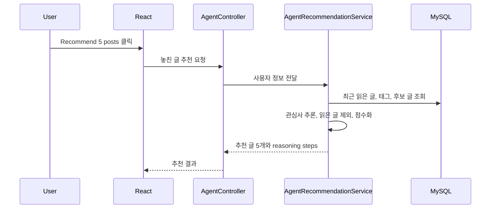

# Project Alpha

Project Alpha는 개발, 학습, 프로젝트, 일상 기록을 남기는 LinkedIn 스타일의 AI 게시판입니다.
일반 게시판 CRUD 위에 RAG, MCP, AI Agent 기능을 붙여서 사용자가 글을 더 잘 쓰고, 이미 쓴 글을 검증하고, 놓친 글을 추천받을 수 있게 만드는 것이 목표입니다.

## 3줄 요약

- Project Alpha는 React와 Spring Boot로 만든 AI 게시판이며, 기본 게시판 기능 위에 RAG, MCP, AI Agent를 실제 서비스 흐름으로 연결했습니다.
- RAG는 기존 게시글을 검색해 AI 초안의 근거로 쓰고, MCP는 GitHub/날씨 같은 외부 데이터를 불러와 작성된 글을 검증합니다.
- Agent는 사용자별 읽음 기록을 바탕으로 이미 본 글을 제외하고 놓쳤을 법한 게시글 5개를 추천합니다.

## 과제 요구사항 대응

| 요구사항 | Project Alpha 구현 |
| --- | --- |
| Frontend | React, Vite, React Router |
| Backend | Spring Boot 3.5, Java 25 |
| Database | MySQL 8.4 |
| 회원가입/로그인 | Spring Security + JWT |
| 게시글 CRUD | 목록, 상세, 생성, 수정, 삭제 |
| 댓글 | 게시글 상세 댓글 생성/삭제 |
| 태그 | 태그 저장, 태그 검색, 게시글 태그 표시 |
| 페이징 | 서버 API 기반 페이지네이션 |
| 검색 | 키워드, 카테고리, 태그 검색 |
| RAG | 유사 게시글 검색, 근거 기반 AI 초안 생성 |
| MCP | 내부 JSON-RPC MCP server + GitHub/날씨 외부 도구 |
| AI Agent | 사용자 읽음 기록 기반 놓친 글 5개 추천 |

## 핵심 기능

### 기본 게시판

- 회원가입, 로그인, 로그아웃
- httpOnly cookie 기반 JWT 인증 요청
- CSRF token, refresh token rotation, 로그인 실패 rate limit, 전체 refresh token logout
- 게시글 목록, 상세, 생성, 수정, 삭제
- 댓글 생성, 삭제
- 카테고리 필터, 태그 검색, 키워드 검색
- 페이지네이션과 카테고리별 전체 게시글 수 표시

### RAG

- 사용자가 작성 중인 제목, 본문, 태그를 기준으로 유사 게시글 검색
- 게시글 본문을 청크 단위로 나누어 임베딩 저장
- Vector similarity, BM25, 키워드 정렬 점수를 조합한 hybrid retrieval
- 관련성이 약한 검색 결과는 초안 근거에서 제외
- 유사 게시글을 근거로 글 초안 생성
- RAGAS 기반 평가 스크립트 제공

### MCP

- Spring Boot 내부에 JSON-RPC 형태의 MCP server 구현
- MCP 도구로 외부 시스템 호출
- 현재 도구:
  - GitHub repository summary
  - Weather current forecast
- 게시글 상세 화면에서 MCP fact check 버튼을 누르면 글 내용과 외부 데이터를 비교
- GitHub 저장소 주장이나 날씨 주장을 찾아 `Supported`, `Contradicted`, `Insufficient`, `Not supported` 형태로 판단

### AI Agent

- 사용자별 최근 읽은 글 기록 저장
- 읽은 글의 태그와 카테고리 흐름을 기반으로 관심사 추론
- 이미 읽은 글은 제외하고 놓쳤을 법한 글 5개 추천
- 추천 과정은 observe, infer, retrieve, rank 단계로 나누어 응답

## 기술 스택

| 영역 | 사용 기술 |
| --- | --- |
| Frontend | React, Vite, React Router |
| Backend | Spring Boot 3.5, Java 25 |
| Database | MySQL 8.4 |
| ORM | Spring Data JPA, Hibernate |
| Auth | Spring Security, JWT |
| LLM | OpenAI Chat API |
| Embedding | OpenAI Embedding API |
| Vector DB | Qdrant |
| RAG 원본 저장소 | MySQL `posts`, `post_embeddings`, `post_embedding_chunks` |
| Retrieval | Qdrant vector search, BM25, RRF, metadata/category/tag signals, chunk evidence |
| MCP | Spring Boot 내부 JSON-RPC endpoint |
| Agent state | MySQL `post_reads` |
| Evaluation | RAGAS, custom retrieval evaluation script |
| Local infra | Docker Compose |

## 전체 아키텍처





## AI 기능 구조

### RAG 구조



### MCP 구조



### Agent 구조



## 실행 방법

### 1. 환경 변수 준비

루트의 `.env.example`을 참고해서 필요한 값을 준비합니다.

```properties
OPENAI_API_KEY=...
OPENAI_CHAT_MODEL=gpt-4.1-mini
OPENAI_EMBEDDING_MODEL=text-embedding-3-small
APP_JWT_SECRET=...
APP_JWT_EXPIRATION_SECONDS=900
APP_REFRESH_TOKEN_EXPIRATION_SECONDS=604800
APP_LOGIN_RATE_LIMIT_MAX_FAILURES=5
APP_LOGIN_RATE_LIMIT_WINDOW_SECONDS=600
APP_LOGIN_RATE_LIMIT_LOCK_SECONDS=300
APP_SECURITY_PRODUCTION_MODE=false
APP_SECURITY_COOKIE_SECURE=false
SPRING_JPA_HIBERNATE_DDL_AUTO=update
SPRING_FLYWAY_ENABLED=true
SPRING_FLYWAY_BASELINE_ON_MIGRATE=true
QDRANT_ENABLED=true
QDRANT_BASE_URL=http://localhost:6333
QDRANT_POST_COLLECTION=project_alpha_posts
QDRANT_CHUNK_COLLECTION=project_alpha_chunks
```

Backend는 `backend/.env` 파일을 선택적으로 읽습니다. API key와 비밀번호는 Git에 커밋하지 않습니다. 운영 배포에서는 `APP_SECURITY_PRODUCTION_MODE=true`, `APP_SECURITY_COOKIE_SECURE=true`, `SPRING_JPA_HIBERNATE_DDL_AUTO=validate`, `SPRING_FLYWAY_ENABLED=true`를 사용합니다. production mode에서 기본 JWT secret을 그대로 쓰면 서버가 시작되지 않습니다. access token 기본 만료시간은 15분이고, refresh token은 7일 동안 유지되며 재발급 때마다 rotation됩니다. 로그인 실패 rate limit은 기본 10분 창에서 5회 실패 시 5분 동안 잠급니다.

### 2. MySQL, Qdrant 실행

```powershell
cd C:\Users\cedis\week15_project
docker compose up -d mysql qdrant
```

MySQL은 게시글과 원본 데이터를 저장하고, Qdrant는 임베딩 벡터 후보 검색을 담당합니다.

### 3. Backend 실행

```powershell
cd C:\Users\cedis\week15_project\backend
.\gradlew.bat bootRun
```

Backend 기본 주소는 `http://127.0.0.1:8080` 입니다.

### 4. Frontend 실행

```powershell
cd C:\Users\cedis\week15_project\frontend\project-alpha
npm install
npm run dev
```

Frontend 기본 주소는 `http://127.0.0.1:5173` 입니다.

## 개발용 데이터 주입

RAG 검색 품질을 보기 위해 외부 한국어 웹 텍스트를 게시글처럼 저장할 수 있습니다.
소스 목록은 `backend/src/main/resources/corpus-sources.tsv`에 있습니다.

```powershell
cd C:\Users\cedis\week15_project\backend
.\gradlew.bat bootRun --args="--app.corpus-import.enabled=true --app.corpus-import.max-items=20"
```

코퍼스 importer는 다음 순서로 동작합니다.

1. URL에서 HTML 본문 텍스트 추출
2. `crawler` 작성자 생성 또는 재사용
3. `posts`에 일반 게시글로 저장
4. 태그를 `tags`, `post_tags`에 저장
5. `embedding_jobs`에 임베딩 작업 예약

평소 서버 실행에서는 `app.corpus-import.enabled=false`가 기본값이므로 자동 import가 돌지 않습니다.

기존 MySQL 임베딩을 Qdrant에 다시 동기화해야 할 때는 백엔드 서버 실행 후 다음 API를 호출합니다.

```powershell
curl -X POST "http://127.0.0.1:8080/api/ai/vector-store/sync?limit=2000"
```

## RAG 평가

현재 운영 설정의 retrieval 평가는 Node script로 실행합니다.

```powershell
node scripts\evaluate-rag-retrieval.mjs
```

후보 조합과 오프라인 ablation은 아래 스크립트로 재현할 수 있습니다.

```powershell
node scripts\evaluate-rag-online-candidates.mjs
node scripts\evaluate-rag-offline-ablation.mjs
node scripts\evaluate-chunk-size-variants.mjs
node scripts\evaluate-rag-scenarios.mjs
```

RAGAS 평가는 별도 Python 환경에서 실행합니다.

```powershell
cd C:\Users\cedis\week15_project
python -m venv eval\ragas\.venv
eval\ragas\.venv\Scripts\python.exe -m pip install -r eval\ragas\requirements.txt
eval\ragas\.venv\Scripts\python.exe eval\ragas\run_project_alpha_ragas.py
```

평가 결과는 `eval/ragas/output` 아래에 저장되며 Git에는 올라가지 않습니다.

## 테스트와 검증

Backend 테스트:

```powershell
cd C:\Users\cedis\week15_project\backend
.\gradlew.bat test
```

Frontend 빌드:

```powershell
cd C:\Users\cedis\week15_project\frontend\project-alpha
npm run build
```

전체 기능 QA에서 확인한 주요 시나리오:

- 회원가입/로그인
- 게시글 CRUD
- 댓글 생성/삭제
- 검색, 태그, 카테고리, 페이징
- RAG 유사글 검색과 초안 생성
- MCP fact check의 supported/contradicted 케이스
- Agent 놓친 글 5개 추천

## 데모 시나리오

1. 로그인 후 메인 게시판 진입
2. `Write post`로 글 작성 모달 열기
3. 제목/본문을 입력하고 `Related posts`로 유사 게시글 확인
4. `Draft from sources`로 RAG 초안 생성
5. 게시글 발행 후 상세 페이지 이동
6. `MCP fact check`의 `Check` 버튼으로 외부 데이터 기반 검증
7. 메인에서 `Recommend 5 posts`로 Agent 추천 확인

## 주요 문서

- [Project Alpha 교재형 학습 문서](docs/textbook/README.md)
- [코드 읽기 로드맵](docs/code-reading-roadmap.md)
- [코드 맵](docs/code-map.md)
- [DB 스키마](docs/database-schema.md)
- [AWS 워크숍 적용 계획](docs/aws-workshop-application-plan.md)
- [RAG 검색 성능 보고서](docs/rag-performance-report.md)
- [RAG 측정 로그 인벤토리](docs/rag-measurement-inventory.md)
- [RAG 시나리오 입출력 평가](docs/rag-scenario-evaluation.md)
- [데모 시나리오와 스크린샷](docs/demo-scenario.md)
- [전체 기능 QA 체크리스트](docs/qa-checklist.md)
- [7분 발표 흐름](docs/presentation-flow.md)
- [면접 질문 대비](docs/interview-qa.md)
- [RAGAS 평가 안내](eval/ragas/README.md)

## 한계점과 개선 아이디어

- 현재는 Qdrant가 1차 벡터 후보 검색을 담당하고, Spring Boot가 BM25/RRF/metadata/chunk evidence 재정렬을 수행합니다. 더 큰 규모에서는 Qdrant 검색 파라미터와 reranker 구조를 별도로 튜닝해야 합니다.
- 현재 RAG reranker는 직접 구현한 점수 조합입니다. Cross-encoder reranker 또는 LLM reranker를 붙이면 더 정교해질 수 있습니다.
- MCP 도구는 GitHub와 날씨 중심입니다. 공공데이터, Jira, Slack, 뉴스 API 등으로 확장할 수 있습니다.
- Agent는 읽음 기록과 태그 기반 추천입니다. 클릭, 댓글, 작성 이력, 체류 시간까지 반영하면 개인화 품질을 높일 수 있습니다.
- 초기 DB 스키마는 Flyway migration 파일 `backend/src/main/resources/db/migration/V1__create_project_alpha_schema.sql`에 기록했습니다. 로컬 개발은 `ddl-auto=update`를 병행하고, 배포 단계에서는 `ddl-auto=validate`와 Flyway migration을 기준으로 운영합니다.
- 로그인 실패 rate limit은 현재 단일 서버 인메모리 방식입니다. 여러 서버로 배포할 때는 Redis 같은 공유 저장소 기반으로 바꾸는 것이 맞습니다.
