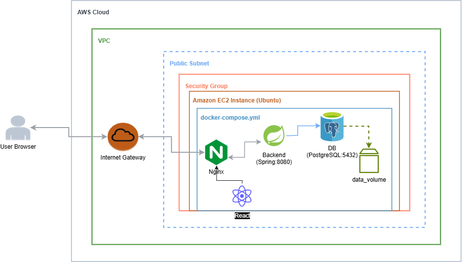
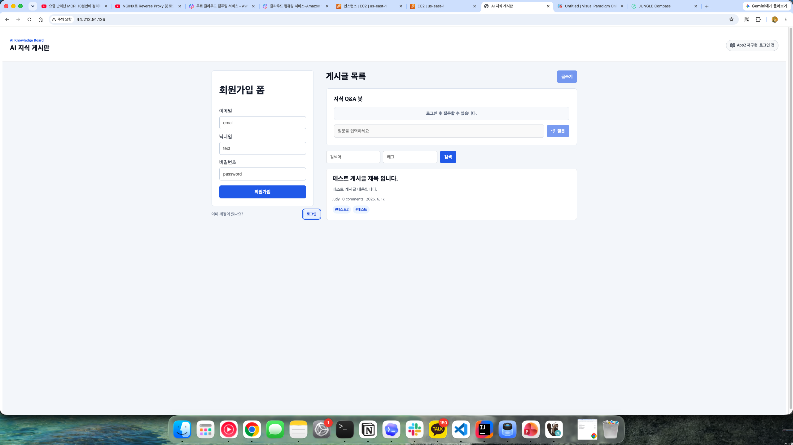
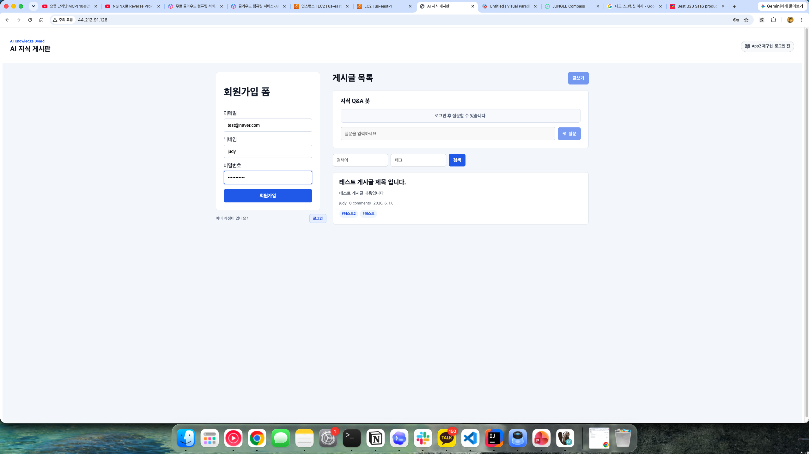
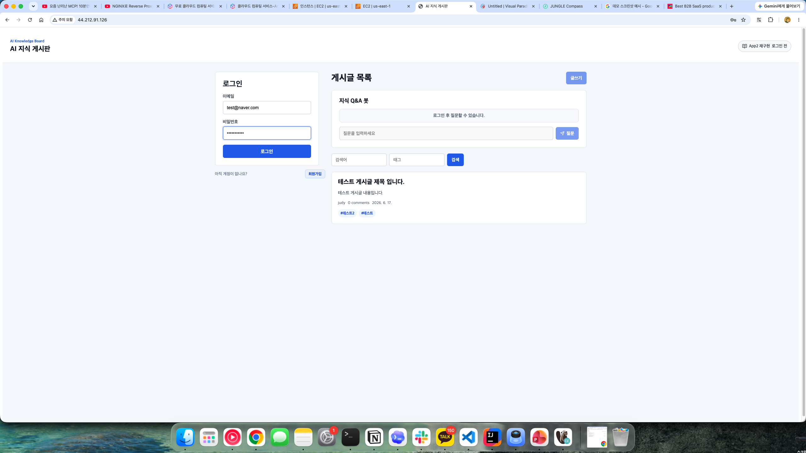
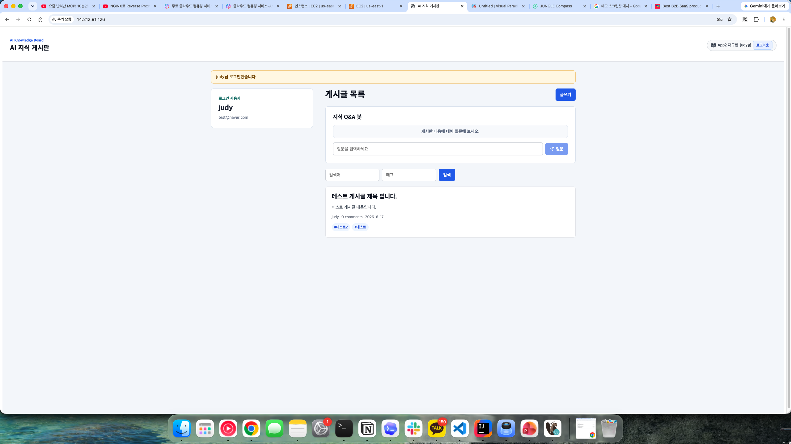
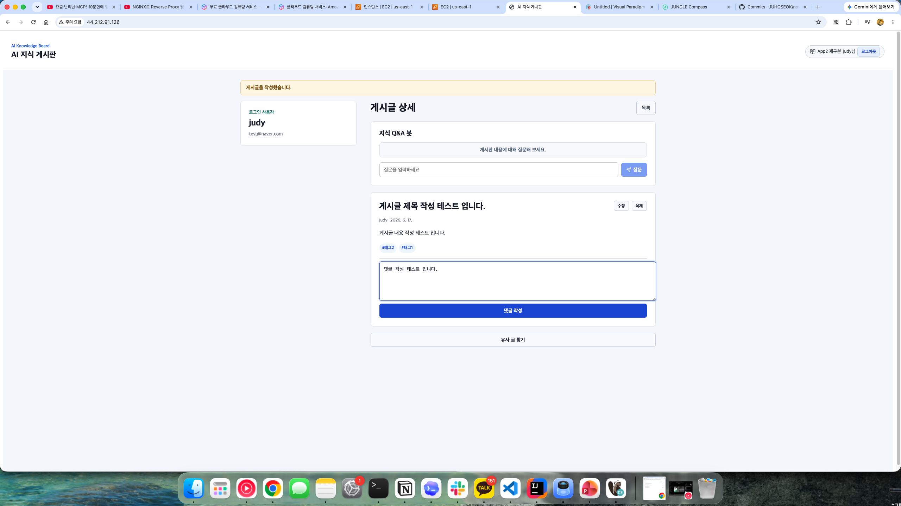
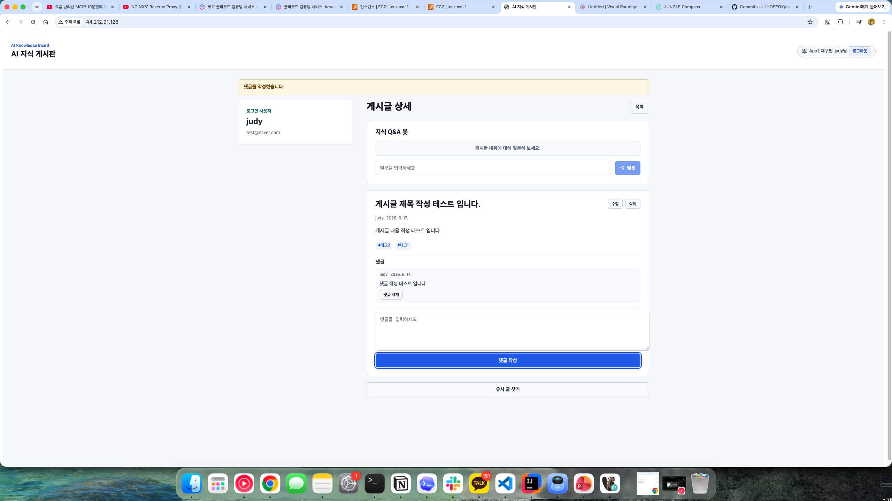
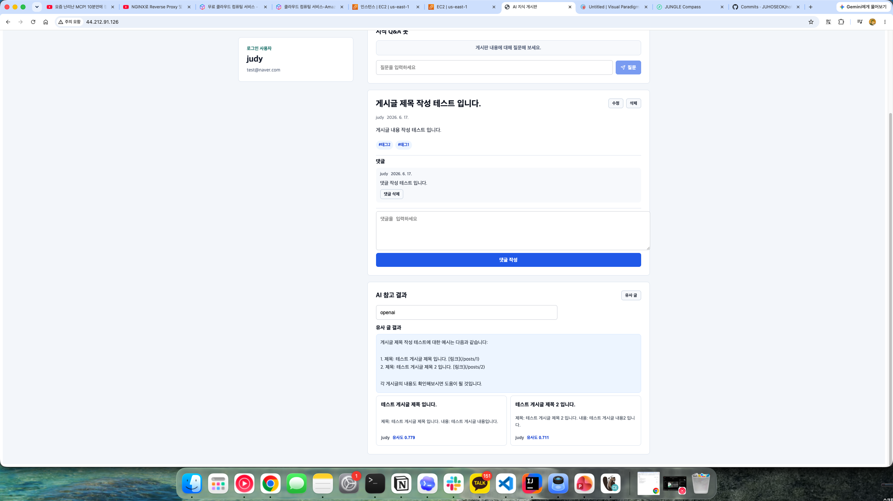
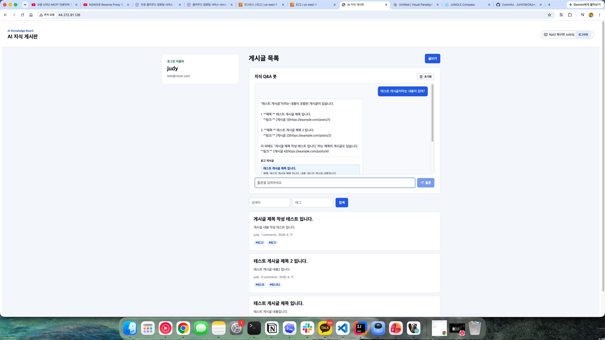

# AI 지식 게시판

React, Spring Boot, PostgreSQL, pgvector를 사용한 2주 개인 과제용 MVP 게시판입니다. 기본 게시판 기능에 RAG를 결합한 Ai 지식 게시판.

## 1. 프로젝트 개요

### React, Spring Boot, PostgreSQL, pgvector를 사용해 기본 게시판 기능과 RAG 기반 AI 활용 기능을 결합한 게시판 애플리케이션.

- 기본 게시판: 회원가입/로그인, 게시글 CRUD, 댓글, 태그, 페이징, 검색
- RAG: 게시글 임베딩 저장, 유사 글 검색, Ai 채팅기능

## 2. 주요 구현 기능 

| Method | Path | 설명 |
|---|---|---|
| POST | `/api/auth/signup` | 회원가입 |
| POST | `/api/auth/login` | 로그인 |
| GET | `/api/posts?page=&keyword=&tag=` | 게시글 목록 조회 / 키워드 검색 / 태그 검색 |
| POST | `/api/posts` | 게시글 작성 |
| GET | `/api/posts/{id}` | 게시글 상세 조회 |
| PUT | `/api/posts/{id}` | 게시글 수정 |
| DELETE | `/api/posts/{id}` | 게시글 삭제 |
| POST | `/api/posts/{id}/comments` | 댓글 작성 |
| DELETE | `/api/comments/{id}` | 댓글 삭제 |
| POST | `/api/ai/rag/similar` | 입력한 글 또는 질문과 유사한 게시글 검색 및 요약 |
| POST | `/api/ai/rag/chat` | 게시판 게시글 기반 RAG Q&A 답변 생성 |
| POST | `/api/ai/rag/reindex` | 기존 게시글 전체를 다시 벡터 저장소에 인덱싱 |

## 전체 아키텍처



## 3.2. DB 설계

| 테이블 | 역할 |
|---|---|
| users | 로그인 사용자 저장 |
| posts | 게시글 본문 저장 |
| comments | 게시글 댓글 저장 |
| tags | 태그 이름 저장 |
| post_tags | 게시글과 태그의 N:M 연결 |
| vector_store | RAG 검색용 게시글 벡터 저장 |


## 4. AI 기능 설명

### RAG

게시글 작성/수정 시 제목 + 내용 chunk 단위로 나눈 뒤 VectorStore에 저장. 질문이나 초안이 들어오면 Spring AI VectorStore가 PostgreSQL vector_store에서 cosine distance 기반 유사도 검색을 수행, 검색된 게시글을 근거로 요약 답변을 생성.

게시글 저장
 -> title + content를 Spring AI Document로 변환
 -> TokenTextSplitter로 chunk 단위 분리
 -> Spring AI VectorStore가 embedding 생성
 -> PostgreSQL pgvector의 vector_store 테이블에 저장

유사 글 요청
 -> 사용자 query를 Spring AI VectorStore에 전달
 -> vector_store에서 pgvector cosine distance 기반 유사도 검색
 -> 검색된 chunk의 metadata에서 postId, title, author 정보 추출
 -> 같은 게시글의 중복 결과 정리
 -> 검색된 게시글을 근거로 Spring AI ChatClient가 요약/답변 생성
 -> 출처 링크 반환

OpenAI API 키가 없을 때도 로컬 해시 기반 임베딩을 사용합니다. 이 fallback은 실제 품질보다는 제출 데모 안정성을 위한 장치입니다.

## 5. 로컬 실행 방법

### PostgreSQL 준비

가장 쉬운 방법은 Docker Compose로 전체 실행하는 것입니다. 백엔드만 직접 실행하려면 PostgreSQL과 pgvector가 필요합니다.

### 백엔드

```bash
cd backend
./gradlew bootJar -x test
./gradlew bootRun
```

### 프론트엔드

```bash
cd frontend
npm install
npm run dev
```

브라우저에서 `http://localhost:5173`에 접속합니다.


Nginx는 `/api`를 백엔드로 보내고, 나머지 경로를 React 정적 파일로 보냅니다.

## 6. 데모 스크린샷

스크린샷은 `docs/screenshots/`에 저장합니다.

### 1. 회원가입






### 2. 로그인





### 3. 게시글 상세와 댓글/태그 





### 4. RAG 유사 글 찾기



### 5. AI 채팅



## 6. 회고

이 프로젝트는 AI 기능의 품질보다 구조 이해를 우선했습니다. RAG는 게시글 기반 벡터 검색과 출처 표시를 보여주는 데 집중하고 그에 맞춰 ai 채팅 기능을 만들었습니다. 

## 6.1 한계와 개선점

### 한계

RAG 기능을 구현하는 과정에서 처음에는 게시글 내용을 문단 단위로 직접 나누는 청킹 함수를 만들어 사용해 보았습니다. 하지만 유사 글 검색 결과를 비교해 보니, 직접 만든 문단 기반 청킹보다 Spring AI의 토큰화 기반 청킹 방식이 더 안정적인 검색 결과를 보여주었습니다.

그래서 최종적으로는 직접 구현한 청킹 로직 대신 Spring AI의 `TokenTextSplitter`를 사용했습니다. 이 과정에서 RAG 성능은 단순히 벡터 검색을 붙이는 것만으로 결정되는 것이 아니라, 문서를 어떤 기준으로 나누고 저장하느냐가 검색 품질에 큰 영향을 준다는 점을 알게 되었습니다.

이번 프로젝트에서는 기본 게시판 기능과 RAG 기능 구현을 우선순위로 두었기 때문에 MCP와 Agent 기능은 실제 구현까지 완성하지 못했습니다.

### 개선점

현재 RAG 기능은 게시글을 벡터화하고 유사 글을 검색하는 최소 기능에 집중했습니다. 이후에는 RAG 성능을 더 높이기 위해 청킹 크기, overlap 설정, 검색 결과 개수, 프롬프트 구성 등을 조정하면서 어떤 방식이 더 좋은 답변을 만드는지 비교해 볼 필요가 있습니다.

또한 단순히 “검색이 된다”는 수준을 넘어서, 사용자의 질문에 대해 더 관련성 높은 게시글을 찾아내고 출처를 명확하게 보여줄 수 있도록 RAG 검색 품질을 평가하는 기준도 추가하고 싶습니다.

최종적으로는 RAG, MCP, Agent가 각각 따로 존재하는 기능이 아니라, 글 작성 과정에서 서로 연결되도록 개선하고 싶습니다. 사용자가 글을 작성하면 Agent가 필요한 도구를 판단하고, RAG로 기존 게시글을 참고하며, MCP로 외부 정보를 가져오는 흐름까지 확장하고 싶다.
