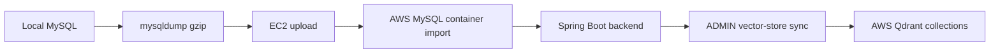

# Project Alpha AWS 데이터 이전 가이드

이 문서는 로컬에서 만든 Project Alpha 데이터를 AWS EC2 배포 환경으로 옮기는 절차를 정리한다.
핵심 원칙은 게시글을 다시 크롤링하거나 임베딩을 다시 생성하지 않고, 로컬 MySQL에 이미 저장된 원본 데이터와 임베딩 결과를 그대로 옮기는 것이다.

## 최초 이전 당시 로컬 데이터 규모

기준 시점: 2026-06-17 최초 AWS 이전 당시의 로컬 `project_alpha` DB.

이후 AWS 검증과 QA 과정에서 테스트 게시글이 생성/삭제되어, 최종 제출 문서의 최신 AWS 수치와 약간 다를 수 있다.

| 항목 | 수량 |
|---|---:|
| users | 23 |
| posts | 1309 |
| published posts | 1303 |
| comments | 1 |
| tags | 373 |
| post_tags | 8348 |
| post_reads | 79 |
| post_embeddings | 1309 |
| post_embedding_chunks | 5419 |
| embedding_jobs | 2510 |
| refresh_tokens | 12 |

게시글 카테고리 분포는 published post 기준이다.

| Category | Count |
|---|---:|
| Briefing | 200 |
| Daily | 300 |
| Development | 201 |
| Learning | 200 |
| Project | 202 |
| Review | 200 |

저장 용량은 아래 수준이다.

| 항목 | 크기 |
|---|---:|
| MySQL 전체 테이블 크기 | 약 228.75 MB |
| mysqldump gzip 압축본 | 약 54 MB |
| Qdrant post collection | 1310 points |
| Qdrant chunk collection | 5420 points |

따라서 1300개 수준의 게시글은 AWS 이전에서 병목이 아니다. EC2 30GB gp3 EBS 기준으로 충분히 작고, 실제로 더 신경 쓸 부분은 데이터 이전 순서와 Qdrant 재동기화다.

## 무엇을 옮겨야 하나

MySQL이 원본 저장소다.

| 데이터 | 위치 | 이전 필요성 |
|---|---|---|
| 계정, 게시글, 댓글, 태그 | MySQL | 필수 |
| 읽음 기록 | MySQL `post_reads` | Agent 추천 시나리오 유지 시 필요 |
| 전체글 임베딩 | MySQL `post_embeddings` | RAG 재사용을 위해 필수 |
| 청크 임베딩 | MySQL `post_embedding_chunks` | RAG 근거 보강을 위해 필수 |
| 임베딩 작업 상태 | MySQL `embedding_jobs` | 운영 확인용. 함께 이전 권장 |
| Qdrant vector points | Qdrant | 직접 복사하거나 MySQL 임베딩으로 재생성 |

권장 방식은 MySQL dump를 먼저 가져간 뒤, AWS의 Qdrant는 MySQL에 저장된 임베딩으로 다시 채우는 것이다. 이렇게 하면 OpenAI Embedding API를 다시 호출하지 않아도 된다.

## 권장 이전 흐름



## 1. 로컬에서 MySQL dump 만들기

PowerShell 리다이렉션으로 gzip 바이너리가 깨질 수 있으므로, 압축 파일은 MySQL 컨테이너 안에서 만든 뒤 `docker cp`로 꺼낸다.

```powershell
cd C:\Users\cedis\week15_project
New-Item -ItemType Directory -Force backups

docker exec project-alpha-mysql sh -c 'mysqldump --single-transaction --quick --default-character-set=utf8mb4 -u"$MYSQL_USER" -p"$MYSQL_PASSWORD" "$MYSQL_DATABASE" | gzip -c > /tmp/project_alpha.sql.gz'

docker cp project-alpha-mysql:/tmp/project_alpha.sql.gz .\backups\project_alpha.sql.gz
```

덤프 파일 크기 확인:

```powershell
Get-Item .\backups\project_alpha.sql.gz | Select-Object Name,Length
```

## 2. EC2로 dump 복사

```powershell
scp -i C:\path\to\your-key.pem .\backups\project_alpha.sql.gz ec2-user@EC2_PUBLIC_IP:~/project_alpha.sql.gz
```

## 3. AWS 컨테이너 실행

EC2에서 프로젝트와 `.env.aws`가 준비된 상태라고 가정한다.

```bash
cd week15-16_team03_ai_board_lab
git checkout HYUNJIN

docker compose --env-file .env.aws -f docker-compose.aws.yml up -d mysql qdrant
docker compose --env-file .env.aws -f docker-compose.aws.yml ps
```

처음 import하는 환경이면 MySQL volume이 비어 있는 상태에서 진행한다. 이미 테스트 데이터가 들어간 volume이라면 먼저 백업한 뒤 `docker compose --env-file .env.aws -f docker-compose.aws.yml down -v`로 초기화할지 결정한다.

## 4. AWS MySQL에 dump import

```bash
MYSQL_CONTAINER=$(docker compose --env-file .env.aws -f docker-compose.aws.yml ps -q mysql)
docker cp ~/project_alpha.sql.gz "$MYSQL_CONTAINER":/tmp/project_alpha.sql.gz

docker compose --env-file .env.aws -f docker-compose.aws.yml exec mysql sh -c 'gunzip -c /tmp/project_alpha.sql.gz | mysql --default-character-set=utf8mb4 -u"$MYSQL_USER" -p"$MYSQL_PASSWORD" "$MYSQL_DATABASE"'
```

row count 확인:

```bash
docker compose --env-file .env.aws -f docker-compose.aws.yml exec mysql sh -c 'mysql -u"$MYSQL_USER" -p"$MYSQL_PASSWORD" "$MYSQL_DATABASE" -e "SELECT COUNT(*) AS posts FROM posts; SELECT COUNT(*) AS post_embeddings FROM post_embeddings; SELECT COUNT(*) AS post_embedding_chunks FROM post_embedding_chunks;"'
```

## 5. Backend와 Frontend 실행

```bash
docker compose --env-file .env.aws -f docker-compose.aws.yml up -d --build
docker compose --env-file .env.aws -f docker-compose.aws.yml ps
```

health check:

```bash
curl http://EC2_PUBLIC_IP:8080/actuator/health
curl "http://EC2_PUBLIC_IP:8080/api/posts?page=0&size=3"
```

## 6. Qdrant 재동기화

MySQL dump에는 임베딩 JSON이 들어 있지만, Qdrant collection은 별도 저장소다. AWS의 Qdrant가 비어 있으면 RAG 후보 검색이 약해지거나 비어 보일 수 있다.

Qdrant는 `POST /api/ai/vector-store/sync`로 재생성한다. 이 endpoint는 `ADMIN` 권한이 필요하다.

`APP_ADMIN_USERNAMES`에는 이미 DB에 있는 사용자명을 넣는다. 예를 들어 데모 계정으로 관리 작업을 할 경우:

```properties
APP_ADMIN_USERNAMES=korean-seed
```

설정 변경 후 backend를 재시작한다.

```bash
docker compose --env-file .env.aws -f docker-compose.aws.yml up -d backend
```

관리자 계정으로 로그인한 뒤 CSRF token과 cookie를 사용해 sync를 호출한다. EC2에 `jq`가 없다면 `sudo yum install -y jq`로 설치한다.

```bash
API=http://EC2_PUBLIC_IP:8080
COOKIE=project-alpha-admin-cookies.txt

CSRF=$(curl -s -c "$COOKIE" "$API/api/auth/csrf" | jq -r '.token')

curl -s -b "$COOKIE" -c "$COOKIE" \
  -H "Content-Type: application/json" \
  -H "X-XSRF-TOKEN: $CSRF" \
  -d '{"username":"korean-seed","password":"korean-seed-password"}' \
  "$API/api/auth/login"

CSRF=$(curl -s -b "$COOKIE" -c "$COOKIE" "$API/api/auth/csrf" | jq -r '.token')

curl -s -b "$COOKIE" -c "$COOKIE" \
  -X POST \
  -H "X-XSRF-TOKEN: $CSRF" \
  "$API/api/ai/vector-store/sync?limit=5000"
```

기대 응답:

```json
{
  "embeddingModel": "text-embedding-3-small",
  "vectorStoreEnabled": true,
  "syncedPostVectorCount": 1309,
  "syncedChunkPostCount": 1309,
  "syncedChunkVectorCount": 5419
}
```

## 7. Qdrant 상태 확인

AWS compose에서는 Qdrant `6333` 포트를 외부에 열지 않는다. EC2 내부에서 같은 Docker network에 붙은 임시 curl 컨테이너로 확인한다.

```bash
MYSQL_CONTAINER=$(docker compose --env-file .env.aws -f docker-compose.aws.yml ps -q mysql)
COMPOSE_NETWORK=$(docker inspect "$MYSQL_CONTAINER" --format '{{range $name, $_ := .NetworkSettings.Networks}}{{println $name}}{{end}}' | head -n 1)

docker run --rm --network "$COMPOSE_NETWORK" curlimages/curl:8.8.0 \
  http://qdrant:6333/collections/project_alpha_posts

docker run --rm --network "$COMPOSE_NETWORK" curlimages/curl:8.8.0 \
  http://qdrant:6333/collections/project_alpha_chunks
```

`points_count`가 게시글/청크 수와 비슷하게 나오면 정상이다.

## 자주 나는 문제

| 증상 | 원인 | 해결 |
|---|---|---|
| `403 Forbidden` | 관리자 권한이 없거나 CSRF token이 빠짐 | `APP_ADMIN_USERNAMES`와 CSRF header 확인 |
| RAG 결과가 비어 있음 | Qdrant가 비어 있거나 collection 이름이 다름 | `vector-store/sync` 실행, `.env.aws`의 collection 이름 확인 |
| 로그인은 되는데 AI 기능만 실패 | OpenAI key 누락 또는 AI rate limit | `OPENAI_API_KEY`, backend log 확인 |
| 프론트가 API를 못 부름 | `FRONTEND_API_BASE_URL`, CORS origin 불일치 | `.env.aws`의 EC2 public IP 값 확인 |
| import 후 테이블 충돌 | 기존 volume에 데이터가 있음 | 백업 후 volume 초기화 또는 기존 DB drop |

## 왜 재크롤링/재임베딩하지 않는가

현재 데이터에는 게시글 본문뿐 아니라 전체글 임베딩과 청크 임베딩이 이미 저장되어 있다. AWS에서 다시 크롤링하면 원본 웹페이지가 바뀌었을 수 있고, 다시 임베딩하면 OpenAI 비용과 시간이 추가로 든다. 발표/과제 배포에서는 로컬에서 검증한 DB dump를 옮기고 Qdrant만 재동기화하는 방식이 가장 재현성이 높다.
