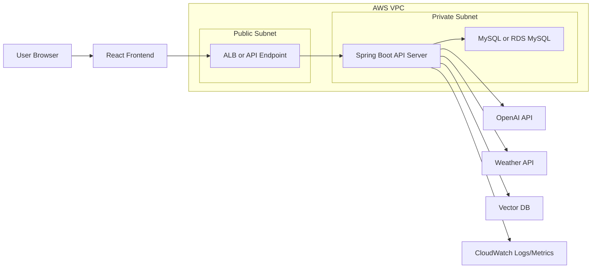

# AWS Workshop Application Plan

이 문서는 AWS 워크숍 전사본에서 배운 내용을 Project Alpha 게시판에 어떻게 기술적으로 반영할지 정리한다.
전사본에는 실습 안내, 잡담, 쉬는 시간, 오인식된 용어가 섞여 있으므로 실제 설계에 필요한 개념만 추렸다.

## 반영 원칙

- 과제 구현은 과하게 복잡한 AWS 풀세트를 먼저 붙이지 않는다.
- 현재 결정한 스택인 React, Spring Boot, MySQL, OpenAI API를 중심으로 유지한다.
- AWS 워크숍 내용은 배포 아키텍처, 보안 경계, RAG/Agent 설계 품질을 높이는 기준으로 반영한다.
- Bedrock은 이번 프로젝트에서 꼭 사용하지 않는다. 다만 Knowledge Base, Agent, Guardrail 개념은 OpenAI 기반 구현에도 그대로 적용한다.

## 워크숍 핵심과 Project Alpha 반영

| 워크숍 내용 | 핵심 의미 | Project Alpha 반영 |
| --- | --- | --- |
| Region, AZ | 리소스를 배치하는 물리적/논리적 위치 | 배포 시 서울 리전 우선, 장애 대비 설명에는 Multi-AZ 구조를 포함 |
| VPC | AWS 안의 격리된 네트워크 | 배포 README에 public/private subnet 구조를 명시 |
| Public Subnet | 인터넷에서 접근 가능한 영역 | ALB 또는 프론트 정적 배포 진입점 배치 |
| Private Subnet | 외부에서 직접 접근하지 않는 영역 | Spring Boot API 서버, MySQL/RDS 배치 후보 |
| Security Group | 리소스 단위 방화벽 | ALB -> API 서버 -> DB 순서로만 열리는 규칙 사용 |
| ALB | HTTP 요청을 여러 서버로 분산 | 백엔드가 여러 대가 될 때 진입점으로 사용 |
| Launch Template, AMI | 동일한 EC2 서버를 반복 생성하는 기준 | 초기에는 필수 아님. Auto Scaling 확장 시 사용 |
| Auto Scaling Group | 부하에 따라 EC2 수 조절 | 발표 문서에는 확장 구조로 포함, 실제 구현은 선택 |
| CloudWatch | 로그/메트릭/알람 | API 에러, CPU, 비용 알람을 배포 체크리스트에 포함 |
| S3 | 파일/문서 저장소 | 추후 사용자 업로드 문서, RAG 원본 문서 저장 후보 |
| Bedrock Knowledge Base | 문서를 청크/임베딩/벡터DB로 관리하는 RAG 관리형 서비스 | 우리 RAG의 설계 기준으로 사용. 실제 구현은 OpenAI Embedding + Vector DB |
| Bedrock Agent | LLM이 지식 검색과 외부 액션을 선택해 실행 | 우리 Agent의 도구 선택 루프 설계 기준으로 사용 |
| Guardrail | 민감정보, 금지 주제, 유해 출력을 통제 | AI 초안 생성 결과 검증, 중복/복붙 방지, 민감정보 차단에 반영 |

## AWS 배포 목표 아키텍처

처음부터 이 구조를 모두 구현하지는 않는다. 다만 README와 발표자료의 최종 아키텍처 설명은 아래 방향을 목표로 잡는다.



### 배포 단계 선택

| 단계 | 목적 | 구성 |
| --- | --- | --- |
| 1단계 로컬 검증 | 기능 구현과 학습 | React dev server, Spring Boot, Docker MySQL |
| 2단계 단순 배포 | 발표용 서비스 구동 | EC2 1대에 Spring Boot, MySQL은 Docker 또는 RDS 선택 |
| 3단계 안정 배포 | AWS 워크숍 내용 반영 | ALB, Private API 서버, RDS MySQL, CloudWatch |
| 4단계 확장 구조 | 트래픽 증가 대비 | Launch Template, Auto Scaling Group, Multi-AZ |

현재 개인 과제 일정에서는 2단계 또는 3단계를 현실적인 목표로 본다. Auto Scaling은 발표 문서의 개선 방향으로 남겨도 충분하다.

## Security Group 설계

워크숍에서 가장 실무적으로 중요한 내용은 Security Group을 IP뿐 아니라 다른 Security Group 기준으로 열 수 있다는 점이다.

| 대상 | 인바운드 허용 | 설명 |
| --- | --- | --- |
| ALB Security Group | `0.0.0.0/0:80`, 추후 `443` | 사용자가 들어오는 공개 입구 |
| API Server Security Group | ALB Security Group에서 오는 `8080` 또는 앱 포트 | API 서버는 ALB를 통해서만 접근 |
| DB Security Group | API Server Security Group에서 오는 `3306` | DB는 외부 공개 금지 |

이 구조를 쓰면 DB와 API 서버가 직접 인터넷에 노출되지 않는다.

## RAG 기능 반영

확정한 RAG 기능은 글 작성 중 AI 초안 생성이다.

### 기능 의도

사용자가 제목/본문/태그를 입력하고 AI Draft 버튼을 누르면, 기존 게시글 중 유사한 글을 찾아 참고 자료로 넣고 새로운 초안을 생성한다.

### 워크숍 개념과 매핑

| Bedrock Knowledge Base 개념 | 우리 구현 |
| --- | --- |
| S3 데이터 소스 | `posts` 테이블의 제목, 본문, 태그 |
| Chunking | 게시글 단위 또는 제목+본문 일부 단위 |
| Embedding model | OpenAI embedding model |
| Vector Store | 초기에는 구현 난이도에 맞춰 선택. 후보: Chroma, OpenSearch Serverless |
| Retrieve | 유사 게시글 top-k 검색 |
| RetrieveAndGenerate | 검색 결과를 GPT 프롬프트에 넣고 초안 생성 |

### RAG API 초안

```http
POST /api/ai/draft
Cookie: project_alpha_access_token=<JWT>
Content-Type: application/json
```

```json
{
  "title": "작성 중인 제목",
  "content": "작성 중인 메모",
  "category": "Learning",
  "tags": ["React", "Spring"]
}
```

응답은 초안만 주지 않고, 어떤 기존 글을 참고했는지도 포함한다.

```json
{
  "draftTitle": "초안 제목",
  "draftContent": "초안 본문",
  "references": [
    {
      "postId": 1,
      "title": "유사 게시글 제목",
      "similarity": 0.82
    }
  ],
  "warnings": [
    "유사도가 높은 글과 문장 구조가 겹치지 않도록 새 관점으로 작성했습니다."
  ]
}
```

### RAG 품질 가드

- 유사 게시글이 없으면 기존 글을 억지로 참고하지 않는다.
- 유사 글이 너무 높게 매칭되면 그대로 복붙하지 말고 관점/구성/예시를 바꾼다.
- 참고한 게시글 ID를 응답에 포함해 사용자가 확인할 수 있게 한다.
- GPT 응답을 바로 게시하지 않고 작성창 초안으로만 넣는다.

### Contextual Retrieval 반영

게시글 임베딩 입력에는 본문만 넣지 않고 서비스 맥락, 카테고리, 제목, 본문, 태그를 함께 넣는다.
이는 chunk가 단독으로 검색될 때 원래 게시판 맥락을 잃지 않게 하기 위한 설계다.

### 임베딩 작업 처리 흐름

게시글 생성/수정 시에는 `embedding_jobs`에 `PENDING` 작업만 예약한다.
`EmbeddingJobProcessor`는 오래된 `PENDING` 작업 하나를 `PROCESSING`으로 바꾼 뒤 OpenAI Embedding API를 호출하고, 결과를 `post_embeddings`에 저장한 후 작업을 `COMPLETED`로 마무리한다. 일시 실패는 `attempt_count` 기준으로 최대 3회까지 다시 `PENDING`으로 돌리고, 마지막 실패에서만 `FAILED`로 고정한다.
외부 API 호출은 게시글 저장 트랜잭션과 분리해 게시글 작성 속도와 OpenAI 장애를 격리한다.

## MCP 기능 반영

초기 MCP 후보는 날씨 브리핑 기반 글 작성 보조였지만, 최종 구현은 게시글 상세에서 실행하는 외부 데이터 기반 팩트체크로 정리했다. 날씨 API 연동은 유지하되, GitHub/날씨 같은 외부 도구 결과를 이미 작성된 글의 주장과 비교하는 방향이다.

워크숍의 Agent Action Group과 Lambda 개념은 MCP 도구 설계에 참고할 수 있다. 우리 프로젝트에서는 처음부터 Lambda를 쓰지 않고, MCP Server 또는 Spring Boot 내부 어댑터로 시작한다.

### MCP 도구 후보

```json
{
  "tool": "get_weather_briefing",
  "arguments": {
    "location": "Seoul",
    "date": "today"
  }
}
```

### 게시판 기능 연결

- 사용자가 Weather Briefing 버튼 클릭
- 지역 입력
- MCP 도구가 외부 날씨 API 호출
- GPT가 게시판 톤에 맞는 짧은 일상/학습 로그 초안 생성
- 결과는 작성창에 삽입

### API Key 관리

- 날씨 API Key는 프론트에 두지 않는다.
- `.env` 또는 AWS 환경변수로 백엔드/MCP 서버에만 둔다.
- README에는 키 이름만 설명하고 실제 값은 커밋하지 않는다.

## Agent 기능 반영

확정한 Agent 기능은 선호 태그 기반 놓친 글 5개 추천이다.

워크숍의 Bedrock Agent 개념 중 아래 내용을 반영한다.

- Agent는 단순 추천 함수가 아니라 여러 도구를 순서대로 선택한다.
- 무한 루프 방지를 위해 최대 단계 수를 제한한다.
- Memory/State로 사용자의 읽은 글, 선호 태그, 최근 추천 이력을 관리한다.

### Agent 도구 후보

| 도구 | 역할 |
| --- | --- |
| `get_user_preferences` | 사용자의 선호 태그 조회 |
| `find_unread_posts` | 안 읽은 게시글 후보 조회 |
| `rank_posts` | 태그, 최신성, 댓글 수 기준 랭킹 |
| `summarize_posts` | 추천 이유와 요약 생성 |

### Agent 루프 제한

- 최대 4단계까지만 실행
- 도구 호출 실패 시 사용자에게 실패 사유 반환
- 같은 도구를 2번 이상 반복 호출하지 않음
- 최종 응답은 반드시 게시글 ID 목록을 포함

## Guardrail 반영

Bedrock Guardrail 실습은 그대로 쓰지 않더라도, 다음 규칙은 우리 서비스에 직접 반영한다.

| 위험 | 대응 |
| --- | --- |
| AI가 기존 글을 거의 복사 | 유사도 높은 글이 있으면 초안 생성 프롬프트에 복붙 금지와 새 관점 요구 |
| AI가 없는 사실을 만들어냄 | 참고 게시글에 없는 정보는 추정이라고 표시 |
| 민감정보 노출 | 이메일, 전화번호, API Key 형태의 문자열을 AI 입력/출력에서 탐지 |
| 금지 주제 이탈 | 게시판 주제와 무관한 투자/의료/법률 조언은 경고 또는 거절 |
| 무한 Agent 루프 | 최대 도구 호출 횟수 제한 |

## 다음 구현 순서 제안

| 순서 | 작업 | 이유 |
| --- | --- | --- |
| 1 | OpenAI API 설정 추가 | RAG/MCP/Agent 공통 기반 |
| 2 | 게시글 임베딩 저장 구조 결정 | RAG 검색의 핵심 |
| 3 | AI Draft API 구현 | 확정된 RAG 기능을 먼저 완성 |
| 4 | 날씨 MCP 도구 구현 | 외부 API 연동 요구사항 충족 |
| 5 | 놓친 글 추천 Agent 구현 | Agent 요구사항 충족 |
| 6 | Guardrail 유틸 추가 | 발표 품질과 안정성 보강 |
| 7 | AWS 배포 체크리스트 작성 | 발표 README와 아키텍처 문서 보강 |

## 발표 문서에 넣을 표현

Project Alpha는 React와 Spring Boot 기반의 개발/학습/일상 로그 게시판이다. 기본 게시판 기능 위에 OpenAI 기반 RAG 초안 생성, MCP 외부 데이터 기반 팩트체크, 읽음 기록 기반 Agent 추천 기능을 결합한다. 배포 구조는 AWS VPC 안에서 public entry point와 private application/database 영역을 분리하는 방향으로 설계하며, 추후 ALB, RDS, CloudWatch를 통해 운영 안정성을 확장할 수 있다.
