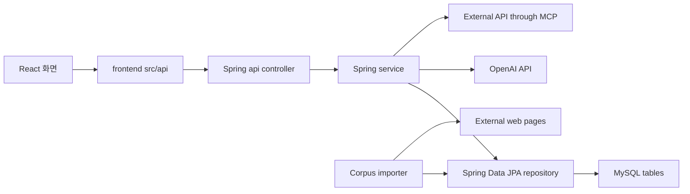

# Project Alpha Code Map

이 문서는 처음 프로젝트를 보는 사람이 파일 역할을 빠르게 잡기 위한 지도다.
기능을 고칠 때는 먼저 아래 흐름을 따라 읽고, 같은 책임의 파일 안에서 수정한다.

## 전체 흐름

## Frontend

| 경로 | 역할 | 먼저 볼 때 |
| --- | --- | --- |
| `frontend/project-alpha/src/App.jsx` | 로그인 여부에 따라 라우팅하고, 페이지와 hook을 연결 | 화면 전체 흐름 |
| `frontend/project-alpha/src/pages/BoardPage.jsx` | 게시글 목록 화면을 조립 | 메인 화면 구조 |
| `frontend/project-alpha/src/pages/PostDetailPage.jsx` | 게시글 상세, 댓글, MCP 팩트체크 화면 | 상세 화면 구조 |
| `frontend/project-alpha/src/pages/LoginPage.jsx` | 로그인 폼 | 인증 화면 |
| `frontend/project-alpha/src/pages/SignupPage.jsx` | 회원가입 폼 | 인증 화면 |
| `frontend/project-alpha/src/hooks/useAuth.js` | 로그인, 회원가입, 로그아웃 상태 관리 | JWT가 프론트에 저장되는 위치 |
| `frontend/project-alpha/src/hooks/usePosts.js` | 서버 게시글/댓글 API 호출 결과를 React 상태로 관리 | DB 데이터가 화면에 반영되는 방식 |
| `frontend/project-alpha/src/hooks/usePostComposer.js` | 글 작성/수정 폼 상태 관리 | 제목, 본문, 태그, 수정 모드 상태 |
| `frontend/project-alpha/src/hooks/useRagDraft.js` | 유사 게시글 검색과 RAG 초안 생성 상태 관리 | RAG 버튼의 loading/error/result 상태 |
| `frontend/project-alpha/src/api/postApi.js` | 게시글/댓글 HTTP 요청 함수 | 백엔드 게시판 API 주소 |
| `frontend/project-alpha/src/api/authApi.js` | 로그인/회원가입 HTTP 요청 함수 | 백엔드 인증 API 주소 |
| `frontend/project-alpha/src/api/ragApi.js` | 유사 게시글 검색과 RAG 초안 생성 요청 | RAG 프론트 진입점 |
| `frontend/project-alpha/src/api/mcpApi.js` | MCP 팩트체크 요청 | MCP 프론트 진입점 |
| `frontend/project-alpha/src/components/PostForm.jsx` | 글 작성 폼과 RAG 버튼 | 작성 모달 내부 |
| `frontend/project-alpha/src/components/WeatherFactCheckPanel.jsx` | MCP 팩트체크 결과 표시 | 팩트체크 UI |
| `frontend/project-alpha/src/components/PostCard.jsx` | 목록의 게시글 카드 | 게시글 목록 아이템 |

## Backend

| 경로 | 역할 | 먼저 볼 때 |
| --- | --- | --- |
| `backend/src/main/java/com/jungle_choi/namanmu/api/AuthController.java` | 회원가입/로그인 API | JWT 발급 흐름 |
| `backend/src/main/java/com/jungle_choi/namanmu/api/PostController.java` | 게시글 목록/상세/생성/수정/삭제 API | 게시글 API 진입점 |
| `backend/src/main/java/com/jungle_choi/namanmu/api/CommentController.java` | 댓글 생성/삭제 API | 댓글 API 진입점 |
| `backend/src/main/java/com/jungle_choi/namanmu/api/AiController.java` | 유사 게시글 검색, RAG 초안, 임베딩 작업 API | RAG API 진입점 |
| `backend/src/main/java/com/jungle_choi/namanmu/api/McpController.java` | JSON-RPC MCP endpoint | MCP 프로토콜 진입점 |
| `backend/src/main/java/com/jungle_choi/namanmu/api/PostFactCheckController.java` | 게시글 상세에서 사용하는 MCP 팩트체크 API | 외부 정보 검증 기능 |
| `backend/src/main/java/com/jungle_choi/namanmu/api/dto` | 프론트로 내려가는 응답 record | JSON 응답 모양 |
| `backend/src/main/java/com/jungle_choi/namanmu/api/mapper/PostResponseMapper.java` | Entity를 응답 DTO로 변환 | API 응답 조립 |
| `backend/src/main/java/com/jungle_choi/namanmu/domain/post/Post.java` | 게시글 Entity | `posts` 테이블 구조 |
| `backend/src/main/java/com/jungle_choi/namanmu/domain/comment/Comment.java` | 댓글 Entity | `comments` 테이블 구조 |
| `backend/src/main/java/com/jungle_choi/namanmu/domain/tag/Tag.java` | 태그 Entity | `tags` 테이블 구조 |
| `backend/src/main/java/com/jungle_choi/namanmu/domain/embedding/PostEmbedding.java` | 게시글 임베딩 Entity | `post_embeddings` 테이블 구조 |
| `backend/src/main/java/com/jungle_choi/namanmu/domain/embedding/EmbeddingJob.java` | 임베딩 작업 Entity | `embedding_jobs` 테이블 구조 |
| `backend/src/main/java/com/jungle_choi/namanmu/domain/read/PostRead.java` | 읽음 기록 Entity | Agent 추천용 상태 데이터 |
| `backend/src/main/java/com/jungle_choi/namanmu/service/PostService.java` | 게시글 검색, 상세, 생성, 수정, 삭제 규칙 | 게시글 비즈니스 로직 |
| `backend/src/main/java/com/jungle_choi/namanmu/service/CommentService.java` | 댓글 생성, 삭제와 작성자 검증 | 댓글 비즈니스 로직 |
| `backend/src/main/java/com/jungle_choi/namanmu/service/PostTagService.java` | 게시글 태그 정규화와 저장 | 태그 저장 규칙 |
| `backend/src/main/java/com/jungle_choi/namanmu/service/EmbeddingJobService.java` | 게시글 임베딩 작업 예약 | 게시글 저장 후 RAG 준비 |
| `backend/src/main/java/com/jungle_choi/namanmu/service/EmbeddingJobProcessor.java` | 임베딩 작업 처리 | OpenAI Embedding 호출 위치 |
| `backend/src/main/java/com/jungle_choi/namanmu/service/SimilarPostSearchService.java` | 코사인 유사도로 비슷한 게시글 검색 | Retrieval 구현 |
| `backend/src/main/java/com/jungle_choi/namanmu/service/RagDraftService.java` | 유사 게시글을 근거로 초안 생성 | RAG 생성 구현 |
| `backend/src/main/java/com/jungle_choi/namanmu/service/McpServerService.java` | MCP 도구 목록/호출 처리 | MCP server 핵심 |
| `backend/src/main/java/com/jungle_choi/namanmu/service/WeatherApiClient.java` | 외부 날씨 API 호출 | MCP 외부 연동 |
| `backend/src/main/java/com/jungle_choi/namanmu/service/WeatherFactCheckService.java` | 날씨 도구 결과로 게시글 팩트체크 | MCP 응용 기능 |
| `backend/src/main/java/com/jungle_choi/namanmu/service/PostReadService.java` | 상세 조회 시 읽음 기록 저장 | Agent 데이터 수집 |
| `backend/src/main/java/com/jungle_choi/namanmu/corpus/CorpusImportRunner.java` | 외부 웹 텍스트를 posts에 넣는 import 실행기 | 코퍼스 주입 진입점 |
| `backend/src/main/java/com/jungle_choi/namanmu/corpus/CorpusSourceLoader.java` | `corpus-sources.tsv` 읽기 | URL 목록 파싱 |
| `backend/src/main/java/com/jungle_choi/namanmu/corpus/CorpusWebCrawler.java` | URL의 HTML에서 본문 텍스트 추출 | 크롤링/본문 추출 |
| `backend/src/main/java/com/jungle_choi/namanmu/corpus/CorpusClassifier.java` | 카테고리 정규화와 태그 자동 보강 | 태그 처리 |
| `backend/src/main/java/com/jungle_choi/namanmu/corpus/CorpusPostImportService.java` | crawler 작성자로 posts 저장, 태그 저장, 임베딩 작업 예약 | DB 주입 |
| `backend/src/main/resources/corpus-sources.tsv` | 카테고리, 기본 태그, URL 목록 | 코퍼스 입력 파일 |

## 기능별 읽기 순서

### 게시글 생성

1. `PostForm.jsx`
2. `usePostComposer.js`
3. `App.jsx`의 `handleSubmit`
4. `usePosts.js`의 `createPost`
5. `postApi.js`의 `createPost`
6. `PostController.createPost`
7. `PostService.createPost`
8. `PostTagService.updatePostTags`
9. `EmbeddingJobService.enqueuePostEmbedding`

### RAG 초안 생성

1. `PostForm.jsx`
2. `useRagDraft.js`
3. `App.jsx`의 `handleCreateDraftFromSources`
4. `ragApi.js`의 `createDraftFromSources`
5. `AiController.createDraft`
6. `RagDraftService.createDraft`
7. `SimilarPostSearchService.searchSimilarPosts`
8. `OpenAiTextClient.generateText`

### 외부 웹 텍스트 코퍼스 주입

1. `corpus-sources.tsv`
2. `CorpusImportRunner`
3. `CorpusSourceLoader.load`
4. `CorpusWebCrawler.crawl`
5. `CorpusClassifier.buildTags`
6. `CorpusPostImportService.importDocument`
7. `PostService.createPost`
8. `EmbeddingJobService.enqueuePostEmbedding`

### MCP 날씨 팩트체크

1. `PostDetailPage.jsx`
2. `mcpApi.js`의 `checkWeatherFact`
3. `PostFactCheckController.checkWeatherFact`
4. `WeatherFactCheckService.check`
5. `McpServerService.callWeatherTool`
6. `WeatherApiClient.getCurrentForecast`

### Agent 읽음 기록

1. `PostDetailPage.jsx`
2. `postApi.js`의 `fetchPost`
3. `PostController.getPost`
4. `PostService.getPublishedPost`
5. `PostReadService.markRead`
6. `PostReadRepository.findByUserIdAndPostId`

## 현재 정리 필요 지점

- AI 기능이 늘어나면 `backend/src/main/java/com/jungle_choi/namanmu/service` 아래의 RAG, MCP, Agent 서비스를 기능별 하위 패키지로 한 번 더 나눌 수 있다.
