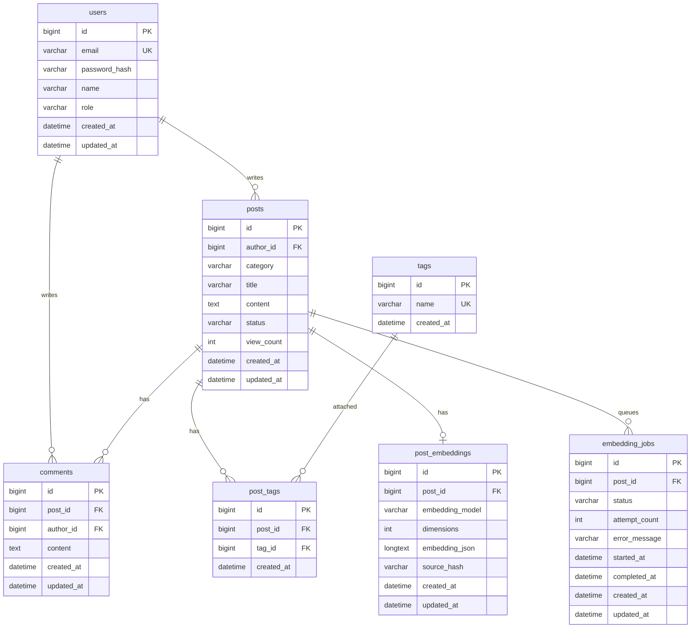

# Project Alpha Database Schema

이 문서는 Project Alpha 게시판의 기능별 테이블 설계도를 정리한다.
현재 기준은 Spring Boot JPA Entity이며, 로컬 MySQL 실행 시 `spring.jpa.hibernate.ddl-auto=update` 설정에 의해 테이블이 생성된다.

## 전체 관계도

## 기능별 테이블

| 기능 | 테이블 | Entity | 역할 |
| --- | --- | --- | --- |
| 회원가입/로그인 | `users` | `User` | 사용자 계정, 비밀번호 해시, 권한 저장 |
| 게시글 CRUD | `posts` | `Post` | 게시글 제목, 본문, 카테고리, 상태, 조회수 저장 |
| 댓글 | `comments` | `Comment` | 게시글별 댓글과 댓글 작성자 저장 |
| 태그 | `tags` | `Tag` | 태그 이름 저장 |
| 게시글-태그 연결 | `post_tags` | `PostTag` | 게시글과 태그의 다대다 관계 연결 |
| RAG 유사 게시글 | `post_embeddings` | `PostEmbedding` | 게시글별 임베딩 벡터와 원본 해시 저장 |
| RAG 임베딩 작업 큐 | `embedding_jobs` | `EmbeddingJob` | 게시글 임베딩 생성 작업의 상태와 실패 기록 저장 |

## 테이블 상세

### users

회원가입과 로그인을 위한 사용자 테이블이다.

| 컬럼 | 타입 | 제약 | 설명 |
| --- | --- | --- | --- |
| `id` | `BIGINT` | PK, AUTO_INCREMENT | 사용자 식별자 |
| `email` | `VARCHAR(100)` | NOT NULL, UNIQUE | 로그인 이메일 |
| `password_hash` | `VARCHAR(255)` | NOT NULL | 암호화된 비밀번호 |
| `name` | `VARCHAR(30)` | NOT NULL | 화면에 표시할 사용자 이름 |
| `role` | `VARCHAR(20)` | NOT NULL | `USER`, `ADMIN` |
| `created_at` | `DATETIME` | NOT NULL | 가입 시간 |
| `updated_at` | `DATETIME` | NOT NULL | 수정 시간 |

### posts

게시글 목록, 상세, 검색의 중심 테이블이다.

| 컬럼 | 타입 | 제약 | 설명 |
| --- | --- | --- | --- |
| `id` | `BIGINT` | PK, AUTO_INCREMENT | 게시글 식별자 |
| `author_id` | `BIGINT` | FK, NOT NULL | 작성자. `users.id` 참조 |
| `category` | `VARCHAR(30)` | NOT NULL | `Learning`, `Project`, `Daily` 같은 분류 |
| `title` | `VARCHAR(150)` | NOT NULL | 게시글 제목 |
| `content` | `TEXT` | NOT NULL | 게시글 본문 |
| `status` | `VARCHAR(20)` | NOT NULL | `PUBLISHED`, `HIDDEN`, `DELETED` |
| `view_count` | `INT` | NOT NULL | 조회수 |
| `created_at` | `DATETIME` | NOT NULL | 작성 시간 |
| `updated_at` | `DATETIME` | NOT NULL | 수정 시간 |

### comments

댓글 기능을 위한 테이블이다. 댓글은 게시글과 작성자를 모두 참조한다.

| 컬럼 | 타입 | 제약 | 설명 |
| --- | --- | --- | --- |
| `id` | `BIGINT` | PK, AUTO_INCREMENT | 댓글 식별자 |
| `post_id` | `BIGINT` | FK, NOT NULL | 댓글이 달린 게시글. `posts.id` 참조 |
| `author_id` | `BIGINT` | FK, NOT NULL | 댓글 작성자. `users.id` 참조 |
| `content` | `TEXT` | NOT NULL | 댓글 내용 |
| `created_at` | `DATETIME` | NOT NULL | 작성 시간 |
| `updated_at` | `DATETIME` | NOT NULL | 수정 시간 |

### tags

태그 이름을 중복 없이 관리하는 테이블이다.

| 컬럼 | 타입 | 제약 | 설명 |
| --- | --- | --- | --- |
| `id` | `BIGINT` | PK, AUTO_INCREMENT | 태그 식별자 |
| `name` | `VARCHAR(50)` | NOT NULL, UNIQUE | 태그 이름 |
| `created_at` | `DATETIME` | 생성 시 입력 | 태그 생성 시간 |

### post_tags

게시글과 태그의 다대다 관계를 연결하는 중간 테이블이다.

| 컬럼 | 타입 | 제약 | 설명 |
| --- | --- | --- | --- |
| `id` | `BIGINT` | PK, AUTO_INCREMENT | 연결 식별자 |
| `post_id` | `BIGINT` | FK, NOT NULL | 게시글. `posts.id` 참조 |
| `tag_id` | `BIGINT` | FK, NOT NULL | 태그. `tags.id` 참조 |
| `created_at` | `DATETIME` | 생성 시 입력 | 태그 연결 시간 |

`post_id`, `tag_id` 조합에는 unique 제약이 있다. 같은 게시글에 같은 태그가 중복으로 붙지 않게 하기 위해서다.

### post_embeddings

RAG 유사 게시글 검색을 위한 게시글 임베딩 저장 테이블이다.
초기 구현에서는 MySQL에 임베딩을 JSON 문자열로 저장하고, 서버 코드에서 cosine similarity를 계산한다.
데이터가 커지면 Chroma, OpenSearch, pgvector 같은 전용 Vector DB로 교체할 수 있다.

| 컬럼 | 타입 | 제약 | 설명 |
| --- | --- | --- | --- |
| `id` | `BIGINT` | PK, AUTO_INCREMENT | 임베딩 식별자 |
| `post_id` | `BIGINT` | FK, UNIQUE, NOT NULL | 임베딩 대상 게시글. `posts.id` 참조 |
| `embedding_model` | `VARCHAR(100)` | NOT NULL | 임베딩 생성에 사용한 모델명 |
| `dimensions` | `INT` | NOT NULL | 임베딩 벡터 차원 수 |
| `embedding_json` | `LONGTEXT` | NOT NULL | 벡터 값을 JSON 배열 문자열로 저장 |
| `source_hash` | `VARCHAR(64)` | NOT NULL | 임베딩 입력 문자열의 SHA-256 해시. 재생성 필요 여부 판단용 |
| `created_at` | `DATETIME` | NOT NULL | 최초 생성 시간 |
| `updated_at` | `DATETIME` | NOT NULL | 마지막 갱신 시간 |

`post_id`는 unique 제약을 둔다. 게시글 하나에는 현재 기준의 최신 임베딩 하나만 연결하기 위해서다.

### embedding_jobs

게시글 저장과 OpenAI Embedding API 호출을 분리하기 위한 작업 큐 테이블이다.
게시글 생성/수정 트랜잭션에서는 이 테이블에 `PENDING` 작업만 예약하고, 실제 외부 API 호출은 별도 수동 실행 API 또는 Scheduler가 처리한다.
현재 구현은 게시글 생성/수정이 완료될 때 `EmbeddingJobService`가 중복 `PENDING` 작업을 확인한 뒤 새 작업을 예약한다.

| 컬럼 | 타입 | 제약 | 설명 |
| --- | --- | --- | --- |
| `id` | `BIGINT` | PK, AUTO_INCREMENT | 임베딩 작업 식별자 |
| `post_id` | `BIGINT` | FK, NOT NULL | 임베딩을 생성할 게시글. `posts.id` 참조 |
| `status` | `VARCHAR(20)` | NOT NULL | `PENDING`, `PROCESSING`, `COMPLETED`, `FAILED` |
| `attempt_count` | `INT` | NOT NULL | 처리 시도 횟수 |
| `error_message` | `VARCHAR(1000)` | NULL | 마지막 실패 사유 |
| `started_at` | `DATETIME` | NULL | 마지막 처리 시작 시간 |
| `completed_at` | `DATETIME` | NULL | 성공 또는 실패로 처리 종료된 시간 |
| `created_at` | `DATETIME` | NOT NULL | 작업 예약 시간 |
| `updated_at` | `DATETIME` | NOT NULL | 작업 상태 갱신 시간 |

이 테이블은 완성된 벡터를 저장하지 않는다. 완성된 결과는 `post_embeddings`에 저장하고, `embedding_jobs`는 처리해야 할 일과 처리 상태만 관리한다.

## 현재 API 연결 상태

| API | 현재 상태 |
| --- | --- |
| `GET /api/posts` | `PostRepository`를 통해 `posts` 테이블 조회 |
| `POST /api/posts` | 아직 미구현. 다음 단계에서 게시글 저장 API로 추가 예정 |
| 댓글 API | 아직 미구현 |
| 태그 API | 아직 미구현 |
| 회원가입/로그인 API | 아직 미구현 |

현재 `GET /api/posts` 응답은 게시글과 작성자 이름만 DB에서 가져온다. 태그와 댓글은 응답 구조만 유지하고 빈 배열로 내려간다.

## 확장 후보

AI 기능과 개인화 기능은 아직 테이블로 만들지 않았다. 구현 시점에 아래 후보를 추가 검토한다.

| 기능 | 후보 테이블 | 목적 |
| --- | --- | --- |
| AI 초안 생성 기록 | `ai_draft_logs` | 입력 초안, 참조 게시글, 생성 결과, 모델명 저장 |
| MCP 날씨 브리핑 | `weather_briefing_logs` | 지역, 날씨 원본 데이터, 생성된 브리핑 저장 |
| 놓친 글 추천 Agent | `post_reads`, `user_interests` | 읽은 글 기록, 사용자 선호 태그 저장 |

## 유지보수 규칙

- 기능 하나를 추가할 때 먼저 어떤 테이블이 필요한지 이 문서에 기록한다.
- Entity 필드명을 바꾸면 DB 컬럼명도 함께 바뀔 수 있으므로 API와 프론트 응답을 같이 확인한다.
- 로컬 개발에서는 `ddl-auto=update`를 사용하지만, 배포 단계에서는 Flyway 또는 Liquibase 같은 migration 도구를 검토한다.
- 비밀번호, DB 주소, API key는 `.env` 또는 배포 환경변수로 관리하고 Git에 커밋하지 않는다.
