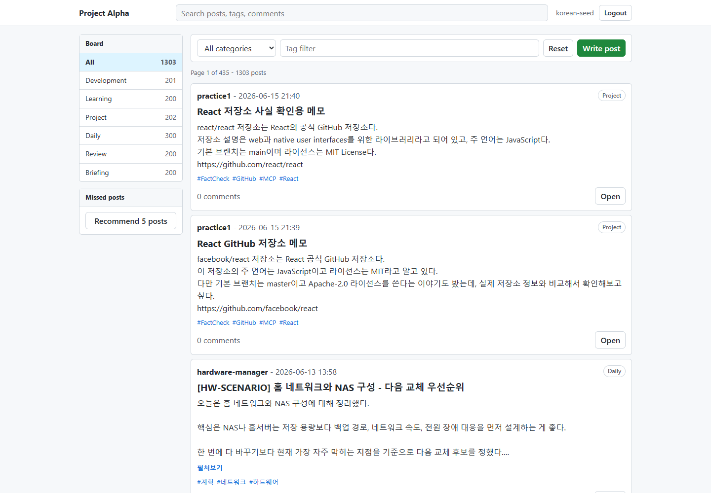
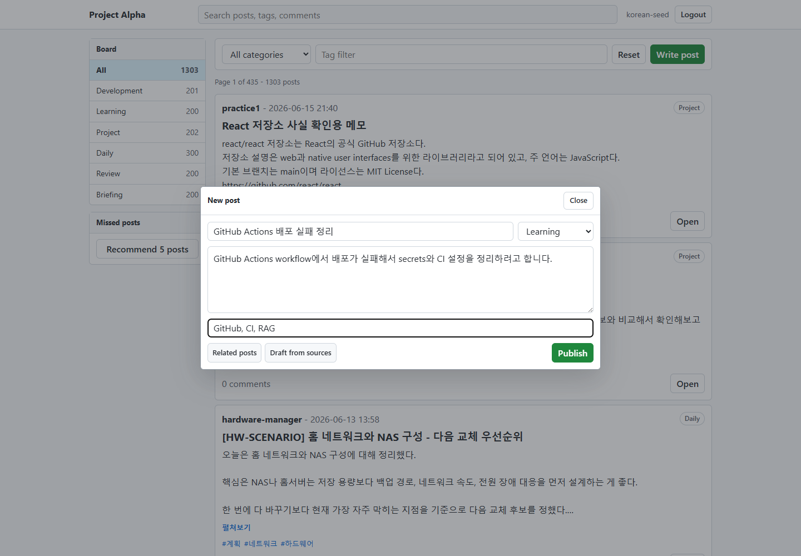
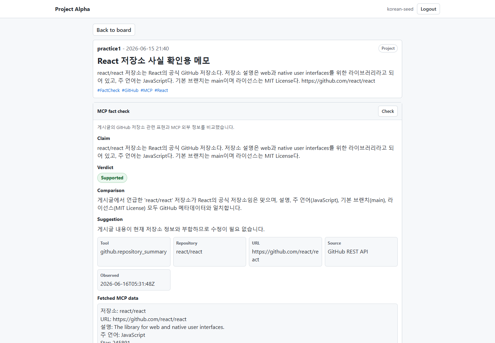

# Project Alpha 데모 시나리오

이 문서는 발표와 제출용 데모 흐름을 정리한다. 목표는 기능을 많이 나열하는 것이 아니라, "기본 게시판 위에 RAG, MCP, Agent가 어떻게 붙어 있는가"를 5분 안에 보여주는 것이다.

## 데모 계정

| 항목 | 값 |
|---|---|
| URL | `http://127.0.0.1:5173` |
| Username | `korean-seed` |
| Password | `korean-seed-password` |
| Backend | `http://127.0.0.1:8080` |

## 실행 상태 확인

| 서버 | 확인 방법 | 기대 상태 |
|---|---|---|
| Frontend | `http://127.0.0.1:5173` 접속 | 로그인 화면 또는 게시판 화면 |
| Backend | `http://127.0.0.1:8080` | API 응답 가능 |
| MySQL | `docker compose ps mysql` | `running` |
| Qdrant | `http://127.0.0.1:6333/dashboard` | Qdrant dashboard 접근 가능 |

## 데모 흐름

| 순서 | 화면 | 보여줄 것 | 말할 포인트 |
|---:|---|---|---|
| 1 | 로그인 | `korean-seed` 계정으로 로그인 | JWT 기반 인증으로 게시판 API를 호출한다. |
| 2 | 메인 게시판 | 카테고리별 게시글 수, 검색, 페이징, 게시글 목록 | 기본 게시판 기능은 서버 DB를 기준으로 동작한다. |
| 3 | 글 작성 모달 | 제목, 본문, 태그 입력 후 `Related posts`와 `Draft from sources` 버튼 확인 | RAG 기능이 별도 챗봇이 아니라 글쓰기 흐름 안에 들어가 있다. |
| 4 | RAG 유사글 검색 | 작성 중인 글과 비슷한 기존 게시글 추천 | Qdrant 후보 검색 후 BM25/RRF/metadata/chunk evidence로 재정렬한다. |
| 5 | RAG 초안 생성 | 유사 게시글을 근거로 초안 생성 | LLM이 빈손으로 글을 만드는 것이 아니라 기존 게시글을 근거로 사용한다. |
| 6 | 상세 페이지 | 게시글 본문, 태그, 댓글, MCP fact check 패널 | 작성된 글에 대해 외부 데이터 검증을 실행할 수 있다. |
| 7 | MCP fact check | GitHub 저장소 정보와 게시글 주장 비교 | MCP server가 외부 GitHub API를 호출하고, 글 내용과 비교한 판정을 반환한다. |
| 8 | Agent 추천 | `Recommend 5 posts` 실행 | 사용자 읽음 기록을 바탕으로 이미 본 글을 제외한 추천을 만든다. |

## 스크린샷

### 게시판 메인

### RAG 글 작성 입력 상태

### MCP Fact Check 결과

## 데모 입력 예시

| 기능 | 입력 |
|---|---|
| RAG 제목 | `GitHub Actions 배포 실패 정리` |
| RAG 본문 | `GitHub Actions workflow에서 배포가 실패해서 secrets와 CI 설정을 정리하려고 합니다.` |
| RAG 태그 | `GitHub, CI, RAG` |
| MCP 게시글 예시 | `React 저장소 사실 확인용 메모` |
| Agent 시나리오 | 하드웨어/React/GitHub 관련 글을 몇 개 읽은 뒤 놓친 글 추천 실행 |

## 실패 시 대처

| 문제 | 확인 |
|---|---|
| 로그인 실패 | `korean-seed` 계정이 없으면 `scripts/import-korean-seed.mjs` 또는 회원가입으로 계정 생성 |
| 게시글이 비어 있음 | MySQL 컨테이너와 seed/import 데이터 확인 |
| RAG 결과가 비어 있음 | OpenAI API key, `embedding_jobs`, Qdrant 동기화 상태 확인 |
| MCP GitHub 결과 실패 | 네트워크, GitHub API rate limit, 게시글에 GitHub URL 포함 여부 확인 |
| Agent 추천이 약함 | 해당 계정의 읽음 기록과 `post_reads` 데이터 확인 |
