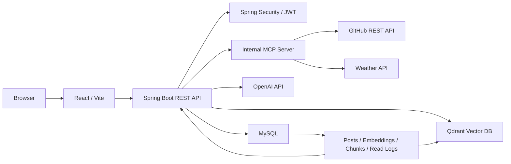
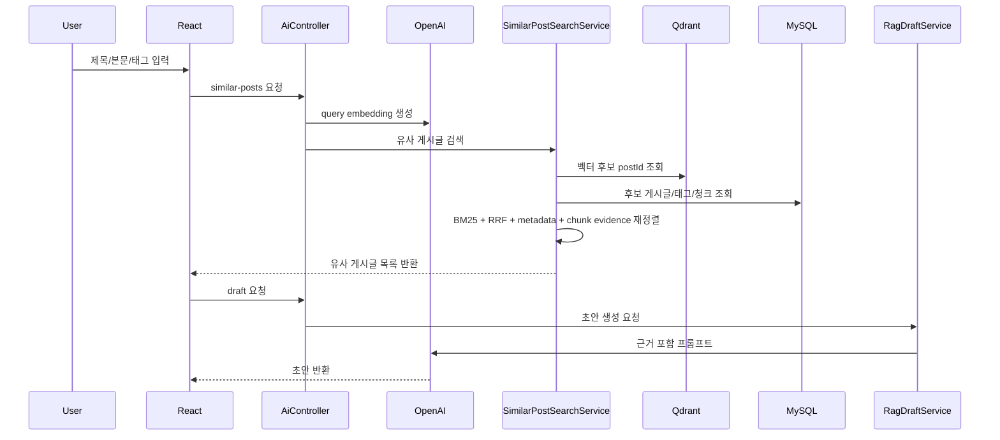
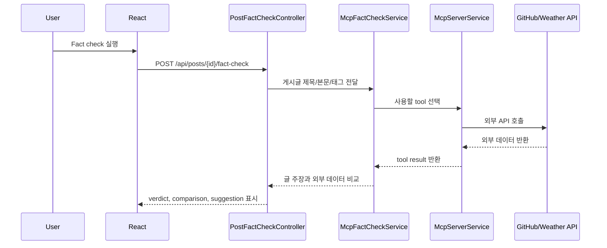
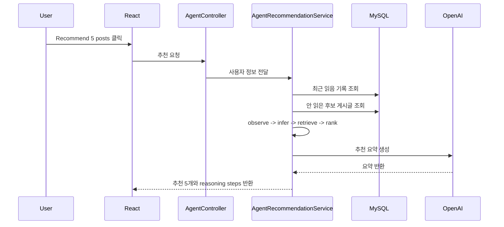

# Project Alpha 최종 제출 문서

## 1. 프로젝트 개요

Project Alpha는 개발, 학습, 프로젝트, 일상 기록을 남기는 LinkedIn 스타일의 AI 게시판이다. 단순 게시판 CRUD에 그치지 않고, 글쓰기 흐름 안에 RAG, MCP, AI Agent를 넣어 사용자가 글을 더 잘 쓰고, 이미 쓴 글을 외부 데이터로 검증하고, 놓친 글을 추천받을 수 있게 만드는 것을 목표로 했다.

핵심 컨셉은 다음과 같다.

| 질문 | 답 |
|---|---|
| 어떤 서비스인가 | 개발/학습/프로젝트/일상 기록을 남기는 AI 게시판 |
| 왜 만들었나 | 게시판 데이터를 LLM과 연결해 글쓰기 보조, 사실 검증, 개인화 추천을 경험하기 위해 |
| 주요 사용자 흐름 | 글 작성 -> 유사글 검색 -> 근거 기반 초안 생성 -> 게시글 발행 -> 외부 데이터 fact check -> 놓친 글 추천 |
| 구현 방식 | React frontend, Spring Boot backend, MySQL, Qdrant, OpenAI API, 내부 MCP server |

## 2. 요구사항 대응

| 과제 요구사항 | 구현 내용 |
|---|---|
| Frontend React | React, Vite, React Router 기반 UI |
| Backend 선택 | Spring Boot 3.5, Java 25 |
| Database 선택 | MySQL 8.4 |
| 회원가입/로그인 | Spring Security, httpOnly cookie JWT, refresh token rotation |
| 게시글 CRUD | 목록, 상세, 생성, 수정, 삭제 |
| 댓글 | 상세 페이지 댓글 생성/삭제 |
| 태그 | 태그 저장, 표시, 태그 검색 |
| 페이징 | 서버 API 기반 페이지네이션 |
| 검색 | 키워드, 카테고리, 태그 검색 |
| RAG | 유사 게시글 검색, 근거 기반 AI 초안 생성 |
| MCP | JSON-RPC 형태의 내부 MCP server와 GitHub/날씨 외부 도구 |
| AI Agent | 사용자 읽음 기록 기반 놓친 글 5개 추천 |

## 3. 전체 기술 아키텍처




### 기술 스택

| 영역 | 기술 |
|---|---|
| Frontend | React, Vite, React Router |
| Backend | Spring Boot 3.5, Java 25 |
| ORM | Spring Data JPA, Hibernate |
| Database | MySQL 8.4 |
| Auth | Spring Security, JWT, CSRF |
| LLM | OpenAI `gpt-4.1-mini` |
| Embedding | OpenAI `text-embedding-3-small` |
| Vector DB | Qdrant |
| RAG retrieval | Qdrant vector search, BM25, RRF, metadata signals, chunk evidence |
| Korean search | Apache Lucene Nori |
| MCP tools | GitHub REST API, Weather API |
| Agent state | MySQL `post_reads` |
| Deployment | AWS EC2, Docker Compose |

## 4. 주요 구현 기능

### 4.1 기본 게시판

| 기능 | 구현 |
|---|---|
| 인증 | 회원가입, 로그인, 로그아웃, refresh token rotation |
| 보안 | httpOnly cookie, CSRF token, 로그인 실패 rate limit, AI 요청 rate limit |
| 게시글 | 생성, 조회, 수정, 삭제 |
| 댓글 | 게시글 상세에서 댓글 생성/삭제 |
| 태그 | 태그 저장, 태그 검색 |
| 검색 | 키워드, 카테고리, 태그 조합 검색 |
| 페이징 | `1`, `현재-1`, `현재`, `현재+1`, `마지막` 형태의 축약 페이지네이션 |
| UI | 글쓰기 모달, 긴 본문 접기/펼치기, 게시글 상세 화면 |

### 4.2 운영성

| 항목 | 구현 |
|---|---|
| DB schema | Flyway migration `V1__create_project_alpha_schema.sql` |
| 로컬 실행 | Docker Compose로 MySQL/Qdrant 실행 |
| AWS 배포 | EC2 한 대에서 frontend/backend/mysql/qdrant 실행 |
| 데이터 이전 | 로컬 MySQL dump -> EC2 import -> Qdrant sync |
| 관리자 API | embedding job 처리, Qdrant sync, RAG 평가 API는 ADMIN 권한 필요 |
| QA | backend test, frontend build, API/browser smoke test 문서화 |

## 5. RAG 기능

### 5.1 기능 설명

사용자가 글 작성 모달에서 제목, 본문, 태그를 입력하면 `Related posts` 버튼으로 기존 게시글 중 유사한 글을 찾는다. 이후 `Draft from sources` 버튼을 누르면 직접 관련성이 높은 유사글을 근거로 AI 초안을 생성한다.

### 5.2 RAG 아키텍처



### 5.3 검색 파이프라인

```text
사용자 작성글
-> OpenAI Embedding 생성
-> Qdrant에서 유사 벡터 후보 postId 검색
-> MySQL에서 후보 게시글/태그/청크 원본 조회
-> Nori 기반 한국어 토큰화
-> Vector score 계산
-> BM25 score 계산
-> RRF로 vector rank와 BM25 rank 결합
-> metadata/category/tag/keyword/chunk evidence 반영
-> 상위 유사 게시글 반환
-> 선택된 유사글을 근거로 AI 초안 생성
```

### 5.4 최종 RAG 성능

최종 운영 설정은 실제 Spring Boot API, OpenAI, Qdrant, MySQL 경로를 모두 태운 온라인 후보 검증 결과를 기준으로 선택했다.

| Metric | Score |
|---|---:|
| Precision@5 | 0.8667 |
| Recall@5 | 0.4957 |
| MRR@5 | 1.0000 |
| NDCG@5 | 0.9076 |
| Hit@5 | 1.0000 |

해석:

- `MRR@5 = 1.0`, `Hit@5 = 1.0`이므로 모든 평가 케이스에서 상위 5개 안에 관련 글이 있었고, 첫 번째 추천이 관련 글이었다.
- `Recall@5`는 낮지만, 관련 글이 많은 주제에서 top5만 보는 기능 특성상 구조적으로 낮게 나올 수 있다.
- Project Alpha의 목표는 지식 검색 엔진처럼 모든 관련 글을 찾는 것이 아니라, 글 작성 중 참고할 상위 3~5개 게시글을 추천하는 것이다.

자세한 실험 과정은 [RAG 검색 성능 보고서](rag-performance-report.md)에 정리했다.

## 6. MCP 기능

### 6.1 기능 설명

MCP 기능은 이미 작성된 게시글을 외부 데이터와 비교하는 fact check 기능으로 구현했다. 사용자가 게시글 상세 화면에서 `Check` 버튼을 누르면, 서버가 게시글 내용에서 GitHub 저장소나 날씨 관련 주장을 찾고 적절한 MCP tool을 호출한다.

### 6.2 MCP 아키텍처



### 6.3 구현한 MCP 도구

| 도구 | 외부 시스템 | 역할 |
|---|---|---|
| GitHub repository summary | GitHub REST API | 저장소 이름, URL, 설명, star/fork/open issue, updatedAt 등 확인 |
| Weather current forecast | 날씨 API | 지역 날씨 주장 확인 |

판정은 `Supported`, `Contradicted`, `Insufficient`, `Not supported`처럼 사용자가 바로 이해할 수 있는 형태로 반환한다.

## 7. AI Agent 기능

### 7.1 기능 설명

Agent는 사용자의 최근 읽은 글을 관찰하고, 태그와 카테고리 흐름을 바탕으로 관심사를 추론한 뒤, 이미 읽은 글을 제외하고 놓쳤을 법한 글 5개를 추천한다.

### 7.2 Agent 아키텍처



### 7.3 Agent 상태 관리

| 항목 | 구현 |
|---|---|
| 읽음 기록 | `post_reads` 테이블 |
| 저장 제한 | 사용자별 최근 읽은 글 50개 유지 |
| 추천 제외 | 이미 읽은 글은 후보에서 제외 |
| 추천 기준 | 카테고리 점수, 태그 점수, 최신성 점수 |
| 무한 루프 방지 | observe, infer, retrieve, rank 최대 4단계 |

## 8. AI 비용 추정

Project Alpha는 OpenAI API 비용이 발생하는 지점을 기능별로 분리했다.

| 기능 | 모델 | 비용 성격 |
|---|---|---|
| 게시글/청크 임베딩 | `text-embedding-3-small` | 게시글 저장/수정 후 비동기 job 비용 |
| 유사글 검색 | `text-embedding-3-small` | query embedding 비용 |
| RAG 초안 생성 | `gpt-4.1-mini` | 근거 기반 초안 생성 비용 |
| Agent 추천 요약 | `gpt-4.1-mini` | 추천 이유 요약 비용 |
| MCP fact check | OpenAI 호출 없음 | GitHub/날씨 API 직접 호출 |

2026-06-17 AWS 검증 기준:

| 항목 | 값 |
|---|---:|
| 공개 게시글 | 1303 |
| 전체 게시글 row | 1312 |
| 게시글 전체 임베딩 벡터 | 1312 |
| 청크 임베딩 벡터 | 5422 |
| 현재 코퍼스 재임베딩 추정 비용 | 약 `$0.08 ~ $0.20` |
| RAG 초안 생성 1회 추정 비용 | 약 `$0.0016 ~ $0.0044` |

비용을 줄이기 위해 RAG 초안에 넣는 근거 게시글을 최대 3개로 제한하고, 각 근거 본문 excerpt를 900자로 제한했다. 또한 사용자-facing AI 요청에는 rate limit을 적용하고, 대량 임베딩 처리와 Qdrant sync는 관리자 API로 보호했다.

자세한 계산은 [AI 비용 추정 문서](ai-cost-estimate.md)에 정리했다.

## 9. AWS 배포

최소 배포는 EC2 한 대에서 Docker Compose로 frontend, backend, MySQL, Qdrant를 함께 실행하는 방식으로 구성했다.

| 항목 | 값 |
|---|---|
| Region | `ap-northeast-2` Seoul |
| EC2 | Amazon Linux 2023, `t3.small` |
| Frontend | Nginx container, port 80 |
| Backend | Spring Boot container, port 8080 |
| DB | MySQL container |
| Vector DB | Qdrant container |
| 데이터 이전 | 로컬 MySQL dump gzip 약 54MB -> EC2 import |

AWS 검증 결과:

| 항목 | 결과 |
|---|---|
| Frontend | HTTP 200 |
| Backend health | `UP` |
| MySQL | healthy |
| Qdrant | running |
| `embedding_jobs` | `COMPLETED 2514`, `FAILED 0` |

배포 절차는 [AWS EC2 배포 가이드](aws-ec2-deployment.md), 데이터 이전 절차는 [AWS 데이터 이전 가이드](aws-data-migration.md)에 정리했다.

## 10. 데모

### 10.1 데모 계정

| 항목 | 값 |
|---|---|
| AWS URL | `http://3.37.55.77` |
| Username | `korean-seed` |
| Password | `korean-seed-password` |

### 10.2 데모 흐름

| 순서 | 동작 | 확인할 기능 |
|---:|---|---|
| 1 | 로그인 | JWT cookie 인증 |
| 2 | 메인 게시판 확인 | 검색, 카테고리, 태그, 페이징 |
| 3 | `Write post` 클릭 | 글쓰기 모달 |
| 4 | 제목/본문/태그 입력 후 `Related posts` | RAG 유사글 검색 |
| 5 | `Draft from sources` | 근거 기반 AI 초안 생성 |
| 6 | 게시글 발행 후 상세 이동 | 게시글 CRUD |
| 7 | `MCP fact check` 실행 | 외부 데이터 기반 검증 |
| 8 | 메인에서 `Recommend 5 posts` | Agent 추천 |

### 10.3 데모 스크린샷

#### 게시판 메인


#### RAG 글 작성


#### MCP Fact Check


## 11. 테스트와 QA

| 구분 | 확인 |
|---|---|
| Backend test | `.\gradlew.bat test` 통과 |
| Frontend build | `npm run build` 통과 |
| API smoke test | 인증, 게시글, 댓글, 검색, RAG, MCP, Agent 확인 |
| Browser smoke test | 로그인, 메인, 글쓰기 모달, RAG 버튼, 페이징 확인 |
| AWS smoke test | frontend/backend/mysql/qdrant 실행 확인 |

자세한 체크리스트는 [QA 체크리스트](qa-checklist.md)에 정리했다.

## 12. 회고

### 잘한 점

| 항목 | 내용 |
|---|---|
| 기능 통합 | 기본 게시판 위에 RAG, MCP, Agent를 실제 화면 흐름으로 연결했다. |
| RAG 개선 | vector-only에서 Qdrant + BM25 + RRF + Nori + chunk evidence 구조로 발전시켰다. |
| 운영성 보강 | JWT, refresh token, CSRF, rate limit, admin endpoint 보호를 추가했다. |
| 실험 기록 | RAG 성능 개선 과정을 수치와 시나리오 입출력으로 문서화했다. |
| 배포 경험 | 로컬 데이터와 임베딩을 AWS EC2 환경으로 이전하고 Qdrant까지 동기화했다. |

### 어려웠던 점

| 항목 | 내용 |
|---|---|
| RAG 품질 판단 | 유사도 점수가 높다고 실제 사용자에게 좋은 추천은 아니었다. 정량 지표와 실제 출력 확인을 함께 봐야 했다. |
| 한국어 검색 | 조사, 어미, 고유명사 때문에 단순 공백 토큰화만으로는 검색 품질이 흔들렸다. |
| 청크 전략 | 청크 단독 검색은 전체 글 맥락을 잃을 수 있어, 전체글 임베딩을 주 기준으로 두고 청크는 보조 근거로 사용했다. |
| 운영 배포 | 로컬에서는 분리되어 있던 frontend/backend/mysql/qdrant를 EC2 한 대에서 안정적으로 띄우는 과정이 필요했다. |

### 한계

| 한계 | 설명 |
|---|---|
| 평가셋 규모 | RAG 최종 온라인 평가는 6개 대표 케이스 중심이라 일반화에는 한계가 있다. |
| Reranker 부재 | cross-encoder reranker나 LLM reranker는 아직 붙이지 않았다. |
| MCP 도구 범위 | GitHub와 날씨 중심이며, 공공데이터/Jira/Slack/뉴스 API 등은 확장 대상이다. |
| 비용 로그 | OpenAI usage를 DB에 영구 저장하지 않아 기능별 실제 비용 대시보드는 없다. |
| 배포 구조 | EC2 한 대에 DB와 Vector DB가 함께 있어 운영 안정성은 낮다. |

### 개선 아이디어

| 개선 | 설명 |
|---|---|
| RAG 평가셋 확장 | holdout 평가셋과 수동 라벨링을 늘려 과적합 위험을 줄인다. |
| Reranker 도입 | topN 후보 뒤에 cross-encoder reranker나 LLM reranker를 붙여 Precision/NDCG를 비교한다. |
| AI usage logging | 기능별 input/output token과 예상 비용을 `ai_usage_logs` 테이블에 저장한다. |
| MCP 도구 확장 | 공공데이터, Jira, Slack, 뉴스 API 등으로 fact check 범위를 넓힌다. |
| 배포 개선 | RDS MySQL, HTTPS, reverse proxy, CloudWatch alarm, managed vector DB를 검토한다. |

## 13. 주요 문서 링크

| 문서 | 설명 |
|---|---|
| [README](../README.md) | 프로젝트 전체 안내 |
| [코드 읽기 로드맵](code-reading-roadmap.md) | 초보자용 코드 학습 순서 |
| [코드 맵](code-map.md) | 파일별 역할 |
| [DB 스키마](database-schema.md) | 테이블 구조 |
| [RAG 검색 성능 보고서](rag-performance-report.md) | RAG 실험과 최종 지표 |
| [AI 비용 추정](ai-cost-estimate.md) | 토큰 비용 계산 |
| [AWS EC2 배포 가이드](aws-ec2-deployment.md) | 배포 절차 |
| [AWS 데이터 이전 가이드](aws-data-migration.md) | DB dump와 Qdrant sync |
| [데모 시나리오](demo-scenario.md) | 데모 흐름과 스크린샷 |
| [QA 체크리스트](qa-checklist.md) | 최종 기능 검증 |
| [면접 질문 대비](interview-qa.md) | 예상 질문과 답변 |
