# 전체 기능 시퀀스 다이어그램

분석 기준: `frontend/src/App.jsx`, `frontend/src/api/client.js`, `backend/src/main/java`, `backend/src/main/resources/db/migration/V1__init.sql`, `docker-compose.yml`, `infra/nginx/default.conf`를 기준으로 확인했다.

## 확인됨 / 설계 해석

- 확인됨: Frontend API 호출은 `client.js`의 `authApi`, `postApi`, `aiApi`를 통해 이뤄진다.
- 확인됨: 인증이 필요한 요청은 Axios interceptor가 `localStorage.token`을 `Authorization: Bearer ...`로 붙인다.
- 확인됨: Backend의 일반 기능은 `Controller -> Service -> Repository -> DB` 흐름이다.
- 확인됨: RAG 기능은 `RagService -> OpenAiClient -> JdbcTemplate -> post_embeddings` 흐름이다.
- 확인됨: MCP 기능은 `McpService -> GitHub API -> mcp_tool_logs` 흐름이다.
- 확인됨: Agent 기능은 `AgentService`가 RAG, MCP, OpenAI, memory/log 저장을 조합한다.
- 설계 해석: 이 문서는 “사용자 기능 단위”로 시퀀스를 나눴다. 이유는 초보자가 다시 구현할 때 API endpoint 단위보다 사용자가 누르는 버튼/행동 단위가 더 기억하기 쉽기 때문이다.

---

## [1] 전체 구조 설명 (Top-down)

### 전체 기능 묶음

```txt
1. 앱 실행/초기 목록 조회
2. 회원가입
3. 로그인
4. 로그아웃
5. 게시글 목록/검색/페이징
6. 게시글 상세 조회
7. 게시글 작성
8. 게시글 수정
9. 게시글 삭제
10. 댓글 작성
11. 댓글 삭제
12. RAG 자동 인덱싱
13. RAG 유사 글 검색/요약
14. MCP GitHub 사용자 조회
15. MCP GitHub 저장소 조회
16. Agent 작성 보조
17. JWT 인증 공통 흐름
18. 예외 응답 공통 흐름
19. Docker Compose/Nginx 실행 흐름
```

### 왜 이 순서인가

사용자가 실제로 앱을 쓰는 순서와 백엔드 내부 기능 의존 순서를 같이 반영했다. 예를 들어 게시글 작성은 인증, 태그 처리, 게시글 저장, RAG 인덱싱을 모두 포함하므로 단순 CRUD보다 뒤쪽에 AI 자동 인덱싱 흐름을 따로 분리했다.

---

## 1. 앱 실행 / 초기 목록 조회

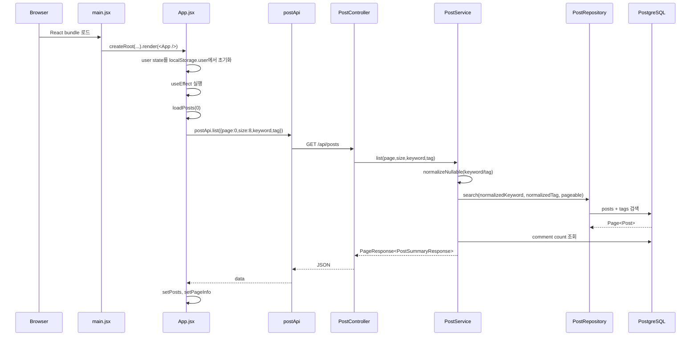
```mermaid
sequenceDiagram
    participant Browser as Browser
    participant Main as main.jsx
    participant App as App.jsx
    participant Client as postApi
    participant Controller as PostController
    participant Service as PostService
    participant Repo as PostRepository
    participant DB as PostgreSQL

    Browser->>Main: React bundle 로드
    Main->>App: createRoot(...).render(<App />)
    App->>App: user state를 localStorage.user에서 초기화
    App->>App: useEffect 실행
    App->>App: loadPosts(0)
    App->>Client: postApi.list({page:0,size:8,keyword,tag})
    Client->>Controller: GET /api/posts
    Controller->>Service: list(page,size,keyword,tag)
    Service->>Service: normalizeNullable(keyword/tag)
    Service->>Repo: search(normalizedKeyword, normalizedTag, pageable)
    Repo->>DB: posts + tags 검색
    DB-->>Repo: Page<Post>
    Service->>DB: comment count 조회
    Service-->>Controller: PageResponse<PostSummaryResponse>
    Controller-->>Client: JSON
    Client-->>App: data
    App->>App: setPosts, setPageInfo
```

### 왜 이 흐름인가

초기 화면은 사용자가 아무 버튼을 누르지 않아도 게시판 목록을 보여줘야 한다. 그래서 `useEffect`에서 `loadPosts(0)`를 실행한다. 목록 응답은 상세 본문 전체가 아니라 `PostSummaryResponse`를 사용해 미리보기와 댓글 수만 내려준다.

---

## 2. 회원가입

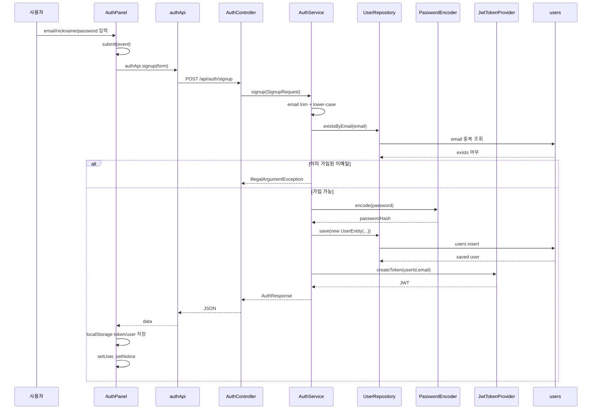
```mermaid
sequenceDiagram
    participant User as 사용자
    participant AuthPanel
    participant Client as authApi
    participant Controller as AuthController
    participant Service as AuthService
    participant Repo as UserRepository
    participant Encoder as PasswordEncoder
    participant Jwt as JwtTokenProvider
    participant DB as users

    User->>AuthPanel: email/nickname/password 입력
    AuthPanel->>AuthPanel: submit(event)
    AuthPanel->>Client: authApi.signup(form)
    Client->>Controller: POST /api/auth/signup
    Controller->>Service: signup(SignupRequest)
    Service->>Service: email trim + lower-case
    Service->>Repo: existsByEmail(email)
    Repo->>DB: email 중복 조회
    DB-->>Repo: exists 여부
    alt 이미 가입된 이메일
        Service-->>Controller: IllegalArgumentException
    else 가입 가능
        Service->>Encoder: encode(password)
        Encoder-->>Service: passwordHash
        Service->>Repo: save(new UserEntity(...))
        Repo->>DB: users insert
        DB-->>Repo: saved user
        Service->>Jwt: createToken(userId,email)
        Jwt-->>Service: JWT
        Service-->>Controller: AuthResponse
        Controller-->>Client: JSON
        Client-->>AuthPanel: data
        AuthPanel->>AuthPanel: localStorage token/user 저장
        AuthPanel->>AuthPanel: setUser, setNotice
    end
```

### 왜 이 흐름인가

회원가입 직후 바로 로그인 상태로 만들기 위해 `AuthService.signup()`도 `AuthResponse`와 JWT를 반환한다. 비밀번호는 평문 저장하면 안 되기 때문에 `PasswordEncoder.encode()`를 거쳐 `password_hash`로 저장한다.

---

## 3. 로그인

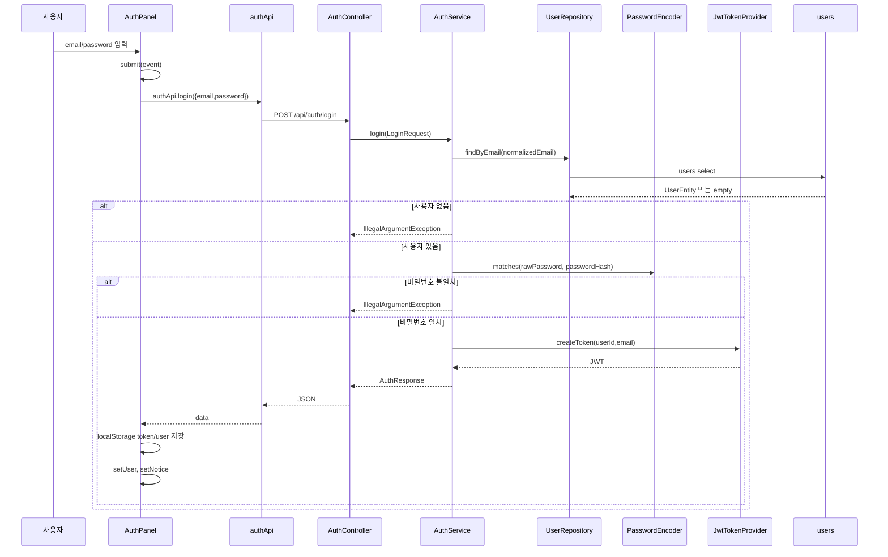
```mermaid
sequenceDiagram
    participant User as 사용자
    participant AuthPanel
    participant Client as authApi
    participant Controller as AuthController
    participant Service as AuthService
    participant Repo as UserRepository
    participant Encoder as PasswordEncoder
    participant Jwt as JwtTokenProvider
    participant DB as users

    User->>AuthPanel: email/password 입력
    AuthPanel->>AuthPanel: submit(event)
    AuthPanel->>Client: authApi.login({email,password})
    Client->>Controller: POST /api/auth/login
    Controller->>Service: login(LoginRequest)
    Service->>Repo: findByEmail(normalizedEmail)
    Repo->>DB: users select
    DB-->>Repo: UserEntity 또는 empty
    alt 사용자 없음
        Service-->>Controller: IllegalArgumentException
    else 사용자 있음
        Service->>Encoder: matches(rawPassword, passwordHash)
        alt 비밀번호 불일치
            Service-->>Controller: IllegalArgumentException
        else 비밀번호 일치
            Service->>Jwt: createToken(userId,email)
            Jwt-->>Service: JWT
            Service-->>Controller: AuthResponse
            Controller-->>Client: JSON
            Client-->>AuthPanel: data
            AuthPanel->>AuthPanel: localStorage token/user 저장
            AuthPanel->>AuthPanel: setUser, setNotice
        end
    end
```

### 왜 이 흐름인가

로그인은 DB의 비밀번호 해시와 사용자가 입력한 비밀번호를 비교하는 과정이다. JWT는 서버 세션을 만들지 않고도 이후 요청에서 사용자를 증명하게 해준다.

---

## 4. 로그아웃

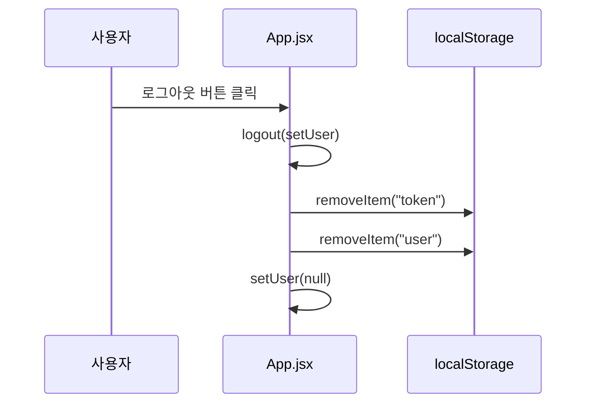
```mermaid
sequenceDiagram
    participant User as 사용자
    participant App as App.jsx
    participant Storage as localStorage

    User->>App: 로그아웃 버튼 클릭
    App->>App: logout(setUser)
    App->>Storage: removeItem("token")
    App->>Storage: removeItem("user")
    App->>App: setUser(null)
```

### 왜 이 흐름인가

이 프로젝트의 JWT는 클라이언트가 보관한다. 로그아웃은 서버 세션 삭제가 아니라 클라이언트 저장소에서 토큰과 사용자 정보를 제거하는 방식이다.

---

## 5. 게시글 목록 / 검색 / 페이징

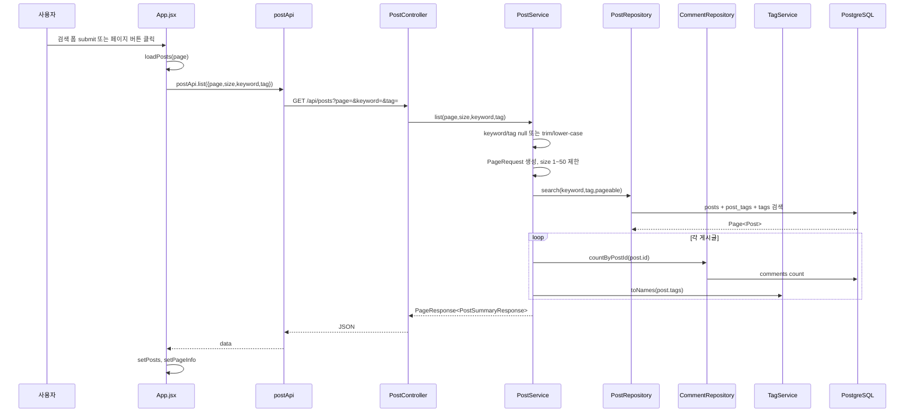
```mermaid
sequenceDiagram
    participant User as 사용자
    participant App as App.jsx
    participant Client as postApi
    participant Controller as PostController
    participant Service as PostService
    participant Repo as PostRepository
    participant CommentRepo as CommentRepository
    participant TagService
    participant DB as PostgreSQL

    User->>App: 검색 폼 submit 또는 페이지 버튼 클릭
    App->>App: loadPosts(page)
    App->>Client: postApi.list({page,size,keyword,tag})
    Client->>Controller: GET /api/posts?page=&keyword=&tag=
    Controller->>Service: list(page,size,keyword,tag)
    Service->>Service: keyword/tag null 또는 trim/lower-case
    Service->>Service: PageRequest 생성, size 1~50 제한
    Service->>Repo: search(keyword,tag,pageable)
    Repo->>DB: posts + post_tags + tags 검색
    DB-->>Repo: Page<Post>
    loop 각 게시글
        Service->>CommentRepo: countByPostId(post.id)
        CommentRepo->>DB: comments count
        Service->>TagService: toNames(post.tags)
    end
    Service-->>Controller: PageResponse<PostSummaryResponse>
    Controller-->>Client: JSON
    Client-->>App: data
    App->>App: setPosts, setPageInfo
```

### 왜 이 흐름인가

목록 화면은 검색 조건과 페이징 조건을 동시에 처리해야 한다. `PostService.list()`에서 page/size/keyword/tag를 정리하면 Controller는 얇게 유지되고 Repository는 검색 쿼리에 집중한다.

---

## 6. 게시글 상세 조회

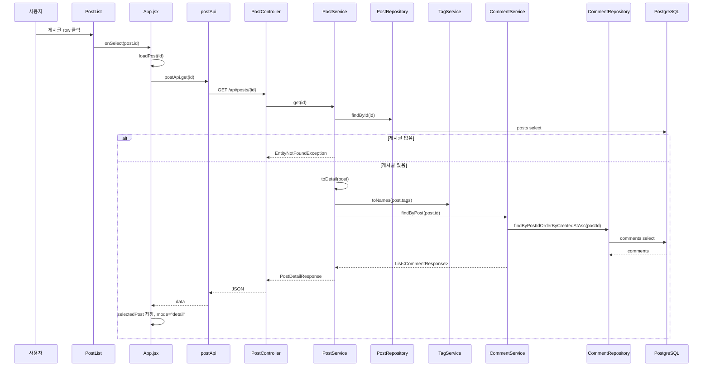
```mermaid
sequenceDiagram
    participant User as 사용자
    participant PostList
    participant App as App.jsx
    participant Client as postApi
    participant Controller as PostController
    participant Service as PostService
    participant Repo as PostRepository
    participant TagService
    participant CommentService
    participant CommentRepo as CommentRepository
    participant DB as PostgreSQL

    User->>PostList: 게시글 row 클릭
    PostList->>App: onSelect(post.id)
    App->>App: loadPost(id)
    App->>Client: postApi.get(id)
    Client->>Controller: GET /api/posts/{id}
    Controller->>Service: get(id)
    Service->>Repo: findById(id)
    Repo->>DB: posts select
    alt 게시글 없음
        Service-->>Controller: EntityNotFoundException
    else 게시글 있음
        Service->>Service: toDetail(post)
        Service->>TagService: toNames(post.tags)
        Service->>CommentService: findByPost(post.id)
        CommentService->>CommentRepo: findByPostIdOrderByCreatedAtAsc(postId)
        CommentRepo->>DB: comments select
        DB-->>CommentRepo: comments
        CommentService-->>Service: List<CommentResponse>
        Service-->>Controller: PostDetailResponse
        Controller-->>Client: JSON
        Client-->>App: data
        App->>App: selectedPost 저장, mode="detail"
    end
```

### 왜 이 흐름인가

상세 화면은 게시글 본문뿐 아니라 태그와 댓글이 함께 필요하다. 그래서 `PostService.toDetail()`이 `TagService`와 `CommentService`를 호출해 응답 DTO를 조립한다.

---

## 7. 게시글 작성

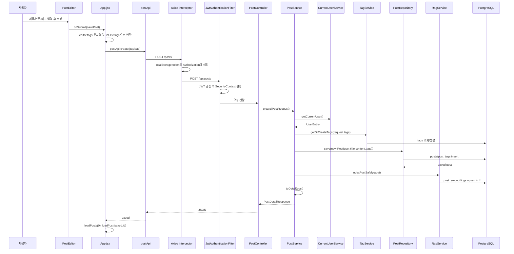
```mermaid
sequenceDiagram
    participant User as 사용자
    participant Editor as PostEditor
    participant App as App.jsx
    participant Client as postApi
    participant Axios as Axios interceptor
    participant Filter as JwtAuthenticationFilter
    participant Controller as PostController
    participant Service as PostService
    participant CurrentUser as CurrentUserService
    participant TagService
    participant Repo as PostRepository
    participant Rag as RagService
    participant DB as PostgreSQL

    User->>Editor: 제목/본문/태그 입력 후 저장
    Editor->>App: onSubmit(savePost)
    App->>App: editor.tags 문자열을 List<String>으로 변환
    App->>Client: postApi.create(payload)
    Client->>Axios: POST /posts
    Axios->>Axios: localStorage.token을 Authorization에 삽입
    Axios->>Filter: POST /api/posts
    Filter->>Filter: JWT 검증 후 SecurityContext 설정
    Filter->>Controller: 요청 전달
    Controller->>Service: create(PostRequest)
    Service->>CurrentUser: getCurrentUser()
    CurrentUser-->>Service: UserEntity
    Service->>TagService: getOrCreateTags(request.tags)
    TagService->>DB: tags 조회/생성
    Service->>Repo: save(new Post(user,title,content,tags))
    Repo->>DB: posts/post_tags insert
    DB-->>Repo: saved post
    Service->>Rag: indexPostSafely(post)
    Rag->>DB: post_embeddings upsert 시도
    Service->>Service: toDetail(post)
    Service-->>Controller: PostDetailResponse
    Controller-->>Client: JSON
    Client-->>App: saved
    App->>App: loadPosts(0), loadPost(saved.id)
```

### 왜 이 흐름인가

게시글 작성은 “저장” 하나로 보이지만 실제로는 인증 사용자 확인, 태그 정규화, 게시글 저장, RAG 인덱싱, 상세 응답 생성이 순서대로 일어난다. 이 순서를 `PostService.create()`에 모아야 기능의 트랜잭션 경계가 분명해진다.

---

## 8. 게시글 수정

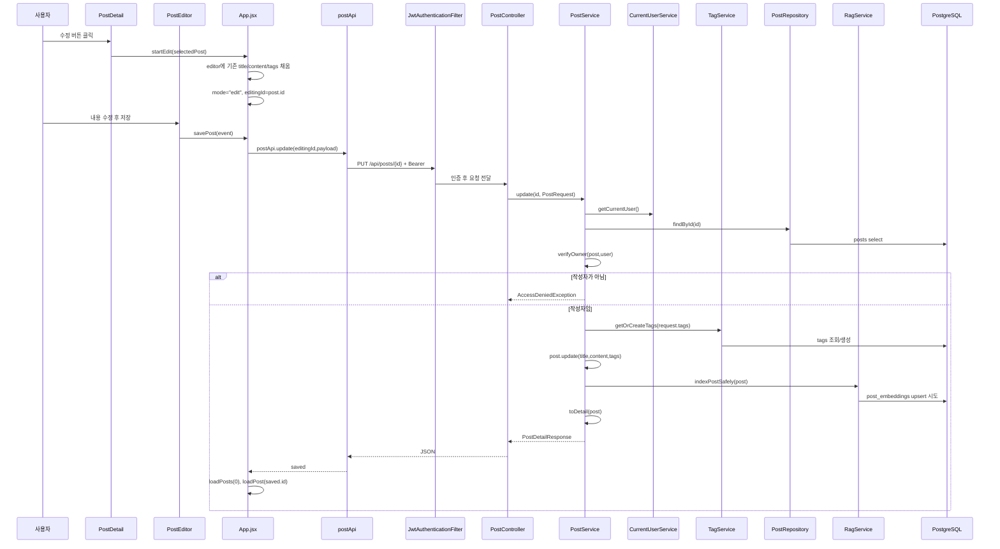
```mermaid
sequenceDiagram
    participant User as 사용자
    participant Detail as PostDetail
    participant Editor as PostEditor
    participant App as App.jsx
    participant Client as postApi
    participant Filter as JwtAuthenticationFilter
    participant Controller as PostController
    participant Service as PostService
    participant CurrentUser as CurrentUserService
    participant TagService
    participant Repo as PostRepository
    participant Rag as RagService
    participant DB as PostgreSQL

    User->>Detail: 수정 버튼 클릭
    Detail->>App: startEdit(selectedPost)
    App->>App: editor에 기존 title/content/tags 채움
    App->>App: mode="edit", editingId=post.id
    User->>Editor: 내용 수정 후 저장
    Editor->>App: savePost(event)
    App->>Client: postApi.update(editingId,payload)
    Client->>Filter: PUT /api/posts/{id} + Bearer
    Filter->>Controller: 인증 후 요청 전달
    Controller->>Service: update(id, PostRequest)
    Service->>CurrentUser: getCurrentUser()
    Service->>Repo: findById(id)
    Repo->>DB: posts select
    Service->>Service: verifyOwner(post,user)
    alt 작성자가 아님
        Service-->>Controller: AccessDeniedException
    else 작성자임
        Service->>TagService: getOrCreateTags(request.tags)
        TagService->>DB: tags 조회/생성
        Service->>Service: post.update(title,content,tags)
        Service->>Rag: indexPostSafely(post)
        Rag->>DB: post_embeddings upsert 시도
        Service->>Service: toDetail(post)
        Service-->>Controller: PostDetailResponse
        Controller-->>Client: JSON
        Client-->>App: saved
        App->>App: loadPosts(0), loadPost(saved.id)
    end
```

### 왜 이 흐름인가

수정은 작성과 달리 “소유권 검증”이 핵심이다. `verifyOwner()`를 통과한 뒤에만 엔티티를 변경하고 RAG 인덱스를 갱신한다.

---

## 9. 게시글 삭제

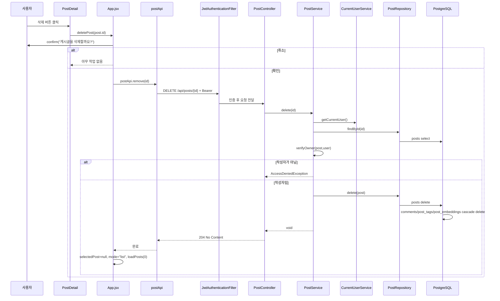
```mermaid
sequenceDiagram
    participant User as 사용자
    participant Detail as PostDetail
    participant App as App.jsx
    participant Client as postApi
    participant Filter as JwtAuthenticationFilter
    participant Controller as PostController
    participant Service as PostService
    participant CurrentUser as CurrentUserService
    participant Repo as PostRepository
    participant DB as PostgreSQL

    User->>Detail: 삭제 버튼 클릭
    Detail->>App: deletePost(post.id)
    App->>User: confirm("게시글을 삭제할까요?")
    alt 취소
        App-->>Detail: 아무 작업 없음
    else 확인
        App->>Client: postApi.remove(id)
        Client->>Filter: DELETE /api/posts/{id} + Bearer
        Filter->>Controller: 인증 후 요청 전달
        Controller->>Service: delete(id)
        Service->>CurrentUser: getCurrentUser()
        Service->>Repo: findById(id)
        Repo->>DB: posts select
        Service->>Service: verifyOwner(post,user)
        alt 작성자가 아님
            Service-->>Controller: AccessDeniedException
        else 작성자임
            Service->>Repo: delete(post)
            Repo->>DB: posts delete
            DB->>DB: comments/post_tags/post_embeddings cascade delete
            Service-->>Controller: void
            Controller-->>Client: 204 No Content
            Client-->>App: 완료
            App->>App: selectedPost=null, mode="list", loadPosts(0)
        end
    end
```

### 왜 이 흐름인가

삭제도 수정처럼 소유권 검증이 필요하다. DB migration에서 comments, post_tags, post_embeddings는 `ON DELETE CASCADE`이므로 게시글 삭제 시 관련 데이터도 같이 정리된다.

---

## 10. 댓글 작성

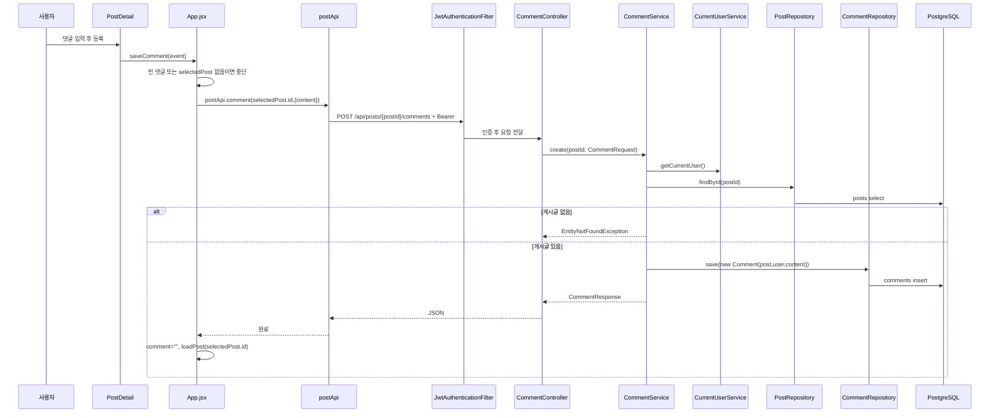
```mermaid
sequenceDiagram
    participant User as 사용자
    participant Detail as PostDetail
    participant App as App.jsx
    participant Client as postApi
    participant Filter as JwtAuthenticationFilter
    participant Controller as CommentController
    participant Service as CommentService
    participant CurrentUser as CurrentUserService
    participant PostRepo as PostRepository
    participant CommentRepo as CommentRepository
    participant DB as PostgreSQL

    User->>Detail: 댓글 입력 후 등록
    Detail->>App: saveComment(event)
    App->>App: 빈 댓글 또는 selectedPost 없음이면 중단
    App->>Client: postApi.comment(selectedPost.id,{content})
    Client->>Filter: POST /api/posts/{postId}/comments + Bearer
    Filter->>Controller: 인증 후 요청 전달
    Controller->>Service: create(postId, CommentRequest)
    Service->>CurrentUser: getCurrentUser()
    Service->>PostRepo: findById(postId)
    PostRepo->>DB: posts select
    alt 게시글 없음
        Service-->>Controller: EntityNotFoundException
    else 게시글 있음
        Service->>CommentRepo: save(new Comment(post,user,content))
        CommentRepo->>DB: comments insert
        Service-->>Controller: CommentResponse
        Controller-->>Client: JSON
        Client-->>App: 완료
        App->>App: comment="", loadPost(selectedPost.id)
    end
```

### 왜 이 흐름인가

댓글은 반드시 특정 게시글과 현재 사용자에 연결된다. 그래서 저장 전에 게시글 존재 여부와 현재 사용자를 모두 확인한다.

---

## 11. 댓글 삭제

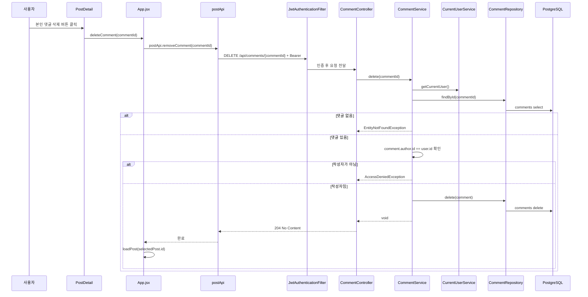
```mermaid
sequenceDiagram
    participant User as 사용자
    participant Detail as PostDetail
    participant App as App.jsx
    participant Client as postApi
    participant Filter as JwtAuthenticationFilter
    participant Controller as CommentController
    participant Service as CommentService
    participant CurrentUser as CurrentUserService
    participant CommentRepo as CommentRepository
    participant DB as PostgreSQL

    User->>Detail: 본인 댓글 삭제 버튼 클릭
    Detail->>App: deleteComment(commentId)
    App->>Client: postApi.removeComment(commentId)
    Client->>Filter: DELETE /api/comments/{commentId} + Bearer
    Filter->>Controller: 인증 후 요청 전달
    Controller->>Service: delete(commentId)
    Service->>CurrentUser: getCurrentUser()
    Service->>CommentRepo: findById(commentId)
    CommentRepo->>DB: comments select
    alt 댓글 없음
        Service-->>Controller: EntityNotFoundException
    else 댓글 있음
        Service->>Service: comment.author.id == user.id 확인
        alt 작성자가 아님
            Service-->>Controller: AccessDeniedException
        else 작성자임
            Service->>CommentRepo: delete(comment)
            CommentRepo->>DB: comments delete
            Service-->>Controller: void
            Controller-->>Client: 204 No Content
            Client-->>App: 완료
            App->>App: loadPost(selectedPost.id)
        end
    end
```

### 왜 이 흐름인가

댓글 삭제는 게시글 삭제와 마찬가지로 권한 검증이 필요하다. 다만 권한 기준은 게시글 작성자가 아니라 댓글 작성자다.

---

## 12. RAG 자동 인덱싱

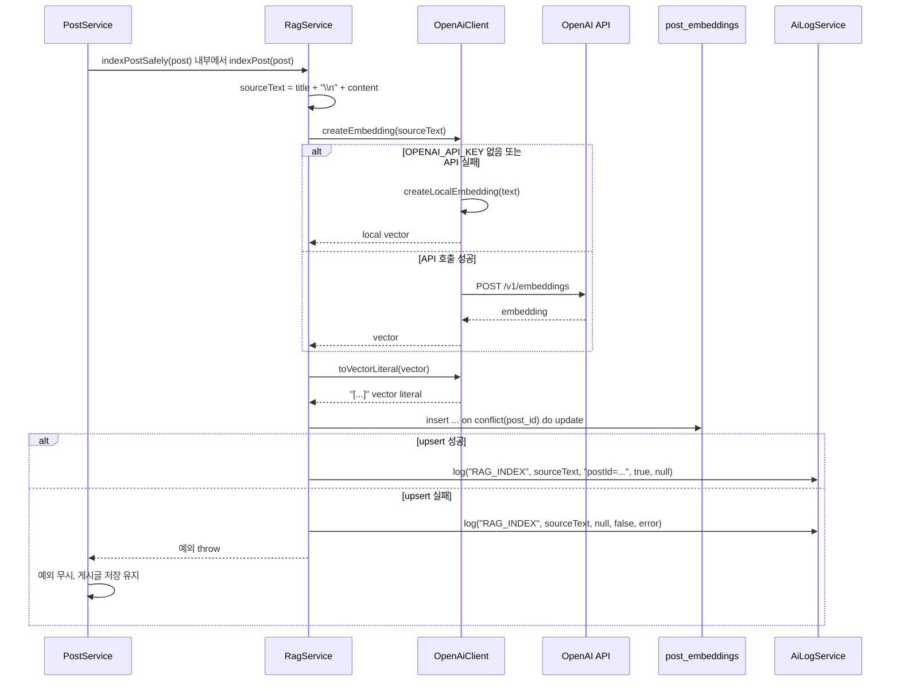
```mermaid
sequenceDiagram
    participant PostService
    participant Rag as RagService
    participant OpenAI as OpenAiClient
    participant External as OpenAI API
    participant DB as post_embeddings
    participant Log as AiLogService

    PostService->>Rag: indexPostSafely(post) 내부에서 indexPost(post)
    Rag->>Rag: sourceText = title + "\\n" + content
    Rag->>OpenAI: createEmbedding(sourceText)
    alt OPENAI_API_KEY 없음 또는 API 실패
        OpenAI->>OpenAI: createLocalEmbedding(text)
        OpenAI-->>Rag: local vector
    else API 호출 성공
        OpenAI->>External: POST /v1/embeddings
        External-->>OpenAI: embedding
        OpenAI-->>Rag: vector
    end
    Rag->>OpenAI: toVectorLiteral(vector)
    OpenAI-->>Rag: "[...]" vector literal
    Rag->>DB: insert ... on conflict(post_id) do update
    alt upsert 성공
        Rag->>Log: log("RAG_INDEX", sourceText, "postId=...", true, null)
    else upsert 실패
        Rag->>Log: log("RAG_INDEX", sourceText, null, false, error)
        Rag-->>PostService: 예외 throw
        PostService->>PostService: 예외 무시, 게시글 저장 유지
    end
```

### 왜 이 흐름인가

RAG 검색은 게시글이 저장될 때 embedding이 만들어져 있어야 빠르게 동작한다. 하지만 AI 인덱싱 실패가 게시글 CRUD를 막으면 기본 게시판 기능이 깨지므로 `indexPostSafely()`가 보호막 역할을 한다.

---

## 13. RAG 유사 글 검색 / 요약

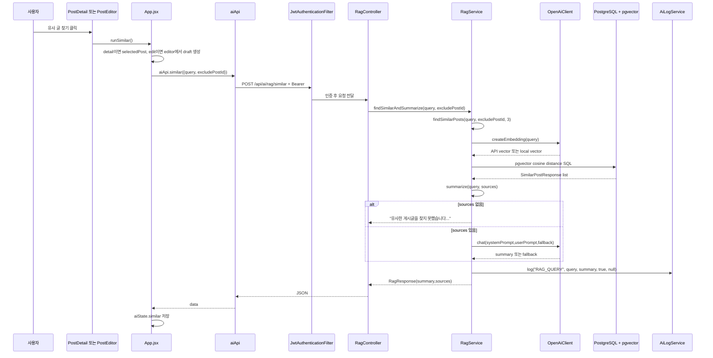
```mermaid
sequenceDiagram
    participant User as 사용자
    participant UI as PostDetail 또는 PostEditor
    participant App as App.jsx
    participant Client as aiApi
    participant Filter as JwtAuthenticationFilter
    participant Controller as RagController
    participant Rag as RagService
    participant OpenAI as OpenAiClient
    participant DB as PostgreSQL + pgvector
    participant Log as AiLogService

    User->>UI: 유사 글 찾기 클릭
    UI->>App: runSimilar()
    App->>App: detail이면 selectedPost, edit이면 editor에서 draft 생성
    App->>Client: aiApi.similar({query, excludePostId})
    Client->>Filter: POST /api/ai/rag/similar + Bearer
    Filter->>Controller: 인증 후 요청 전달
    Controller->>Rag: findSimilarAndSummarize(query, excludePostId)
    Rag->>Rag: findSimilarPosts(query, excludePostId, 3)
    Rag->>OpenAI: createEmbedding(query)
    OpenAI-->>Rag: API vector 또는 local vector
    Rag->>DB: pgvector cosine distance SQL
    DB-->>Rag: SimilarPostResponse list
    Rag->>Rag: summarize(query, sources)
    alt sources 없음
        Rag-->>Controller: "유사한 게시글을 찾지 못했습니다..."
    else sources 있음
        Rag->>OpenAI: chat(systemPrompt,userPrompt,fallback)
        OpenAI-->>Rag: summary 또는 fallback
    end
    Rag->>Log: log("RAG_QUERY", query, summary, true, null)
    Rag-->>Controller: RagResponse(summary,sources)
    Controller-->>Client: JSON
    Client-->>App: data
    App->>App: aiState.similar 저장
```

### 왜 이 흐름인가

RAG는 “검색”과 “요약”이 합쳐진 기능이다. 먼저 벡터로 관련 글을 찾고, 그 결과를 LLM 또는 fallback 문장으로 요약한다. 이렇게 해야 사용자는 단순 목록이 아니라 “어떻게 참고하면 되는지”를 받을 수 있다.

---

## 14. MCP GitHub 사용자 조회

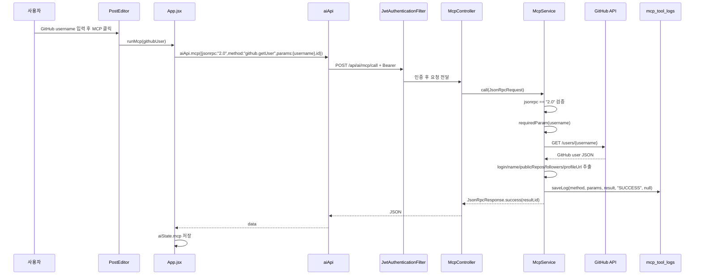
```mermaid
sequenceDiagram
    participant User as 사용자
    participant Editor as PostEditor
    participant App as App.jsx
    participant Client as aiApi
    participant Filter as JwtAuthenticationFilter
    participant Controller as McpController
    participant Service as McpService
    participant GitHub as GitHub API
    participant DB as mcp_tool_logs

    User->>Editor: GitHub username 입력 후 MCP 클릭
    Editor->>App: runMcp(githubUser)
    App->>Client: aiApi.mcp({jsonrpc:"2.0",method:"github.getUser",params:{username},id})
    Client->>Filter: POST /api/ai/mcp/call + Bearer
    Filter->>Controller: 인증 후 요청 전달
    Controller->>Service: call(JsonRpcRequest)
    Service->>Service: jsonrpc == "2.0" 검증
    Service->>Service: requiredParam(username)
    Service->>GitHub: GET /users/{username}
    GitHub-->>Service: GitHub user JSON
    Service->>Service: login/name/publicRepos/followers/profileUrl 추출
    Service->>DB: saveLog(method, params, result, "SUCCESS", null)
    Service-->>Controller: JsonRpcResponse.success(result,id)
    Controller-->>Client: JSON
    Client-->>App: data
    App->>App: aiState.mcp 저장
```

### 왜 이 흐름인가

MCP 기능은 외부 도구 호출 구조를 보여주기 위한 최소 구현이다. JSON-RPC 형식으로 method와 params를 받으면 UI와 Agent가 같은 인터페이스로 도구를 호출할 수 있다.

---

## 15. MCP GitHub 저장소 조회

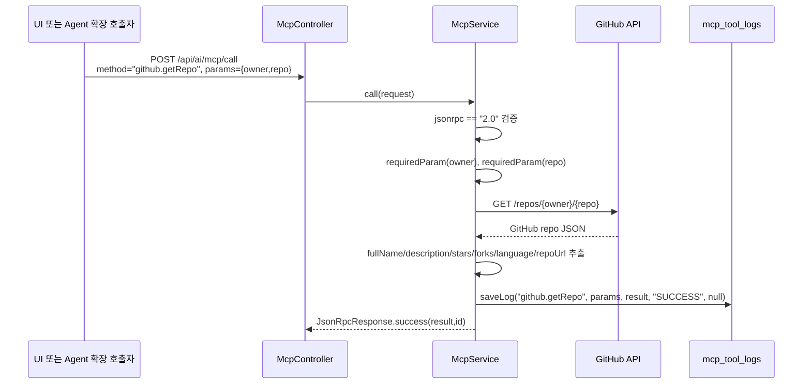
```mermaid
sequenceDiagram
    participant Caller as UI 또는 Agent 확장 호출자
    participant Controller as McpController
    participant Service as McpService
    participant GitHub as GitHub API
    participant DB as mcp_tool_logs

    Caller->>Controller: POST /api/ai/mcp/call<br/>method="github.getRepo", params={owner,repo}
    Controller->>Service: call(request)
    Service->>Service: jsonrpc == "2.0" 검증
    Service->>Service: requiredParam(owner), requiredParam(repo)
    Service->>GitHub: GET /repos/{owner}/{repo}
    GitHub-->>Service: GitHub repo JSON
    Service->>Service: fullName/description/stars/forks/language/repoUrl 추출
    Service->>DB: saveLog("github.getRepo", params, result, "SUCCESS", null)
    Service-->>Controller: JsonRpcResponse.success(result,id)
```

### 왜 이 흐름인가

코드상 `McpService.call()`은 `github.getRepo`도 지원한다. 현재 프론트 버튼은 `github.getUser`만 호출하지만, 백엔드 기능으로는 저장소 조회가 구현되어 있으므로 전체 기능 다이어그램에 포함했다.

---

## 16. Agent 작성 보조

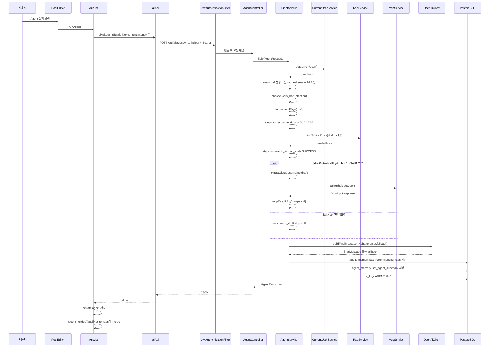
```mermaid
sequenceDiagram
    participant User as 사용자
    participant Editor as PostEditor
    participant App as App.jsx
    participant Client as aiApi
    participant Filter as JwtAuthenticationFilter
    participant Controller as AgentController
    participant Agent as AgentService
    participant CurrentUser as CurrentUserService
    participant Rag as RagService
    participant Mcp as McpService
    participant OpenAI as OpenAiClient
    participant DB as PostgreSQL

    User->>Editor: Agent 실행 클릭
    Editor->>App: runAgent()
    App->>Client: aiApi.agent({draft,title+content,intention})
    Client->>Filter: POST /api/ai/agent/write-helper + Bearer
    Filter->>Controller: 인증 후 요청 전달
    Controller->>Agent: help(AgentRequest)
    Agent->>CurrentUser: getCurrentUser()
    CurrentUser-->>Agent: UserEntity
    Agent->>Agent: sessionId 생성 또는 request.sessionId 사용
    Agent->>Agent: chooseTools(draft,intention)
    Agent->>Agent: recommendTags(draft)
    Agent->>Agent: steps += recommend_tags SUCCESS
    Agent->>Rag: findSimilarPosts(draft,null,3)
    Rag-->>Agent: similarPosts
    Agent->>Agent: steps += search_similar_posts SUCCESS
    alt draft/intention에 github 또는 깃허브 포함
        Agent->>Agent: extractGithubUsername(draft)
        Agent->>Mcp: call(github.getUser)
        Mcp-->>Agent: JsonRpcResponse
        Agent->>Agent: mcpResult 저장, steps 기록
    else GitHub 관련 없음
        Agent->>Agent: summarize_draft step 기록
    end
    Agent->>OpenAI: buildFinalMessage -> chat(prompt,fallback)
    OpenAI-->>Agent: finalMessage 또는 fallback
    Agent->>DB: agent_memory last_recommended_tags 저장
    Agent->>DB: agent_memory last_agent_summary 저장
    Agent->>DB: ai_logs AGENT 저장
    Agent-->>Controller: AgentResponse
    Controller-->>Client: JSON
    Client-->>App: data
    App->>App: aiState.agent 저장
    App->>App: recommendedTags를 editor.tags에 merge
```

### 왜 이 흐름인가

이 Agent는 자율적으로 무한 계획을 세우는 구조가 아니다. 과제용으로 안전하게 설명 가능한 구조를 선택해 `recommend_tags`, `search_similar_posts`, 조건부 `call_mcp_external_api` 또는 `summarize_draft`를 최대 3회 실행한다.

---

## 17. JWT 인증 공통 흐름

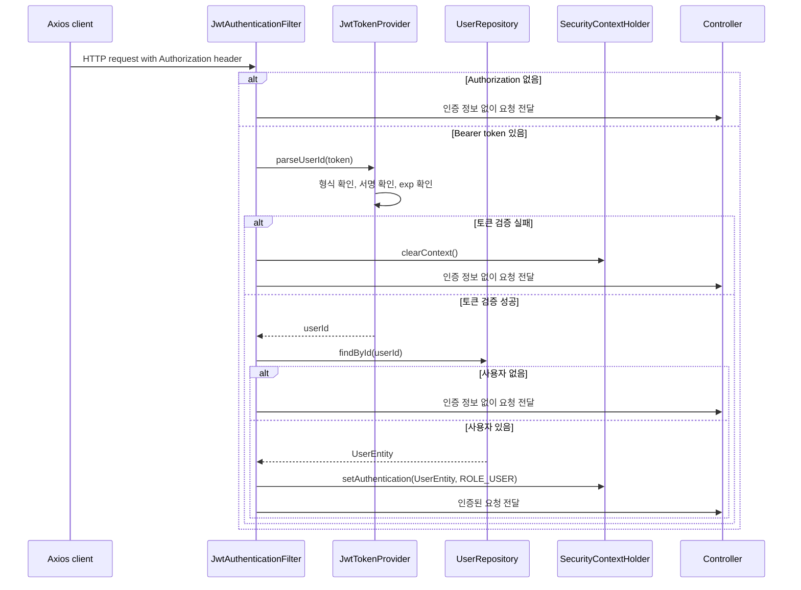
```mermaid
sequenceDiagram
    participant Client as Axios client
    participant Filter as JwtAuthenticationFilter
    participant Jwt as JwtTokenProvider
    participant UserRepo as UserRepository
    participant Context as SecurityContextHolder
    participant Controller as Controller

    Client->>Filter: HTTP request with Authorization header
    alt Authorization 없음
        Filter->>Controller: 인증 정보 없이 요청 전달
    else Bearer token 있음
        Filter->>Jwt: parseUserId(token)
        Jwt->>Jwt: 형식 확인, 서명 확인, exp 확인
        alt 토큰 검증 실패
            Filter->>Context: clearContext()
            Filter->>Controller: 인증 정보 없이 요청 전달
        else 토큰 검증 성공
            Jwt-->>Filter: userId
            Filter->>UserRepo: findById(userId)
            alt 사용자 없음
                Filter->>Controller: 인증 정보 없이 요청 전달
            else 사용자 있음
                UserRepo-->>Filter: UserEntity
                Filter->>Context: setAuthentication(UserEntity, ROLE_USER)
                Filter->>Controller: 인증된 요청 전달
            end
        end
    end
```

### 왜 이 흐름인가

Service는 현재 사용자가 누구인지 알아야 하지만 매번 JWT를 직접 파싱하면 중복이 커진다. 필터에서 한 번 처리해 `SecurityContext`에 넣어두면 `CurrentUserService`가 일관되게 꺼내 쓸 수 있다.

---

## 18. 예외 응답 공통 흐름

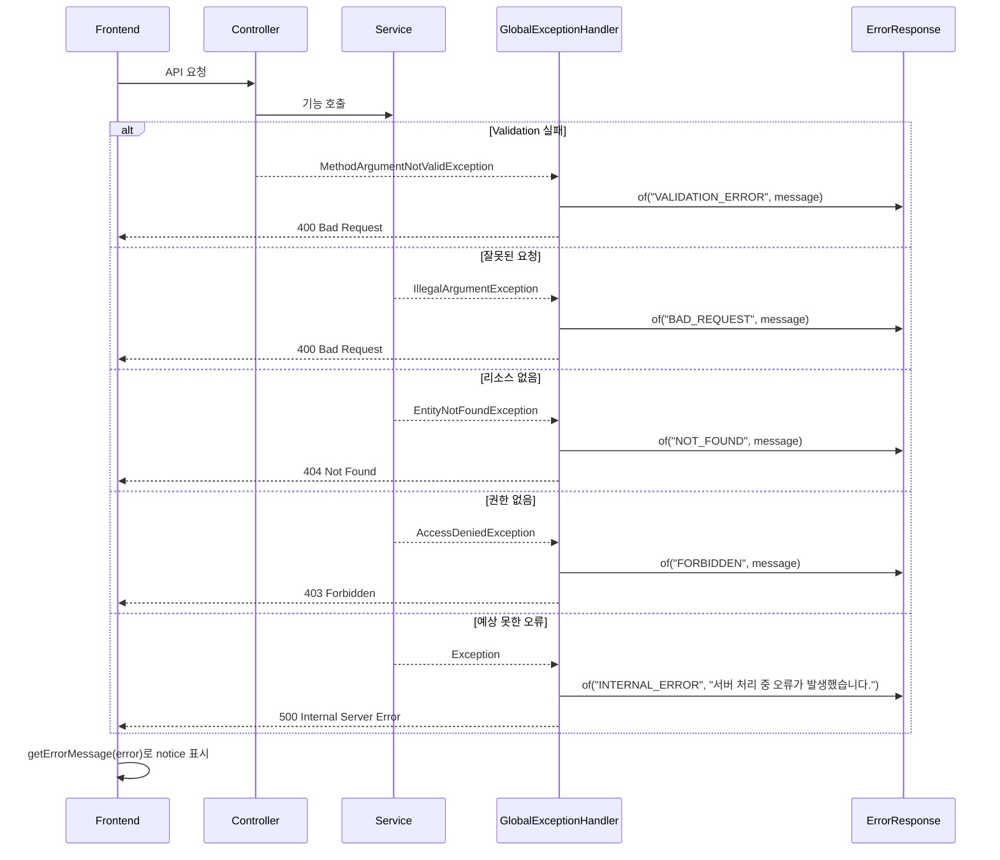
```mermaid
sequenceDiagram
    participant Client as Frontend
    participant Controller as Controller
    participant Service as Service
    participant Advice as GlobalExceptionHandler
    participant Error as ErrorResponse

    Client->>Controller: API 요청
    Controller->>Service: 기능 호출
    alt Validation 실패
        Controller-->>Advice: MethodArgumentNotValidException
        Advice->>Error: of("VALIDATION_ERROR", message)
        Advice-->>Client: 400 Bad Request
    else 잘못된 요청
        Service-->>Advice: IllegalArgumentException
        Advice->>Error: of("BAD_REQUEST", message)
        Advice-->>Client: 400 Bad Request
    else 리소스 없음
        Service-->>Advice: EntityNotFoundException
        Advice->>Error: of("NOT_FOUND", message)
        Advice-->>Client: 404 Not Found
    else 권한 없음
        Service-->>Advice: AccessDeniedException
        Advice->>Error: of("FORBIDDEN", message)
        Advice-->>Client: 403 Forbidden
    else 예상 못한 오류
        Service-->>Advice: Exception
        Advice->>Error: of("INTERNAL_ERROR", "서버 처리 중 오류가 발생했습니다.")
        Advice-->>Client: 500 Internal Server Error
    end
    Client->>Client: getErrorMessage(error)로 notice 표시
```

### 왜 이 흐름인가

예외 처리를 Controller마다 반복하면 응답 형식이 달라진다. `GlobalExceptionHandler`가 공통 응답 형식을 만들면 프론트는 `getErrorMessage()`에서 일관되게 메시지를 꺼낼 수 있다.

---

## 19. Docker Compose / Nginx 실행 흐름

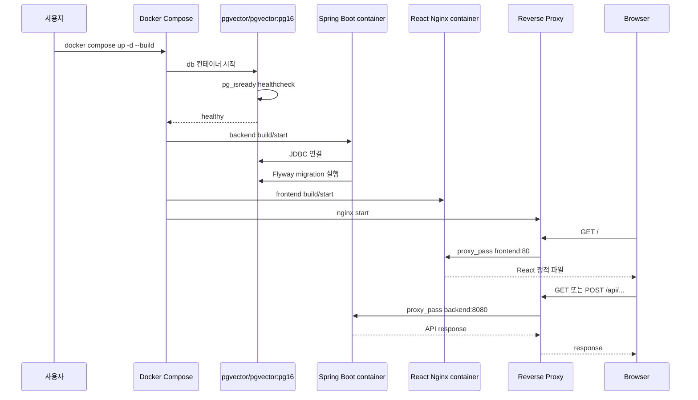
```mermaid
sequenceDiagram
    participant User as 사용자
    participant Compose as Docker Compose
    participant DB as pgvector/pgvector:pg16
    participant Backend as Spring Boot container
    participant Frontend as React Nginx container
    participant Nginx as Reverse Proxy
    participant Browser as Browser

    User->>Compose: docker compose up -d --build
    Compose->>DB: db 컨테이너 시작
    DB->>DB: pg_isready healthcheck
    DB-->>Compose: healthy
    Compose->>Backend: backend build/start
    Backend->>DB: JDBC 연결
    Backend->>DB: Flyway migration 실행
    Compose->>Frontend: frontend build/start
    Compose->>Nginx: nginx start
    Browser->>Nginx: GET /
    Nginx->>Frontend: proxy_pass frontend:80
    Frontend-->>Browser: React 정적 파일
    Browser->>Nginx: GET 또는 POST /api/...
    Nginx->>Backend: proxy_pass backend:8080
    Backend-->>Nginx: API response
    Nginx-->>Browser: response
```

### 왜 이 흐름인가

배포 환경에서는 브라우저가 frontend와 backend에 따로 접근하지 않고 Nginx 하나를 통해 접근한다. `/api`는 backend로, 나머지 경로는 frontend로 보내면 CORS와 배포 URL 관리가 단순해진다.

---

## [2] 설계 이유 (WHY 중심)

### 왜 기능별 시퀀스로 나눴는가

하나의 거대한 시퀀스 다이어그램에 모든 기능을 넣으면 선이 너무 많아져서 학습용으로 보기 어렵다. 이 프로젝트는 기능이 Controller endpoint 단위로 명확히 나뉘므로, 사용자 행동 단위로 분리하는 것이 다시 구현할 때 더 유리하다.

### 왜 공통 흐름을 따로 뺐는가

JWT 인증과 예외 처리는 거의 모든 API에 반복해서 적용된다. 각 기능 다이어그램에 매번 전체 인증/예외 처리를 자세히 넣으면 핵심 기능 흐름이 흐려진다. 그래서 기능별 다이어그램에는 인증을 짧게 표시하고, 공통 인증/예외 흐름은 별도 다이어그램으로 분리했다.

### 왜 RAG 인덱싱과 RAG 검색을 분리했는가

인덱싱은 게시글 작성/수정 후 자동으로 일어나는 “저장 준비” 흐름이고, 검색은 사용자가 AI 버튼을 눌렀을 때 일어나는 “조회” 흐름이다. 두 기능이 모두 `RagService`에 있지만 실행 시점과 목적이 다르기 때문에 분리했다.

---

## [3] 핵심 흐름 단위 설명

| 기능 | 시작점 | 핵심 Service | 핵심 저장소/외부 API | 왜 중요한가 |
|---|---|---|---|---|
| 앱 초기 목록 | `useEffect` | `PostService.list` | `PostRepository.search` | 사용자가 첫 화면에서 게시글을 볼 수 있게 한다. |
| 회원가입 | `AuthPanel.submit` | `AuthService.signup` | `UserRepository`, `JwtTokenProvider` | 사용자를 만들고 즉시 로그인 상태로 전환한다. |
| 로그인 | `AuthPanel.submit` | `AuthService.login` | `UserRepository`, `PasswordEncoder` | 이후 인증 요청에 사용할 JWT를 만든다. |
| 로그아웃 | `logout(setUser)` | 없음 | `localStorage` | 클라이언트 인증 상태를 제거한다. |
| 목록/검색 | `loadPosts` | `PostService.list` | `PostRepository.search` | 검색 조건과 페이징 조건을 처리한다. |
| 상세 | `loadPost` | `PostService.get` | `PostRepository`, `CommentService` | 게시글, 태그, 댓글을 한 응답으로 만든다. |
| 작성 | `savePost` | `PostService.create` | `PostRepository`, `RagService` | 기본 CRUD와 AI 인덱싱을 연결한다. |
| 수정 | `savePost` | `PostService.update` | `PostRepository`, `RagService` | 소유권 검증 후 본문과 벡터를 갱신한다. |
| 삭제 | `deletePost` | `PostService.delete` | `PostRepository` | 작성자만 삭제하고 연관 데이터를 cascade로 정리한다. |
| 댓글 작성 | `saveComment` | `CommentService.create` | `CommentRepository` | 게시글 상세의 대화 기능을 만든다. |
| 댓글 삭제 | `deleteComment` | `CommentService.delete` | `CommentRepository` | 댓글 작성자만 삭제할 수 있게 한다. |
| RAG 인덱싱 | `indexPostSafely` | `RagService.indexPost` | `OpenAiClient`, `post_embeddings` | 유사 글 검색을 위한 벡터 데이터를 준비한다. |
| RAG 검색 | `runSimilar` | `RagService.findSimilarAndSummarize` | pgvector, OpenAI | 유사 글과 요약을 제공한다. |
| MCP | `runMcp` | `McpService.call` | GitHub API, `mcp_tool_logs` | 외부 도구 호출 구조를 보여준다. |
| Agent | `runAgent` | `AgentService.help` | RAG, MCP, OpenAI, memory/log | 여러 도구 결과를 조합해 작성 보조를 제공한다. |
| 인증 공통 | Axios interceptor | `JwtAuthenticationFilter` | `JwtTokenProvider`, `UserRepository` | API 요청의 현재 사용자를 결정한다. |
| 예외 공통 | 모든 Controller | `GlobalExceptionHandler` | `ErrorResponse` | 프론트가 일관된 에러 메시지를 표시하게 한다. |
| DevOps | `docker compose up` | 컨테이너 시작 | DB, backend, frontend, nginx | 로컬/EC2에서 같은 구조로 실행한다. |

---

## [4] 중요한 포인트 정리

### 핵심 개념

- 시퀀스 다이어그램은 “시간 순서”를 보여준다.
- `Controller -> Service -> Repository`는 요청 처리의 기본 뼈대다.
- `JwtAuthenticationFilter`는 Controller 전에 실행된다.
- `CurrentUserService`는 Service에서 현재 로그인 사용자를 꺼내기 위한 도우미다.
- RAG는 인덱싱과 검색이 분리되어 있다.
- MCP는 JSON-RPC request를 외부 API 호출로 바꾸는 어댑터다.
- Agent는 도구 선택, 도구 실행, 결과 조합, memory/log 저장을 한 번에 처리한다.

### 헷갈리기 쉬운 부분

- `savePost()`는 작성과 수정을 모두 처리한다. `editingId`가 있으면 update, 없으면 create다.
- `runSimilar()`는 상세 화면에서는 `selectedPost`, 작성 화면에서는 `editor` 내용을 query로 사용한다.
- `github.getRepo`는 백엔드에서 지원하지만 현재 UI 버튼은 `github.getUser`만 호출한다.
- RAG 인덱싱 실패는 게시글 저장 실패와 같지 않다. `indexPostSafely()`가 예외를 삼킨다.
- OpenAI 키가 없어도 embedding/chat은 fallback으로 동작한다.

### 실수하기 쉬운 부분

- 인증이 필요한 API에서 token이 없으면 `CurrentUserService.getCurrentUser()` 단계에서 실패한다.
- 태그는 프론트에서는 comma string이지만 백엔드에서는 `List<String>`이다.
- `post_embeddings.vector(1536)`과 `app.ai.embedding-dimensions`가 맞아야 한다.
- Agent의 도구 실행은 최대 3회라서 도구를 더 추가하면 우선순위와 제한도 같이 봐야 한다.
- Nginx 배포에서는 `/api` prefix가 backend로 전달되는 구조를 유지해야 한다.
