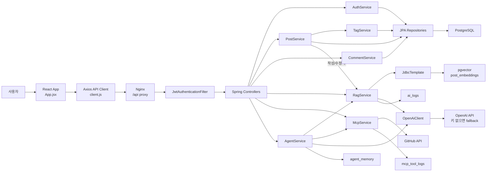
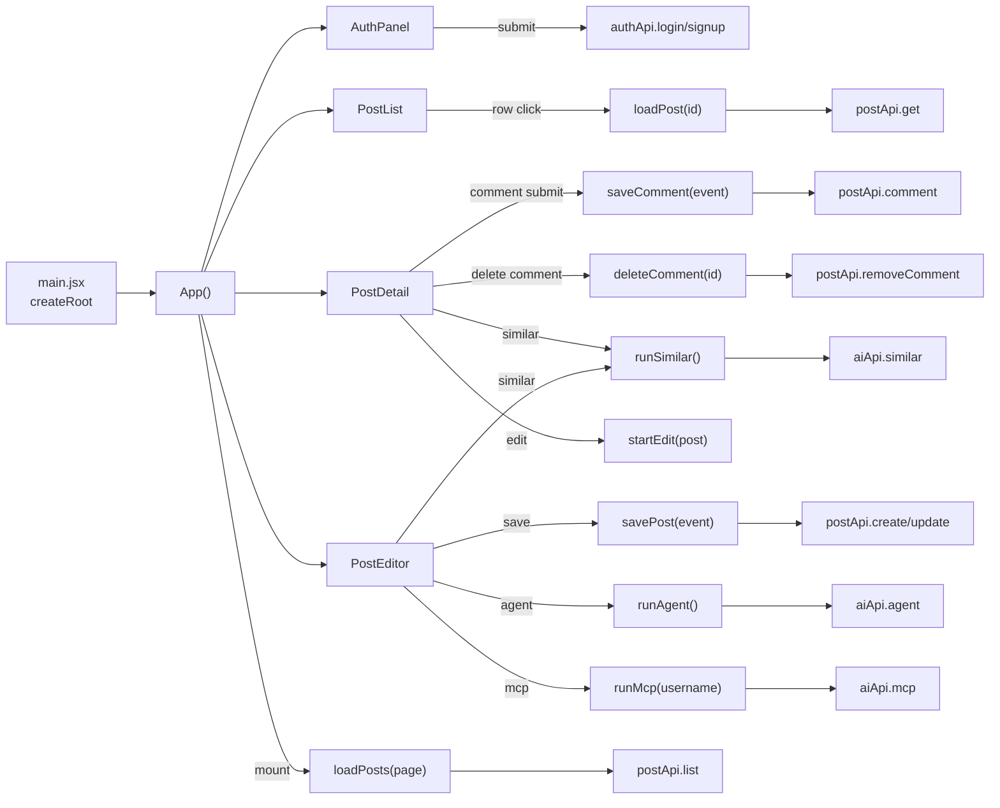
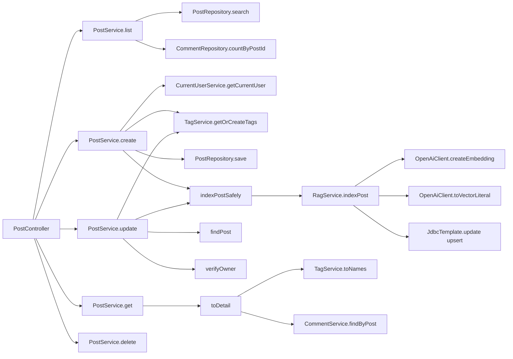
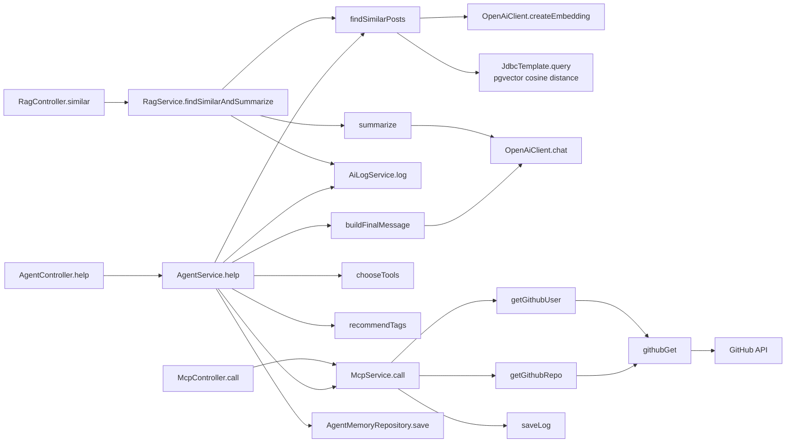
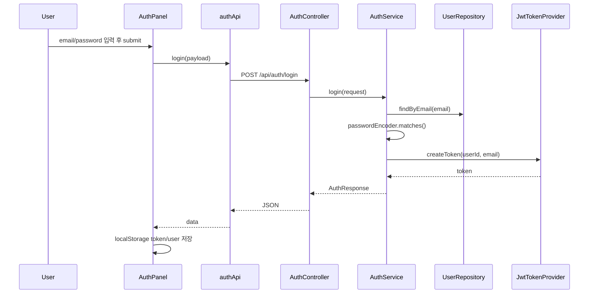
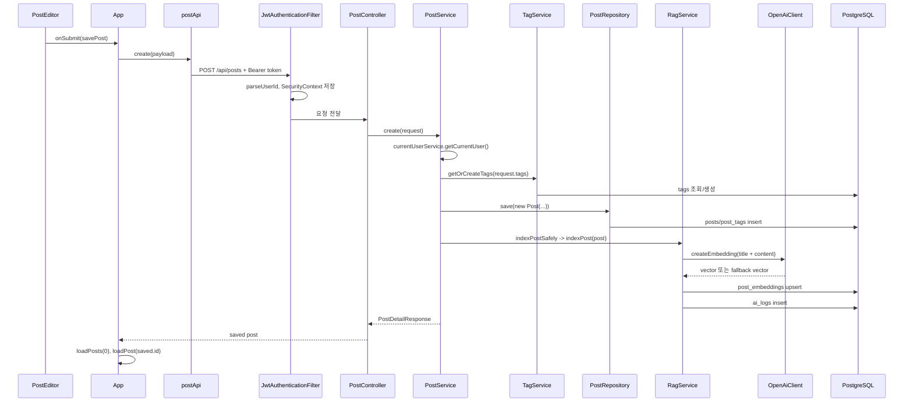
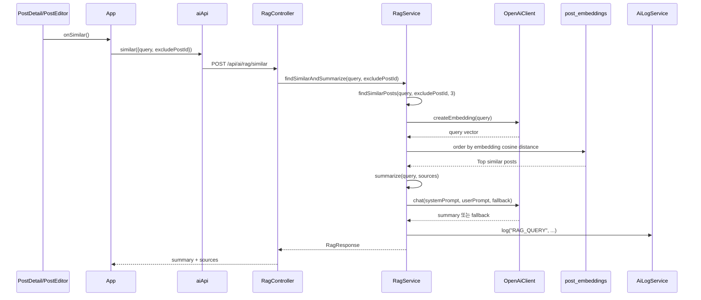
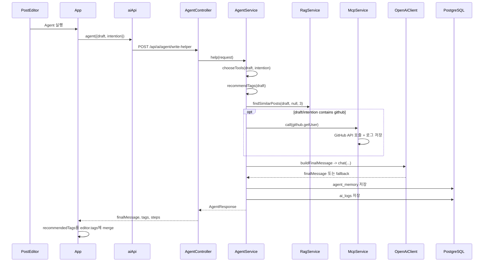
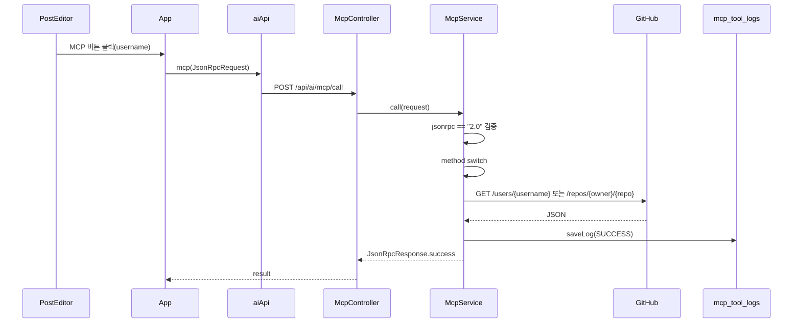

# 프로젝트 구조 분석 & 함수 호출 그래프

분석 기준: 현재 저장소의 `frontend/src`, `backend/src/main/java`, `backend/src/main/resources/db/migration`, `docker-compose.yml`, `infra/nginx/default.conf`를 직접 확인했다.

## 확인됨 / 설계 해석 구분

- 확인됨: React 진입점은 `frontend/src/main.jsx`이고, 실제 화면과 이벤트 흐름은 `frontend/src/App.jsx`가 대부분 소유한다.
- 확인됨: API 클라이언트는 `frontend/src/api/client.js`에서 Axios 인스턴스와 `authApi`, `postApi`, `aiApi`로 묶여 있다.
- 확인됨: Backend는 `Controller -> Service -> Repository/JdbcTemplate -> DB` 구조다.
- 확인됨: 게시글 작성/수정 후 `PostService.indexPostSafely()`가 `RagService.indexPost()`를 호출한다.
- 확인됨: RAG 검색은 JPA Repository가 아니라 `JdbcTemplate`으로 pgvector SQL을 직접 실행한다.
- 확인됨: MCP는 JSON-RPC 스타일 요청을 받아 GitHub Public API를 호출하는 최소 구현이다.
- 확인됨: Agent는 LLM이 자유롭게 계획하는 구조가 아니라, 규칙 기반으로 도구 목록을 고른 뒤 최대 3회 실행한다.
- 설계 해석: 이 프로젝트는 2주 과제용 MVP라서 “기능별 완전 분산”보다 “흐름을 설명하기 쉬운 계층 분리”를 선택한 구조로 보는 것이 적절하다.
- 설계 해석: AI 실패가 게시글 CRUD를 깨지 않도록 fallback과 예외 흡수를 둔 것으로 해석된다.
- 아직 확인하지 않음: 이 문서는 구조 분석 산출물이며, 전체 빌드/통합 실행 성공 여부는 별도 실행 검증이 필요하다.

---

## [1] 전체 구조 설명 (Top-down)

### 전체 흐름

```txt
사용자
 -> React App
 -> Axios API Client
 -> Spring Security JWT Filter
 -> Spring Boot Controller
 -> Service
 -> Repository 또는 JdbcTemplate
 -> PostgreSQL + pgvector
 -> 필요 시 OpenAI API / GitHub API
```

### 계층별 역할

| 계층 | 실제 위치 | 역할 |
|---|---|---|
| Frontend | `frontend/src/App.jsx` | 화면 모드, 입력 상태, API 호출 이벤트를 관리한다. |
| API Client | `frontend/src/api/client.js` | `/api` base URL, Bearer 토큰 삽입, 응답 unwrap을 공통 처리한다. |
| Security | `config/JwtAuthenticationFilter.java`, `SecurityConfig.java` | JWT 검증 후 현재 사용자를 `SecurityContext`에 넣는다. |
| Controller | `auth`, `post`, `comment`, `ai/*` Controller | HTTP path와 request body를 Service 호출로 연결한다. |
| Service | `AuthService`, `PostService`, `RagService`, `AgentService` 등 | 실제 비즈니스 규칙과 함수 호출 순서를 담당한다. |
| Repository | `JpaRepository` 인터페이스들 | 일반 테이블 CRUD와 조회를 담당한다. |
| JdbcTemplate | `RagService` | pgvector 연산자와 upsert SQL을 직접 실행한다. |
| DB | `V1__init.sql` | users, posts, comments, tags, embeddings, AI log 테이블을 만든다. |
| External API | `OpenAiClient`, `McpService` | OpenAI와 GitHub API를 호출하고 실패 시 fallback을 사용한다. |
| DevOps | `docker-compose.yml`, `infra/nginx/default.conf` | db/backend/frontend/nginx를 묶고 `/api`를 backend로 프록시한다. |

### 실행 순서

1. 브라우저가 React 앱을 연다.
2. `App`의 `useEffect`가 `loadPosts(0)`를 호출해 게시글 목록을 가져온다.
3. 로그인하면 `AuthPanel.submit()`이 `authApi.login/signup()`을 호출하고 JWT를 `localStorage`에 저장한다.
4. 이후 API 요청은 Axios interceptor가 `Authorization: Bearer <token>`을 붙인다.
5. 백엔드의 `JwtAuthenticationFilter`가 토큰을 검증하고 현재 사용자를 저장한다.
6. 게시글 작성/수정/삭제, 댓글 작성/삭제, AI 요청은 Controller를 거쳐 Service에서 처리된다.
7. 게시글 작성/수정은 DB 저장 후 RAG 인덱싱을 시도한다.
8. AI 기능은 RAG, MCP, Agent로 나뉘며 각각 로그 테이블에 실행 기록을 남긴다.

---

## 전체 시스템 다이어그램



---

## [2] 설계 이유 (WHY 중심)

### 왜 Controller / Service / Repository로 나눴는가

Controller는 HTTP 요청 모양을 코드 함수 호출로 바꾸는 입구다. 여기서 DB 저장이나 권한 검증을 직접 해버리면 같은 로직을 재사용하기 어렵고, 테스트할 때도 HTTP와 비즈니스 규칙이 섞인다.

Service는 “이 기능이 실제로 어떤 순서로 일어나야 하는가”를 담는다. 예를 들어 게시글 작성은 단순 저장이 아니라 현재 사용자 확인, 태그 정규화, 게시글 저장, RAG 인덱싱, 상세 응답 생성 순서로 진행된다.

Repository는 DB 접근만 맡는다. 그래서 `PostService`는 “게시글 작성 흐름”에 집중하고, `PostRepository`는 “게시글 검색 SQL/JPQL”에 집중한다.

### 왜 Frontend는 `App.jsx` 중심인가

이 프로젝트는 게시판 MVP라서 화면 수가 많지 않다. 별도 라우터나 전역 상태 라이브러리를 도입하면 구조는 커지지만 학습해야 할 개념도 같이 늘어난다. 현재 구조는 `mode = list/detail/edit`로 화면을 전환하기 때문에 “사용자 이벤트 -> 상태 변경 -> API 호출 -> 화면 갱신” 흐름이 한 파일에서 보인다.

단점도 있다. `App.jsx`가 길어지고 기능이 더 늘면 Auth, Post, AI 영역을 파일로 분리하는 편이 좋다. 지금은 과제 규모에서 흐름을 한눈에 보기 쉬운 장점이 더 크다.

### 왜 RAG는 별도 테이블과 `JdbcTemplate`을 쓰는가

`posts`는 게시판의 핵심 데이터다. `post_embeddings`는 AI 검색을 위한 보조 데이터다. 둘을 분리하면 AI 인덱싱이 실패해도 게시글 저장 구조를 단순하게 유지할 수 있다.

`RagService`가 JPA 대신 `JdbcTemplate`을 쓰는 이유는 pgvector의 `cast(? as vector)`, `<=>` cosine distance 연산을 직접 SQL로 표현해야 하기 때문이다. JPA Entity로 억지 추상화하면 오히려 핵심 흐름이 숨는다.

### 왜 fallback을 많이 넣었는가

OpenAI API 키가 없거나 외부 API가 실패해도 과제 데모는 진행되어야 한다. 그래서 `OpenAiClient.createEmbedding()`은 API 실패 시 로컬 해시 기반 embedding을 만들고, `OpenAiClient.chat()`은 fallback 문자열을 반환한다. `PostService.indexPostSafely()`는 인덱싱 예외를 잡아서 게시글 저장 자체는 계속 성공하게 한다.

### 왜 Agent를 규칙 기반으로 제한했는가

Agent가 자유롭게 도구를 고르는 구조는 멋있지만, 과제 MVP에서는 실패 가능성과 설명 난도가 커진다. 현재 `AgentService.chooseTools()`는 항상 태그 추천과 유사 글 검색을 실행하고, GitHub 관련 텍스트가 있으면 MCP를 추가한다. 이렇게 하면 실행 순서가 예측 가능하고 테스트 포인트도 분명해진다.

---

## [3] 핵심 코드 단위 설명

### Frontend 함수 호출 그래프



### Backend 주요 호출 그래프



### AI 기능 호출 그래프



### 핵심 함수 표

| 코드 단위 | 역할 | 왜 필요한가 | 입력 | 출력 | 부작용 | 실패 가능성 | 테스트 포인트 |
|---|---|---|---|---|---|---|---|
| `App()` | 화면 상태와 이벤트 핸들러 소유 | MVP에서 사용자 흐름을 한곳에서 추적하기 쉽다. | 없음 | React UI | 상태 변경 | 상태가 많아지면 복잡도 증가 | 초기 렌더 시 목록 조회 |
| `loadPosts(page)` | 목록/검색/페이징 조회 | 게시판 첫 화면과 검색 결과를 갱신한다. | page, query state | posts, pageInfo state | loading/notice 변경 | API 실패 | keyword/tag 파라미터 전달 |
| `loadPost(id)` | 게시글 상세 조회 | 목록 항목 클릭 후 상세 화면 전환이 필요하다. | post id | selectedPost state | mode를 detail로 변경 | 없는 id, API 실패 | 상세 응답의 comments 표시 |
| `savePost(event)` | 작성/수정 저장 | create와 update가 같은 폼을 쓰므로 분기 처리한다. | editor state, editingId | 저장된 post | DB 저장 요청, 목록/상세 재조회 | 미로그인, validation, 권한 실패 | create/update 분기, 태그 split |
| `runSimilar()` | RAG 검색 요청 | 상세/작성 중인 글을 기준으로 유사 글을 찾는다. | selectedPost 또는 editor | aiState.similar | AI loading 상태 | RAG API 실패 | detail일 때 excludePostId 전달 |
| `runAgent()` | Agent 요청 | 태그 추천과 작성 조언을 한 번에 받는다. | editor title/content | aiState.agent | 추천 태그를 editor.tags에 병합 | Agent API 실패 | 추천 태그 merge 중복 제거 |
| `runMcp(username)` | MCP GitHub 요청 | 외부 도구 호출 데모를 UI에서 실행한다. | username | aiState.mcp | JSON-RPC 요청 생성 | GitHub/API 실패 | jsonrpc/method/params/id 형식 |
| `client.js api interceptor` | JWT 자동 첨부 | 모든 API 함수에서 토큰 코드를 반복하지 않는다. | Axios config | Authorization header | localStorage 읽기 | 토큰 만료 | 로그인 후 write API 인증 |
| `AuthService.signup()` | 회원가입 | email 중복 검증, password hash, user 저장을 한 트랜잭션으로 묶는다. | SignupRequest | AuthResponse | users insert | 중복 email | 비밀번호가 hash로 저장되는지 |
| `AuthService.login()` | 로그인 | 저장된 hash와 입력 password를 비교한다. | LoginRequest | AuthResponse | 없음 | email 없음, password 불일치 | 실패 메시지와 JWT 발급 |
| `JwtAuthenticationFilter.doFilterInternal()` | 요청마다 JWT 인증 | Controller 전에 현재 사용자를 준비해야 Service가 쓸 수 있다. | HTTP request | SecurityContext | 인증 컨텍스트 설정 | 잘못된 토큰 | Bearer 없는 요청, 만료 토큰 |
| `CurrentUserService.getCurrentUser()` | 현재 사용자 반환 | Service가 Security API를 직접 다루지 않게 한다. | SecurityContext | UserEntity | 없음 | 인증 없음 | 비로그인 write 요청 |
| `PostService.list()` | 게시글 검색/페이징 | keyword/tag/page/size 규칙을 Service에서 통제한다. | page, size, keyword, tag | PageResponse | DB select | 검색 조건 오류 | size 1~50 제한 |
| `PostService.create()` | 게시글 생성 | 사용자, 태그, 저장, RAG 인덱싱, 응답 생성을 순서대로 묶는다. | PostRequest | PostDetailResponse | posts/post_tags/post_embeddings insert 시도 | 인증 없음, validation, RAG 실패 | RAG 실패해도 게시글 저장 유지 |
| `PostService.update()` | 게시글 수정 | 소유권 검증 후 본문/태그/RAG 인덱스를 갱신한다. | id, PostRequest | PostDetailResponse | posts/post_tags/post_embeddings update | 작성자 아님 | 다른 사용자의 수정 거부 |
| `PostService.indexPostSafely()` | RAG 인덱싱 보호막 | AI/벡터 DB 실패가 게시글 저장을 막지 않게 한다. | Post | 없음 | RAG 호출 | 예외를 내부에서 무시 | OpenAI 실패 시 create 성공 |
| `TagService.normalize()` | 태그 정규화 | 대소문자/`#`/공백/중복 문제를 한곳에서 해결한다. | raw tag list | LinkedHashSet<String> | 없음 | null 처리 | 최대 5개, 중복 제거 |
| `CommentService.create()` | 댓글 생성 | 댓글도 현재 사용자와 게시글 존재 여부가 필요하다. | postId, CommentRequest | CommentResponse | comments insert | 없는 post, 인증 없음 | 댓글 작성 후 상세 재조회 |
| `RagService.indexPost()` | 게시글 embedding upsert | 게시글 작성/수정 후 검색 가능한 벡터를 유지한다. | Post | 없음 | post_embeddings upsert, ai_logs insert | OpenAI/DB 실패 | source_text와 embedding 갱신 |
| `RagService.findSimilarPosts()` | 벡터 유사도 검색 | query embedding과 저장 embedding의 cosine distance를 비교한다. | query, excludePostId, limit | SimilarPostResponse list | DB select, 실패 로그 | DB/vector 오류 | excludePostId 제외, limit clamp |
| `RagService.summarize()` | RAG 요약 생성 | sources를 사람이 읽을 수 있는 조언으로 바꾼다. | query, sources | summary string | OpenAI 호출 가능 | OpenAI 실패 | sources empty 메시지 |
| `OpenAiClient.createEmbedding()` | embedding 생성 | RAG 저장/검색 모두 같은 벡터 생성 규칙이 필요하다. | text | double[] | OpenAI 호출 가능 | API 실패 | 키 없음 fallback vector |
| `OpenAiClient.chat()` | LLM 응답 생성 | RAG/Agent의 최종 문장을 만든다. | system/user prompt, fallback | string | OpenAI 호출 가능 | API 실패 | fallback 반환 |
| `McpService.call()` | JSON-RPC 도구 실행 | UI/Agent가 같은 외부 도구 호출 인터페이스를 쓰게 한다. | JsonRpcRequest | JsonRpcResponse | GitHub API 호출, log 저장 | method/param/API 실패 | `github.getUser`, `github.getRepo` |
| `AgentService.help()` | 작성 보조 Agent 실행 | 여러 도구 결과를 조합해 최종 조언을 만든다. | AgentRequest | AgentResponse | memory/log 저장, RAG/MCP/OpenAI 호출 | 도구 실패 | 최대 3회, fallback flag |
| `AgentService.chooseTools()` | 도구 선택 | 예측 가능한 Agent 흐름을 만든다. | draft, intention | tool list | 없음 | 없음 | GitHub 단어 포함 시 MCP 추가 |
| `AgentService.recommendTags()` | 태그 추천 | 저장 전 초안에서 태그 후보를 만든다. | draft | tag list | 없음 | draft null이면 위험하지만 request validation이 방어 | 키워드 매핑, 최대 5개 |
| `AgentService.buildFinalMessage()` | 최종 조언 생성 | 도구 결과를 사용자가 바로 볼 문장으로 만든다. | draft, tags, similarPosts, mcpResult | string | OpenAI 호출 가능 | API 실패 | fallback 메시지 |

---

## 기능별 시퀀스 다이어그램

### 로그인



### 게시글 작성 + RAG 인덱싱



### RAG 유사 글 검색



### Agent 작성 보조



### MCP GitHub 호출



---

## DB 관계도

```mermaid
erDiagram
    users ||--o{ posts : writes
    users ||--o{ comments : writes
    posts ||--o{ comments : has
    posts ||--o{ post_tags : maps
    tags ||--o{ post_tags : maps
    posts ||--|| post_embeddings : indexed_by
    users ||--o{ agent_memory : owns

    users {
        bigint id PK
        varchar email UK
        varchar password_hash
        varchar nickname
        timestamp created_at
    }
    posts {
        bigint id PK
        bigint user_id FK
        varchar title
        text content
        timestamp created_at
        timestamp updated_at
    }
    comments {
        bigint id PK
        bigint post_id FK
        bigint user_id FK
        text content
        timestamp created_at
    }
    tags {
        bigint id PK
        varchar name UK
    }
    post_tags {
        bigint post_id FK
        bigint tag_id FK
    }
    post_embeddings {
        bigint id PK
        bigint post_id FK_UK
        vector embedding
        text source_text
        timestamp created_at
        timestamp updated_at
    }
    ai_logs {
        bigint id PK
        varchar feature_type
        text input_summary
        text output_summary
        boolean success
        text error_message
    }
    agent_memory {
        bigint id PK
        bigint user_id FK
        varchar session_id
        varchar memory_key
        text memory_value
    }
    mcp_tool_logs {
        bigint id PK
        varchar tool_name
        text request_summary
        text response_summary
        varchar status
        text error_message
    }
```

---

## Caller -> Callee 표

| Caller | Callee | 넘기는 데이터 | 받는 결과 | 왜 호출하는가 |
|---|---|---|---|---|
| `useEffect` | `loadPosts(0)` | 첫 페이지 번호 | posts/pageInfo state | 앱 진입 시 목록을 보여주기 위해 |
| `AuthPanel.submit` | `authApi.login/signup` | email, password, nickname | AuthResponse | 인증 후 JWT를 저장하기 위해 |
| Axios interceptor | request header | token from localStorage | Authorization header | 모든 인증 API에서 토큰 첨부 중복을 없애기 위해 |
| `PostList` row click | `loadPost(id)` | post id | selectedPost | 목록에서 상세 화면으로 이동하기 위해 |
| `savePost` | `postApi.create/update` | title, content, tags | saved post | 같은 에디터로 작성과 수정을 처리하기 위해 |
| `savePost` | `loadPosts`, `loadPost` | page 0, saved id | 최신 목록/상세 | 저장 후 화면을 최신 DB 상태와 맞추기 위해 |
| `runSimilar` | `aiApi.similar` | query, excludePostId | summary, sources | 현재 글과 유사한 게시글을 찾기 위해 |
| `runAgent` | `aiApi.agent` | draft, intention | finalMessage, tags, steps | 초안 기반 작성 보조를 받기 위해 |
| `runAgent` | `mergeTags` | current tags, recommended tags | comma string | 추천 태그를 기존 입력값에 중복 없이 합치기 위해 |
| `runMcp` | `aiApi.mcp` | JSON-RPC request | JsonRpcResponse | UI에서 외부 도구 호출을 확인하기 위해 |
| `AuthController.signup` | `AuthService.signup` | SignupRequest | AuthResponse | HTTP 계층과 회원가입 로직을 분리하기 위해 |
| `AuthService.signup` | `UserRepository.existsByEmail` | normalized email | boolean | 중복 가입을 막기 위해 |
| `AuthService.signup` | `passwordEncoder.encode` | raw password | password hash | 비밀번호를 평문 저장하지 않기 위해 |
| `AuthService.toResponse` | `JwtTokenProvider.createToken` | userId, email | JWT | 로그인 상태를 클라이언트가 증명할 수 있게 하기 위해 |
| `JwtAuthenticationFilter` | `JwtTokenProvider.parseUserId` | token | userId | 요청 주체를 찾기 위해 |
| `JwtAuthenticationFilter` | `UserRepository.findById` | userId | UserEntity | SecurityContext principal로 실제 사용자를 넣기 위해 |
| `PostController.create` | `PostService.create` | PostRequest | PostDetailResponse | HTTP body를 게시글 생성 흐름으로 넘기기 위해 |
| `PostService.create` | `CurrentUserService.getCurrentUser` | SecurityContext | UserEntity | 작성자를 현재 로그인 사용자로 고정하기 위해 |
| `PostService.create/update` | `TagService.getOrCreateTags` | raw tag list | Set<Tag> | 태그 중복과 새 태그 생성을 처리하기 위해 |
| `PostService.create` | `PostRepository.save` | Post entity | saved Post | posts/post_tags를 저장하기 위해 |
| `PostService.create/update` | `indexPostSafely` | Post | 없음 | 저장된 글을 RAG 검색 대상으로 만들기 위해 |
| `indexPostSafely` | `RagService.indexPost` | Post | 없음 | title+content embedding을 DB에 저장하기 위해 |
| `RagService.indexPost` | `OpenAiClient.createEmbedding` | sourceText | double[] | 텍스트를 벡터 검색 가능한 숫자 배열로 바꾸기 위해 |
| `RagService.indexPost` | `JdbcTemplate.update` | postId, vector, sourceText | update count | `post_embeddings`에 upsert하기 위해 |
| `PostService.toDetail` | `CommentService.findByPost` | postId | comment list | 상세 응답에 댓글을 포함하기 위해 |
| `RagController.similar` | `RagService.findSimilarAndSummarize` | query, excludePostId | RagResponse | 유사 글 검색과 요약을 하나의 API로 제공하기 위해 |
| `RagService.findSimilarAndSummarize` | `findSimilarPosts` | query, excludePostId, 3 | sources | 요약에 사용할 근거 게시글을 찾기 위해 |
| `RagService.findSimilarAndSummarize` | `summarize` | query, sources | summary | 검색 결과를 사람이 읽는 조언으로 바꾸기 위해 |
| `McpController.call` | `McpService.call` | JsonRpcRequest | JsonRpcResponse | JSON-RPC 요청을 실제 도구 실행으로 연결하기 위해 |
| `McpService.call` | `getGithubUser/getGithubRepo` | params | Map result | method 이름에 맞는 GitHub API를 호출하기 위해 |
| `McpService.call` | `saveLog` | method, params, result/error | 없음 | 도구 실행 성공/실패를 기록하기 위해 |
| `AgentController.help` | `AgentService.help` | AgentRequest | AgentResponse | 작성 보조 전체 흐름을 Service에 위임하기 위해 |
| `AgentService.help` | `chooseTools` | draft, intention | tool list | 실행할 도구 순서를 결정하기 위해 |
| `AgentService.help` | `recommendTags` | draft | tag list | 초안 기반 태그 후보를 만들기 위해 |
| `AgentService.help` | `RagService.findSimilarPosts` | draft, null, 3 | similar posts | 중복/참고 글을 찾기 위해 |
| `AgentService.help` | `McpService.call` | github.getUser request | JsonRpcResponse | GitHub 관련 초안이면 외부 정보를 가져오기 위해 |
| `AgentService.help` | `buildFinalMessage` | draft, tool results | finalMessage | 도구 결과를 사용자에게 줄 조언으로 합치기 위해 |
| `AgentService.help` | `AgentMemoryRepository.save` | AgentMemory | saved row | 최근 추천과 요약을 기록하기 위해 |
| `AgentService.help` | `AiLogService.log` | feature/input/output/status | saved log | AI 실행 내역을 남기기 위해 |

---

## [4] 중요한 포인트 정리

### 핵심 개념

- `Controller`는 입구, `Service`는 흐름, `Repository/JdbcTemplate`은 저장소 접근이다.
- `SecurityContext`는 로그인한 사용자를 Service에서 꺼내 쓰기 위한 요청 단위 저장소다.
- `LinkedHashSet`은 태그처럼 “중복은 제거하되 입력 순서는 유지”해야 할 때 적절하다.
- `PageResponse`는 목록 데이터뿐 아니라 현재 페이지와 전체 페이지 수를 함께 내려주기 위한 DTO다.
- `post_embeddings`는 게시글 본문 테이블과 분리된 AI 검색용 보조 테이블이다.
- `double[]` embedding은 텍스트를 벡터 검색이 가능한 숫자 배열로 바꾼 결과다.
- `Map<String, Object>`는 GitHub API처럼 응답 필드가 고정 DTO로 정의되어 있지 않은 외부 JSON을 다룰 때 사용됐다.
- Agent의 `steps`는 사용자가 “어떤 도구가 실행됐는지”를 볼 수 있게 하는 실행 추적 데이터다.

### 자주 헷갈리는 부분

- 게시글 저장 성공과 RAG 인덱싱 성공은 같은 것이 아니다. `PostService.indexPostSafely()` 때문에 RAG가 실패해도 게시글 저장은 계속될 수 있다.
- RAG의 `findSimilarPosts()`는 실패 시 예외를 밖으로 던지지 않고 빈 리스트를 반환한다. 그래서 UI에는 “유사한 게시글을 찾지 못했습니다” 흐름으로 보일 수 있다.
- OpenAI API 키가 없으면 AI 기능이 완전히 꺼지는 것이 아니라 fallback 로직이 동작한다.
- MCP는 여기서 “외부 도구 호출 구조를 보여주는 JSON-RPC 스타일 구현”이다. 실제 MCP 서버 프로토콜 전체 구현은 아니다.
- Agent는 자율적으로 무한 반복하는 구조가 아니다. 최대 3개 도구만 실행한다.
- `GET /api/posts/**`는 공개지만, 그 외 write/AI 요청은 SecurityConfig상 인증이 필요하다.

### 실수하기 쉬운 부분

- 프론트에서 로그인 후 token을 저장하지 않으면 작성/AI API가 인증 실패한다.
- `editor.tags`는 문자열이고 백엔드 `PostRequest.tags`는 리스트다. 그래서 `savePost()`에서 split/map/filter 변환이 필요하다.
- `TagService.normalize()`가 `#` 제거, lower-case, 최대 5개 제한을 하므로 프론트 표시와 DB 저장 태그가 다를 수 있다.
- `RagService`의 vector dimension은 `application.properties`의 `app.ai.embedding-dimensions`와 DB의 `vector(1536)`이 맞아야 한다.
- `McpService.call()`은 method 이름이 정확히 `github.getUser` 또는 `github.getRepo`여야 한다.
- Agent에서 GitHub username 추출은 `github.com/<username>` 패턴만 본다. 없으면 기본값 `openai`를 사용한다.

---

## 다시 만들 때 추천 구현 순서

1. DB 마이그레이션부터 만든다: users, posts, comments, tags, post_tags.
2. Auth를 만든다: signup/login, password hash, JWT create/parse, filter.
3. 게시글 CRUD를 만든다: Controller, Service, Repository, DTO.
4. 댓글과 태그를 붙인다.
5. 프론트 `client.js`와 `App.jsx`에서 목록/상세/작성 흐름을 연결한다.
6. `post_embeddings`와 `RagService.indexPost()`를 붙인다.
7. `RagService.findSimilarPosts()`와 `/api/ai/rag/similar`을 만든다.
8. `McpService.call()`로 JSON-RPC 스타일 GitHub 도구를 만든다.
9. `AgentService.help()`에서 태그 추천, RAG 검색, MCP 호출, 최종 메시지 조합을 순서대로 연결한다.
10. Docker Compose와 Nginx로 `/api -> backend`, `/ -> frontend`를 묶는다.

---
# 아키텍처 설명

## 전체 흐름

```txt
사용자
 -> React UI
 -> Axios API Client
 -> Spring Boot Controller
 -> Service
 -> Repository/JdbcTemplate
 -> PostgreSQL + pgvector
```

AI 기능은 게시판 기능과 같은 백엔드 안에 있지만 패키지는 분리되어 있습니다.

```txt
ai.rag
  - 게시글 임베딩 저장
  - 유사 글 검색
  - 요약 생성

ai.mcp
  - JSON-RPC 요청 검증
  - GitHub API 호출
  - MCP 도구 로그 저장

ai.agent
  - 도구 선택
  - 태그 추천
  - RAG/MCP 호출
  - memory/log 저장
```

## 왜 이 구조인가

Controller는 HTTP 요청과 응답만 다룹니다. Service는 실제 비즈니스 로직을 담당합니다. Repository는 DB 접근을 담당합니다. 이 구조를 사용하면 오류가 났을 때 “요청 문제인지, 로직 문제인지, DB 문제인지”를 나눠서 확인할 수 있습니다.

RAG 검색은 JPA 대신 JdbcTemplate을 사용합니다. pgvector의 `<=>` 연산자는 JPA 엔티티보다 SQL로 직접 쓰는 편이 단순하고 명확하기 때문입니다.

## 주요 실행 순서

### 게시글 작성

```txt
POST /api/posts
 -> JWT로 사용자 확인
 -> 태그 정규화 및 저장
 -> posts 저장
 -> embedding 생성
 -> post_embeddings upsert
```

### 유사 글 검색

```txt
POST /api/ai/rag/similar
 -> query embedding 생성
 -> post_embeddings에서 cosine distance 검색
 -> Top 3 게시글 조회
 -> LLM 또는 fallback 요약
 -> summary + sources 반환
```

### Agent 실행

```txt
POST /api/ai/agent/write-helper
 -> 초안 분석
 -> recommend_tags 실행
 -> search_similar_posts 실행
 -> GitHub 관련 내용이면 call_mcp_external_api 실행
 -> agent_memory와 ai_logs 저장
```
